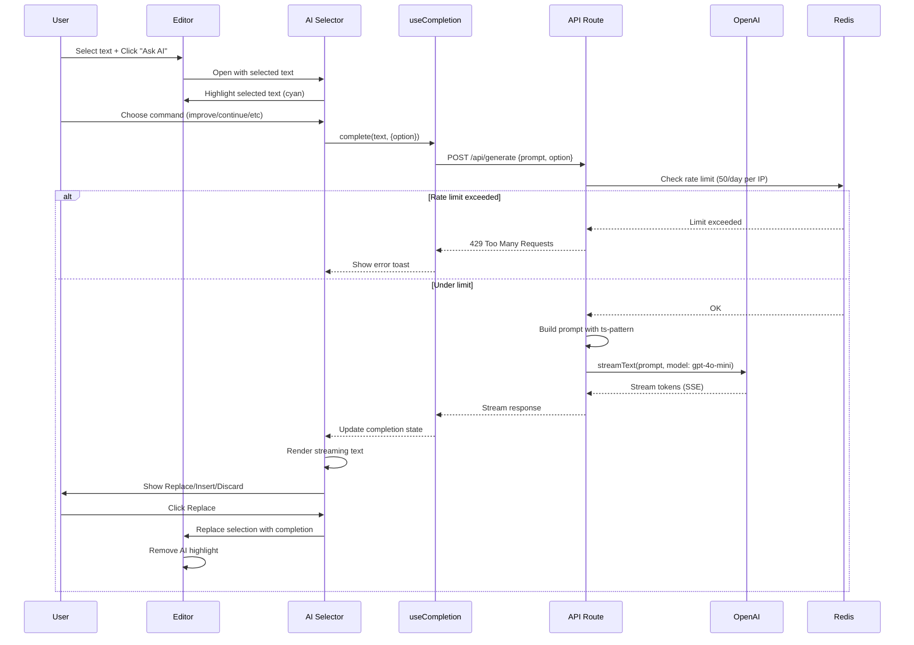

# AI Features Guide

> **Document Version**: 1.0
> **Last Updated**: November 2025
> **Audience**: Developers integrating and customizing AI features

---

## Introduction

### What This Guide Covers

Novel integrates AI-powered writing assistance using OpenAI's GPT models through the Vercel AI SDK. This guide teaches you **everything about AI integration**, from basic concepts to advanced customization.

**You'll learn**:
- **AI Architecture** - How Novel's AI system works end-to-end
- **Vercel AI SDK** - Deep dive into streamText, useCompletion, streaming
- **Seven AI Commands** - Continue, improve, shorter, longer, fix, zap, custom
- **Custom AI Commands** - Build your own AI transformations
- **Streaming Responses** - Server-Sent Events, real-time UI updates
- **Prompt Engineering** - Craft effective prompts for better results
- **Rate Limiting** - Prevent abuse with Upstash Redis
- **Cost Management** - Control OpenAI API costs
- **Error Handling** - Graceful failures, user-friendly messages
- **AI UX Patterns** - Loading states, progressive enhancement, accessibility

### AI Mental Model

**Traditional Text Editor**:
```
User types → Text appears → Done
```

**AI-Powered Editor**:
```
User types → AI suggests/transforms → User accepts/modifies → Text appears
```

The key difference: **AI is a collaborator, not just a tool**.

---

## Table of Contents

- [Part 1: AI Architecture Overview](#part-1-ai-architecture-overview)
- [Part 2: Vercel AI SDK Deep Dive](#part-2-vercel-ai-sdk-deep-dive)
- [Part 3: The Seven AI Commands](#part-3-the-seven-ai-commands)
- [Part 4: Building Custom AI Commands](#part-4-building-custom-ai-commands)
- [Part 5: Streaming Responses](#part-5-streaming-responses)
- [Part 6: Prompt Engineering](#part-6-prompt-engineering)
- [Part 7: Rate Limiting](#part-7-rate-limiting)
- [Part 8: Cost Management](#part-8-cost-management)
- [Part 9: Error Handling](#part-9-error-handling)
- [Part 10: AI UX Patterns](#part-10-ai-ux-patterns)
- [Part 11: OpenAI Configuration](#part-11-openai-configuration)

---

## Part 1: AI Architecture Overview

### Complete AI Flow Diagram



### System Components

| Component | Purpose | File Location |
|-----------|---------|---------------|
| **AI Selector** | UI for AI interactions | `apps/web/components/tailwind/generative/ai-selector.tsx` |
| **useCompletion Hook** | Client-side AI state | From `ai/react` (Vercel AI SDK) |
| **API Route** | Backend AI processing | `apps/web/app/api/generate/route.ts` |
| **OpenAI SDK** | OpenAI API client | From `@ai-sdk/openai` |
| **Rate Limiter** | Abuse prevention | Upstash Redis + `@upstash/ratelimit` |
| **AI Highlight** | Visual feedback | `packages/headless/src/extensions/ai-highlight.ts` |
| **Pattern Matcher** | Command routing | `ts-pattern` library |

### Key Technologies

**Frontend**:
- **ai/react** (v3.0.12) - React hooks for AI interactions
- **react-markdown** - Render AI responses as Markdown
- **sonner** - Toast notifications for errors

**Backend**:
- **@ai-sdk/openai** (v1.1.0) - OpenAI provider for Vercel AI SDK
- **ai** (v3.0.12) - Core streaming library
- **ts-pattern** - Pattern matching for commands
- **@upstash/ratelimit** (v1.0.1) - Rate limiting
- **@vercel/kv** (v1.0.1) - Redis-compatible KV store

---

## Part 2: Vercel AI SDK Deep Dive

### What is Vercel AI SDK?

The Vercel AI SDK is a library that **simplifies streaming AI responses** from various providers (OpenAI, Anthropic, Google, etc.) to React applications.

**Without Vercel AI SDK** (Complex):
```typescript
// Manually handle streaming
const response = await fetch('/api/openai', { method: 'POST' });
const reader = response.body.getReader();

while (true) {
  const { done, value } = await reader.read();
  if (done) break;

  const text = new TextDecoder().decode(value);
  // Parse Server-Sent Events manually
  // Update UI state
  // Handle errors
}
```

**With Vercel AI SDK** (Simple):
```typescript
const { completion, complete } = useCompletion({
  api: '/api/generate',
});

// Trigger completion
complete('Write a story');

// UI automatically updates as `completion` changes
```

### useCompletion Hook

File: `apps/web/components/tailwind/generative/ai-selector.tsx:20-34`

```typescript
const { completion, complete, isLoading } = useCompletion({
  api: "/api/generate",
  onResponse: (response) => {
    if (response.status === 429) {
      toast.error("You have reached your request limit for the day.");
      return;
    }
  },
  onError: (e) => {
    toast.error(e.message);
  },
});
```

**Hook Returns**:

| Property | Type | Description |
|----------|------|-------------|
| `completion` | string | Accumulated AI response (updates in real-time) |
| `complete(prompt, options)` | function | Trigger AI completion |
| `isLoading` | boolean | true during generation |
| `error` | Error \| undefined | Error object if request failed |
| `stop()` | function | Abort ongoing generation |

**Usage Example**:

```typescript
function AIComponent() {
  const { completion, complete, isLoading } = useCompletion({
    api: '/api/generate',
  });

  const handleGenerate = () => {
    complete('Write a story about', {
      body: {
        option: 'continue',
      },
    });
  };

  return (
    <div>
      <button onClick={handleGenerate} disabled={isLoading}>
        {isLoading ? 'Generating...' : 'Generate'}
      </button>

      {completion && <div>{completion}</div>}
    </div>
  );
}
```

### streamText Function (Backend)

File: `apps/web/app/api/generate/route.ts:118-128`

```typescript
import { streamText } from 'ai';
import { openai } from '@ai-sdk/openai';

export async function POST(req: Request) {
  const { prompt } = await req.json();

  const result = await streamText({
    prompt: prompt,
    maxTokens: 4096,
    temperature: 0.7,
    topP: 1,
    frequencyPenalty: 0,
    presencePenalty: 0,
    model: openai("gpt-4o-mini"),
  });

  return result.toDataStreamResponse();
}
```

**streamText Parameters**:

| Parameter | Type | Description |
|-----------|------|-------------|
| `prompt` | string | Text to send to AI |
| `model` | LanguageModel | AI model (OpenAI, Anthropic, etc.) |
| `maxTokens` | number | Maximum response length |
| `temperature` | number | Creativity (0 = deterministic, 1 = creative) |
| `topP` | number | Nucleus sampling (1 = all tokens considered) |
| `frequencyPenalty` | number | Penalty for repetition (0-2) |
| `presencePenalty` | number | Penalty for repeating topics (0-2) |

**Return Value**:
- `toDataStreamResponse()` - Converts to Server-Sent Events (SSE) format
- Automatically handles chunking, encoding, headers
- Compatible with `useCompletion` hook

---

## Part 3: The Seven AI Commands

Novel provides seven built-in AI commands for text transformation.

### Command Architecture

File: `apps/web/app/api/generate/route.ts:39-116`

```typescript
import { match } from 'ts-pattern';

const messages = match(option)
  .with('continue', () => [
    {
      role: 'system',
      content: 'You are an AI writing assistant that continues existing text...',
    },
    {
      role: 'user',
      content: prompt,
    },
  ])
  .with('improve', () => [...])
  .with('shorter', () => [...])
  // ... more commands
  .run();
```

**Pattern Matching Benefits**:
- Type-safe command routing
- Exhaustive matching (compile-time checks)
- Readable, declarative code

### 1. Continue Command

**Purpose**: Continue writing from where user left off.

**System Prompt**:
```
You are an AI writing assistant that continues existing text based on context from prior text. Give more weight/priority to the later characters than the beginning ones. Limit your response to no more than 200 characters, but make sure to construct complete sentences.
```

**Use Case**:
```
User writes: "The quantum computer processed data at"
AI continues: "unprecedented speeds, completing calculations in microseconds that would take traditional computers years to solve."
```

**Technical Details**:
- Requires context from previous text
- Uses `getPrevText()` to extract text before cursor
- Max 200 characters to avoid runaway generation
- Focuses on later context (recent sentences matter more)

### 2. Improve Command

**Purpose**: Enhance writing quality, clarity, grammar.

**System Prompt**:
```
You are an AI writing assistant that improves existing text. Limit your response to no more than 200 characters, but make sure to construct complete sentences.
```

**Prompt Structure**:
```
The existing text is: ${prompt}
```

**Use Case**:
```
User text: "The thing was good because it did stuff well."
AI improves: "The product excelled due to its exceptional performance and user-friendly features."
```

### 3. Shorter Command

**Purpose**: Condense text while preserving meaning.

**System Prompt**:
```
You are an AI writing assistant that shortens existing text.
```

**Use Case**:
```
User text: "Due to the fact that we are experiencing technical difficulties, we will be unable to process your request at this time."
AI shortens: "We're experiencing technical difficulties and can't process your request now."
```

### 4. Longer Command

**Purpose**: Expand text with additional details.

**System Prompt**:
```
You are an AI writing assistant that lengthens existing text.
```

**Use Case**:
```
User text: "React is popular."
AI lengthens: "React is one of the most popular frontend libraries, widely adopted by developers worldwide for building dynamic, component-based user interfaces with a declarative programming model."
```

### 5. Fix Command

**Purpose**: Correct grammar, spelling, punctuation.

**System Prompt**:
```
You are an AI writing assistant that fixes grammar and spelling errors in existing text. Limit your response to no more than 200 characters, but make sure to construct complete sentences.
```

**Use Case**:
```
User text: "The developrs is working on a new feture for teh application"
AI fixes: "The developers are working on a new feature for the application."
```

### 6. Zap Command (Custom Instructions)

**Purpose**: Execute user-defined transformations.

**System Prompt**:
```
You are an AI writing assistant that generates text based on a prompt. You take an input from the user and a command for manipulating the text.
```

**Prompt Structure**:
```
For this text: ${prompt}. You have to respect the command: ${command}
```

**Use Case**:
```
User text: "The company announced new features."
User command: "Make this sound exciting for a press release"
AI result: "In a groundbreaking announcement, the company unveiled revolutionary new features that will transform the industry!"
```

**Implementation**:
```typescript
.with("zap", () => [
  {
    role: "system",
    content: "You are an AI writing assistant that generates text based on a prompt.",
  },
  {
    role: "user",
    content: `For this text: ${prompt}. You have to respect the command: ${command}`,
  },
])
```

### 7. Implicit Zap (User Input)

**Purpose**: Allow freeform AI commands via input field.

**Trigger**: User types custom instruction instead of selecting predefined command.

**Example Flow**:
1. User selects text: "The product is good"
2. User types in AI input: "translate to Spanish"
3. AI responds: "El producto es bueno"

File: `apps/web/components/tailwind/generative/ai-selector.tsx:48-59`

```typescript
const handleKeyDown = (event: KeyboardEvent<HTMLDivElement>) => {
  if (event.key === "Enter") {
    event.preventDefault();
    const slice = editor.state.selection.content();
    const text = editor.storage.markdown.serializer.serialize(
      slice.content,
    );

    complete(text, {
      body: { option: "zap", command: inputValue },
    });
  }
};
```

---

## Part 4: Building Custom AI Commands

### Adding a New Command

Let's add a **"summarize"** command that creates bullet-point summaries.

#### Step 1: Add Command to Pattern Matcher

File: `apps/web/app/api/generate/route.ts`

```typescript
const messages = match(option)
  .with('continue', () => [...])
  .with('improve', () => [...])
  // ... existing commands

  // NEW: Summarize command
  .with('summarize', () => [
    {
      role: 'system',
      content: 'You are an AI writing assistant that creates concise bullet-point summaries of existing text. Extract the main points and present them as a clear, organized list.',
    },
    {
      role: 'user',
      content: `Summarize this text:\n\n${prompt}`,
    },
  ])

  .with('zap', () => [...])
  .run();
```

#### Step 2: Add to Type Definitions

If using TypeScript strictly, add the type:

```typescript
type AIOption =
  | 'continue'
  | 'improve'
  | 'shorter'
  | 'longer'
  | 'fix'
  | 'summarize' // NEW
  | 'zap';
```

#### Step 3: Add UI Button

File: `apps/web/components/tailwind/generative/ai-selector-commands.tsx`

```typescript
import { List } from 'lucide-react'; // Import icon

const options: AISelectorCommandsProps["options"] = [
  {
    value: "improve",
    label: "Improve writing",
    icon: PenLine,
  },
  {
    value: "fix",
    label: "Fix grammar",
    icon: Sparkles,
  },
  // ... existing options

  // NEW: Summarize option
  {
    value: "summarize",
    label: "Summarize as bullets",
    icon: List,
  },
];

export function AISelectorCommands({ onSelect }: AISelectorCommandsProps) {
  return (
    <CommandGroup heading="Edit or review selection">
      {options.map((option) => (
        <CommandItem
          onSelect={() => onSelect(option.value)}
          value={option.value}
          key={option.value}
        >
          <option.icon className="mr-2 h-4 w-4 text-purple-500" />
          {option.label}
        </CommandItem>
      ))}
    </CommandGroup>
  );
}
```

#### Step 4: Test the Command

1. Start dev server: `pnpm dev`
2. Select text in editor
3. Click "Ask AI"
4. Click "Summarize as bullets"
5. Verify AI generates bullet-point summary

### Advanced: Command with Context

**Example**: "Explain to a 5-year-old"

```typescript
.with('explain-eli5', () => [
  {
    role: 'system',
    content: 'You are an AI assistant that explains complex topics using simple language suitable for a 5-year-old. Use analogies, avoid jargon, and keep explanations short.',
  },
  {
    role: 'user',
    content: `Explain this in simple terms:\n\n${prompt}`,
  },
])
```

**Use Case**:
```
User text: "Quantum entanglement occurs when particles become correlated in such a way that the state of one particle instantaneously influences the state of another, regardless of distance."

AI (ELI5): "Imagine you have two magic coins. When you flip one and it lands on heads, the other coin - even if it's on the moon - will also land on heads at the exact same time! That's kind of like quantum entanglement."
```

---

## Part 5: Streaming Responses

### Why Streaming?

**Without Streaming** (Traditional):
```
User waits 10 seconds → Complete response appears all at once
```

**With Streaming** (Modern):
```
User sees words appear in real-time → Feels fast and responsive
```

**Benefits**:
- **Perceived Performance**: Users see progress immediately
- **Lower Time-to-First-Token**: First word appears in ~500ms instead of 10s
- **Better UX**: Users can cancel if response is going wrong direction
- **Lower Memory**: Chunks processed incrementally, not all at once

### Server-Sent Events (SSE)

Streaming uses Server-Sent Events, a browser API for server-to-client streaming.

**SSE Format**:
```
data: {"type":"text","content":"Hello"}

data: {"type":"text","content":" world"}

data: {"type":"finish"}

```

**Advantages over WebSockets**:
- One-way communication (server → client)
- Automatic reconnection
- Works over HTTP (no special protocol)
- Simpler implementation

### Backend Streaming Implementation

File: `apps/web/app/api/generate/route.ts:118-128`

```typescript
export async function POST(req: Request) {
  const { prompt, option } = await req.json();

  // Build messages based on command
  const messages = match(option).with(...).run();

  // Stream response from OpenAI
  const result = await streamText({
    prompt: messages[messages.length - 1].content,
    model: openai("gpt-4o-mini"),
    maxTokens: 4096,
  });

  // Convert to SSE format
  return result.toDataStreamResponse();
}
```

**What `toDataStreamResponse()` does**:
1. Sets headers: `Content-Type: text/event-stream`
2. Enables chunked transfer encoding
3. Formats chunks as SSE: `data: {...}\n\n`
4. Handles connection lifecycle

### Frontend Streaming Implementation

```typescript
const { completion, complete, isLoading } = useCompletion({
  api: '/api/generate',
});

// Trigger stream
complete('Write a story', {
  body: { option: 'continue' },
});

// completion updates in real-time:
// t=0ms:   ""
// t=100ms: "Once"
// t=200ms: "Once upon"
// t=300ms: "Once upon a"
// t=400ms: "Once upon a time"
// ...
```

**How `useCompletion` handles streaming**:

1. **Opens EventSource connection**:
   ```typescript
   const eventSource = new EventSource('/api/generate');
   ```

2. **Listens for messages**:
   ```typescript
   eventSource.onmessage = (event) => {
     const data = JSON.parse(event.data);
     setCompletion(prev => prev + data.content);
   };
   ```

3. **Closes on completion**:
   ```typescript
   eventSource.addEventListener('finish', () => {
     eventSource.close();
     setIsLoading(false);
   });
   ```

### Visualizing Streaming in UI

File: `apps/web/components/tailwind/generative/ai-selector.tsx:76-92`

```typescript
{hasCompletion && (
  <>
    <div className="flex max-h-[300px]">
      <ScrollArea>
        <div className="prose p-2 px-4 prose-sm">
          {/* Render streaming text as Markdown */}
          <Markdown>{completion}</Markdown>
        </div>
      </ScrollArea>
    </div>
    <Separator />
  </>
)}

{/* Show loading state while streaming */}
{isLoading && (
  <div className="flex h-12 w-full items-center px-4 text-sm font-medium text-purple-500">
    <Magic className="mr-2 h-4 w-4" />
    AI is thinking
    <CrazySpinner className="ml-2" />
  </div>
)}
```

**Progressive Enhancement**:
- Text renders as Markdown while streaming
- Scroll area auto-scrolls to show latest content
- Loading spinner indicates ongoing generation
- User can stop generation mid-stream

---

## Part 6: Prompt Engineering

### Anatomy of a Good Prompt

**Bad Prompt**:
```
Improve this.
```

**Good Prompt**:
```
System: You are an AI writing assistant that improves existing text. Focus on clarity, conciseness, and professional tone. Preserve the original meaning while enhancing readability.

User: The existing text is: "The thing was good because it did stuff well."
```

**Why it's better**:
1. **Clear role** - "You are an AI writing assistant"
2. **Specific task** - "improves existing text"
3. **Guidelines** - "clarity, conciseness, professional tone"
4. **Constraints** - "Preserve original meaning"
5. **Context** - "The existing text is: ..."

### Prompt Templates in Novel

File: `apps/web/app/api/generate/route.ts:39-116`

**Pattern 1: Transformation Prompts**

```typescript
{
  role: 'system',
  content: `You are an AI writing assistant that ${action} existing text. ${constraints}`,
}
```

**Examples**:
- action = "improves" → Improve command
- action = "shortens" → Shorter command
- action = "lengthens" → Longer command

**Pattern 2: Generation Prompts**

```typescript
{
  role: 'system',
  content: 'You are an AI writing assistant that continues existing text based on context from prior text.',
}
```

**Used for**: Continue command

**Pattern 3: Custom Prompts**

```typescript
{
  role: 'user',
  content: `For this text: ${prompt}. You have to respect the command: ${command}`,
}
```

**Used for**: Zap command with user-defined instructions

### Effective Constraints

**1. Length Constraints**:
```
Limit your response to no more than 200 characters, but make sure to construct complete sentences.
```

**Why**:
- Prevents runaway generation
- Ensures responses fit in UI
- Reduces API costs

**2. Formatting Constraints**:
```
Present your response as a bulleted list with 3-5 main points.
```

**3. Tone Constraints**:
```
Maintain a professional, technical tone appropriate for developer documentation.
```

**4. Content Constraints**:
```
Do not add new information. Only rephrase the existing content.
```

### Context Extraction

Novel uses two utility functions to extract editor content:

**Function 1: getPrevText** (for "continue" command)

File: `packages/headless/src/utils/index.ts`

```typescript
export const getPrevText = (editor: EditorInstance, position: number) => {
  const nodes: Node[] = [];

  editor.state.doc.forEach((node, pos) => {
    if (pos >= position) return false;
    nodes.push(node);
    return true;
  });

  const fragment = Fragment.fromArray(nodes);
  const doc = editor.state.doc.copy(fragment);

  return editor.storage.markdown.serializer.serialize(doc) as string;
};
```

**Use Case**:
```typescript
// Get all text before cursor for context
const context = getPrevText(editor, cursorPosition);
const prompt = `${context}\n\n[Continue from here]`;
```

**Function 2: getAllContent** (for other commands)

```typescript
export const getAllContent = (editor: EditorInstance) => {
  const fragment = editor.state.doc.content;
  const doc = editor.state.doc.copy(fragment);
  return editor.storage.markdown.serializer.serialize(doc) as string;
};
```

**Use Case**:
```typescript
// Get selected text for transformation
const selectedText = getAllContent(editor);
const prompt = `Improve this text: ${selectedText}`;
```

### Advanced Prompting Techniques

**1. Few-Shot Learning**:

```typescript
{
  role: 'system',
  content: `You are an AI that converts technical jargon to plain English.

Examples:
- "idempotent operation" → "an action that produces the same result no matter how many times you do it"
- "eventual consistency" → "data will be the same everywhere, but it might take a moment"

Now convert the user's text.`,
}
```

**2. Chain-of-Thought**:

```typescript
{
  role: 'system',
  content: 'You are an AI that explains code. First, describe what the code does in plain English. Then, explain why it works. Finally, suggest improvements.',
}
```

**3. Negative Prompting**:

```typescript
{
  role: 'system',
  content: 'Improve this text. Do NOT change the technical terms. Do NOT add emoji. Do NOT change the tone.',
}
```

---

## Part 7: Rate Limiting

### Why Rate Limit?

**Without Rate Limiting**:
- Users can make unlimited AI requests
- Malicious users can drain your OpenAI credits
- Accidental loops can cost thousands of dollars
- Service can be overwhelmed

**With Rate Limiting**:
- Each IP limited to 50 requests/day
- Protects against abuse
- Predictable costs
- Fair usage across users

### Implementation

File: `apps/web/app/api/generate/route.ts:17-36`

```typescript
import { Ratelimit } from '@upstash/ratelimit';
import { kv } from '@vercel/kv';

export async function POST(req: Request) {
  // Only enforce rate limiting if KV is configured
  if (process.env.KV_REST_API_URL && process.env.KV_REST_API_TOKEN) {
    const ip = req.headers.get('x-forwarded-for');

    const ratelimit = new Ratelimit({
      redis: kv,
      limiter: Ratelimit.slidingWindow(50, '1 d'), // 50 requests per day
    });

    const { success, limit, reset, remaining } = await ratelimit.limit(
      `novel_ratelimit_${ip}`,
    );

    if (!success) {
      return new Response('You have reached your request limit for the day.', {
        status: 429,
        headers: {
          'X-RateLimit-Limit': limit.toString(),
          'X-RateLimit-Remaining': remaining.toString(),
          'X-RateLimit-Reset': reset.toString(),
        },
      });
    }
  }

  // Process AI request...
}
```

### Sliding Window Algorithm

```
Time:  00:00    12:00    23:59    00:00    12:00
       |------Day 1------|------Day 2------|

Request 1-50: ✅ Allowed
Request 51:   ❌ Blocked (wait until 00:00)
Request 52:   ❌ Blocked (at 00:01, request from 00:01 yesterday expires)
```

**Benefits over Fixed Window**:
- No "burst" at window boundaries
- Smoother traffic distribution
- More fair to users

### Setting Up Rate Limiting

#### Step 1: Create Vercel KV Database

```bash
# Via Vercel Dashboard
1. Go to Storage → Create Database
2. Select KV (Redis)
3. Name it "novel-rate-limit"
4. Note the credentials
```

#### Step 2: Add Environment Variables

File: `apps/web/.env.local`

```bash
KV_REST_API_URL="https://your-kv-url.upstash.io"
KV_REST_API_TOKEN="your-token-here"
```

#### Step 3: Install Dependencies

```bash
pnpm add @upstash/ratelimit @vercel/kv
```

#### Step 4: Configure Limit

Adjust the limit based on your needs:

```typescript
// 50 requests per day
Ratelimit.slidingWindow(50, '1 d')

// 100 requests per hour
Ratelimit.slidingWindow(100, '1 h')

// 10 requests per minute
Ratelimit.slidingWindow(10, '1 m')

// 1000 requests per month
Ratelimit.slidingWindow(1000, '30 d')
```

### User-Friendly Error Messages

File: `apps/web/components/tailwind/generative/ai-selector.tsx:22-27`

```typescript
const { completion, complete, isLoading } = useCompletion({
  api: "/api/generate",
  onResponse: (response) => {
    if (response.status === 429) {
      toast.error("You have reached your request limit for the day.");
      return;
    }
  },
});
```

**Better UX**: Show clear message instead of generic error.

### Custom Rate Limiting Strategies

**Per-User Limits** (requires auth):

```typescript
const userId = await getUserId(req);

const { success } = await ratelimit.limit(`user_${userId}`);
```

**Tiered Limits**:

```typescript
const userTier = await getUserTier(userId);

const limits = {
  free: 10,
  pro: 100,
  enterprise: 1000,
};

const ratelimit = new Ratelimit({
  redis: kv,
  limiter: Ratelimit.slidingWindow(limits[userTier], '1 d'),
});
```

**Combined IP + User**:

```typescript
const ip = req.headers.get('x-forwarded-for');
const userId = await getUserId(req);

// Check both limits
const ipLimit = await ipRatelimit.limit(`ip_${ip}`);
const userLimit = await userRatelimit.limit(`user_${userId}`);

if (!ipLimit.success || !userLimit.success) {
  return new Response('Rate limit exceeded', { status: 429 });
}
```

---

## Part 8: Cost Management

### Understanding OpenAI Costs

OpenAI charges per **token** (roughly 4 characters = 1 token).

**gpt-4o-mini Pricing** (as of Nov 2025):
- Input: $0.150 / 1M tokens
- Output: $0.600 / 1M tokens

**Example Cost Calculation**:

```typescript
// User request
Input: "Improve this text: The thing was good." // ~10 tokens
// AI response
Output: "The product excelled due to its exceptional performance." // ~12 tokens

Cost = (10 × $0.150 / 1M) + (12 × $0.600 / 1M)
     = $0.0000015 + $0.0000072
     = $0.00000870 per request
```

**Monthly Cost Estimates**:

| Usage | Requests/Day | Cost/Month |
|-------|--------------|------------|
| Light | 100 | ~$0.26 |
| Medium | 1,000 | ~$2.61 |
| Heavy | 10,000 | ~$26.10 |
| Very Heavy | 100,000 | ~$261.00 |

### Cost Optimization Strategies

#### 1. Use Smaller Models

```typescript
// ❌ Expensive: gpt-4-turbo
model: openai("gpt-4-turbo")
// $10.00 / 1M input tokens

// ✅ Cost-effective: gpt-4o-mini
model: openai("gpt-4o-mini")
// $0.150 / 1M input tokens (66x cheaper!)
```

**When to use each**:
- **gpt-4o-mini**: Simple edits (improve, fix, shorter, longer)
- **gpt-4-turbo**: Complex reasoning, creative writing, technical explanations

#### 2. Limit Max Tokens

```typescript
// ❌ Unlimited response
maxTokens: undefined  // Could generate thousands of tokens

// ✅ Capped response
maxTokens: 4096       // Maximum ~3000 words
maxTokens: 1024       // Maximum ~750 words (cheaper)
maxTokens: 200        // Maximum ~150 words (cheapest)
```

**Novel's approach**:
```typescript
// System prompt includes length constraint
content: 'Limit your response to no more than 200 characters, but make sure to construct complete sentences.'

// AND backend enforces token limit
maxTokens: 4096
```

#### 3. Cache System Prompts (Advanced)

**Problem**: System prompt is sent with every request.

```typescript
// Every request sends full system prompt
{
  role: 'system',
  content: 'You are an AI writing assistant that improves existing text. Focus on clarity, conciseness, and professional tone. Preserve the original meaning while enhancing readability.' // ~40 tokens per request
}
```

**Solution**: Some providers support prompt caching (check OpenAI docs for updates).

#### 4. Implement Request Deduplication

```typescript
// Prevent duplicate requests
const requestCache = new Map<string, Promise<string>>();

export async function POST(req: Request) {
  const { prompt, option } = await req.json();
  const cacheKey = `${option}:${prompt}`;

  // Return cached promise if duplicate request
  if (requestCache.has(cacheKey)) {
    return requestCache.get(cacheKey);
  }

  const promise = streamText({ ... });
  requestCache.set(cacheKey, promise);

  // Clean up after 10 seconds
  setTimeout(() => requestCache.delete(cacheKey), 10000);

  return promise;
}
```

#### 5. Monitor Usage

**Vercel Dashboard**:
- View OpenAI API usage
- Set spending limits
- Get alerts when approaching limit

**Custom Monitoring**:

```typescript
import { logger } from '@/lib/logger';

export async function POST(req: Request) {
  const startTime = Date.now();

  const result = await streamText({ ... });

  const tokens = result.usage;
  const duration = Date.now() - startTime;

  logger.info('AI request completed', {
    option,
    inputTokens: tokens.promptTokens,
    outputTokens: tokens.completionTokens,
    totalTokens: tokens.totalTokens,
    duration,
    estimatedCost: (tokens.promptTokens * 0.150 + tokens.completionTokens * 0.600) / 1_000_000,
  });

  return result.toDataStreamResponse();
}
```

### Free Tier Alternatives

**1. Local Models** (Free, but slower):
- **Ollama** - Run models locally
- **llama.cpp** - Lightweight local inference
- **GPT4All** - Privacy-focused local AI

**2. Free Tier APIs**:
- **Groq** - Free tier with fast inference
- **Together AI** - Free tier for open models
- **Hugging Face** - Free inference API

**Example with Ollama**:

```typescript
import { ollama } from 'ollama-ai-provider';

const result = await streamText({
  model: ollama('llama2'), // Free, runs locally
  prompt,
});
```

---

## Part 9: Error Handling

### Error Types

| Error | Status | Cause | Solution |
|-------|--------|-------|----------|
| Missing API Key | 400 | `OPENAI_API_KEY` not set | Set environment variable |
| Rate Limited | 429 | Too many requests | Wait or upgrade plan |
| OpenAI API Error | 500 | OpenAI service issue | Retry with exponential backoff |
| Invalid Request | 400 | Malformed JSON | Validate input |
| Timeout | 408 | Request too slow | Reduce maxTokens or retry |
| Network Error | 503 | Connection failed | Retry request |

### Backend Error Handling

File: `apps/web/app/api/generate/route.ts`

```typescript
export async function POST(req: Request) {
  try {
    // Validate API key
    if (!process.env.OPENAI_API_KEY || process.env.OPENAI_API_KEY === "") {
      return new Response(
        "Missing OPENAI_API_KEY - make sure to add it to your .env file.",
        { status: 400 }
      );
    }

    // Parse request
    const { prompt, option, command } = await req.json();

    // Validate input
    if (!prompt || typeof prompt !== 'string') {
      return new Response('Invalid prompt', { status: 400 });
    }

    // Check rate limit
    const rateLimit = await checkRateLimit(req);
    if (!rateLimit.success) {
      return new Response('Rate limit exceeded', { status: 429 });
    }

    // Generate response
    const result = await streamText({ ... });

    return result.toDataStreamResponse();

  } catch (error) {
    console.error('AI generation error:', error);

    // Return user-friendly error
    return new Response(
      'An error occurred while generating AI response. Please try again.',
      { status: 500 }
    );
  }
}
```

### Frontend Error Handling

File: `apps/web/components/tailwind/generative/ai-selector.tsx`

```typescript
const { completion, complete, isLoading, error } = useCompletion({
  api: "/api/generate",

  // Handle HTTP errors
  onResponse: (response) => {
    if (response.status === 429) {
      toast.error("You have reached your request limit for the day.");
      return;
    }

    if (response.status === 400) {
      toast.error("Invalid request. Please try again.");
      return;
    }

    if (response.status >= 500) {
      toast.error("Server error. Please try again later.");
      return;
    }
  },

  // Handle network/parsing errors
  onError: (error) => {
    console.error('AI completion error:', error);
    toast.error(error.message || "An unexpected error occurred.");
  },
});

// Show error state in UI
if (error) {
  return (
    <div className="p-4 text-red-600">
      <p>Failed to generate AI response</p>
      <button onClick={() => retry()}>Try Again</button>
    </div>
  );
}
```

### Retry Logic

**Exponential Backoff**:

```typescript
async function retryWithBackoff<T>(
  fn: () => Promise<T>,
  maxRetries = 3,
  baseDelay = 1000
): Promise<T> {
  for (let attempt = 0; attempt < maxRetries; attempt++) {
    try {
      return await fn();
    } catch (error) {
      // Don't retry on client errors (4xx)
      if (error.status >= 400 && error.status < 500) {
        throw error;
      }

      // Last attempt, throw error
      if (attempt === maxRetries - 1) {
        throw error;
      }

      // Wait before retry (exponential: 1s, 2s, 4s)
      const delay = baseDelay * Math.pow(2, attempt);
      await new Promise(resolve => setTimeout(resolve, delay));
    }
  }

  throw new Error('Max retries exceeded');
}

// Usage
const result = await retryWithBackoff(() =>
  streamText({ model, prompt })
);
```

### Graceful Degradation

**Progressive Enhancement**:

```typescript
function AISelector() {
  const [hasAI, setHasAI] = useState(true);

  useEffect(() => {
    // Check if AI is available
    fetch('/api/generate', { method: 'HEAD' })
      .then(res => setHasAI(res.ok))
      .catch(() => setHasAI(false));
  }, []);

  if (!hasAI) {
    return (
      <div className="p-4 text-muted-foreground">
        <p>AI features are currently unavailable.</p>
        <p className="text-sm">Please configure OPENAI_API_KEY to enable AI assistance.</p>
      </div>
    );
  }

  return <AIComponent />;
}
```

---

## Part 10: AI UX Patterns

### Loading States

**Bad UX**:
```tsx
{isLoading ? 'Loading...' : completion}
```

**Good UX** (Novel's approach):

```tsx
{isLoading && (
  <div className="flex h-12 w-full items-center px-4 text-sm font-medium text-purple-500">
    <Magic className="mr-2 h-4 w-4 shrink-0" />
    AI is thinking
    <CrazySpinner className="ml-2" />
  </div>
)}

{hasCompletion && (
  <div className="prose p-2 px-4 prose-sm">
    <Markdown>{completion}</Markdown>
  </div>
)}
```

**Key Elements**:
1. **Icon** - Visual indicator (magic wand)
2. **Message** - Clear status ("AI is thinking")
3. **Spinner** - Animated feedback
4. **Color** - Purple for AI (brand consistency)
5. **Smooth transition** - From loading → content

### Progressive Disclosure

**Show results incrementally**:

```tsx
function AISelector() {
  const { completion, isLoading } = useCompletion();

  // Calculate progress
  const words = completion.split(' ').length;
  const isComplete = !isLoading && completion;

  return (
    <>
      {/* Show partial results while loading */}
      {completion && (
        <div className={cn(
          "prose",
          !isComplete && "opacity-80" // Dim while incomplete
        )}>
          <Markdown>{completion}</Markdown>
          {!isComplete && (
            <span className="inline-block w-2 h-4 bg-purple-500 animate-pulse">
              |
            </span>
          )}
        </div>
      )}

      {/* Show word count */}
      {completion && (
        <div className="text-xs text-muted-foreground">
          {words} words {!isComplete && '(generating...)'}
        </div>
      )}
    </>
  );
}
```

### Cancel/Stop Generation

```typescript
const { completion, complete, stop, isLoading } = useCompletion();

return (
  <>
    {isLoading && (
      <Button
        onClick={() => stop()}
        variant="ghost"
        size="sm"
      >
        Stop Generating
      </Button>
    )}
  </>
);
```

### AI Highlight Visual Feedback

File: `apps/web/components/tailwind/generative/ai-selector.tsx:36-46`

```typescript
useEffect(() => {
  // Highlight text when AI menu opens
  if (open) {
    addAIHighlight(editor);
  } else {
    removeAIHighlight(editor);
  }
}, [editor, open]);
```

**Visual Effect**:
```
Before AI: "The quick brown fox"
With AI:   "The quick brown fox" ← Highlighted with cyan background
```

**Implementation** (`packages/headless/src/extensions/ai-highlight.ts`):

```typescript
export const addAIHighlight = (editor: EditorInstance) => {
  const { from, to } = editor.state.selection;
  editor.chain().setAIHighlight({ from, to }).run();
};

export const removeAIHighlight = (editor: EditorInstance) => {
  editor.chain().unsetAIHighlight().run();
};
```

### Keyboard Shortcuts

**Example**: Trigger AI with keyboard

```typescript
import { CustomKeymap } from 'novel/extensions';

const extensions = [
  CustomKeymap.configure({
    'Mod-Shift-a': () => {
      // Open AI selector
      setOpenAI(true);
      return true;
    },
  }),
];
```

**User Experience**:
- Select text
- Press `Cmd+Shift+A` (Mac) or `Ctrl+Shift+A` (Windows)
- AI menu opens instantly

### Accessibility

**Screen Reader Support**:

```tsx
<div
  role="status"
  aria-live="polite"
  aria-atomic="true"
>
  {isLoading ? 'AI is generating response' : completion}
</div>
```

**Keyboard Navigation**:

```tsx
<Command className="w-[350px]">
  <CommandInput
    placeholder="Ask AI to edit or generate..."
    autoFocus // Focus on open
  />
  <CommandList>
    {/* Items navigable with arrow keys */}
    <CommandItem onSelect={() => {}}>
      Improve writing
    </CommandItem>
  </CommandList>
</Command>
```

### Response Actions

File: `apps/web/components/tailwind/generative/ai-completion-command.tsx`

```tsx
export function AICompletionCommands() {
  const { editor } = useEditor();

  return (
    <CommandGroup>
      {/* Replace selected text */}
      <CommandItem
        onSelect={() => {
          const { from, to } = editor.state.selection;
          editor.chain()
            .focus()
            .deleteRange({ from, to })
            .insertContent(completion)
            .run();
        }}
      >
        <Check className="mr-2 h-4 w-4" />
        Replace selection
      </CommandItem>

      {/* Insert below selection */}
      <CommandItem
        onSelect={() => {
          const { to } = editor.state.selection;
          editor.chain()
            .focus()
            .insertContentAt(to, completion)
            .run();
        }}
      >
        <TextQuote className="mr-2 h-4 w-4" />
        Insert below
      </CommandItem>

      {/* Discard */}
      <CommandItem
        onSelect={() => {
          setCompletion('');
          onOpenChange(false);
        }}
      >
        <X className="mr-2 h-4 w-4" />
        Discard
      </CommandItem>
    </CommandGroup>
  );
}
```

---

## Part 11: OpenAI Configuration

### Environment Setup

File: `apps/web/.env.local`

```bash
# Required
OPENAI_API_KEY=sk-proj-...

# Optional
OPENAI_BASE_URL=https://api.openai.com/v1
OPENAI_ORG_ID=org-...

# Rate limiting (optional)
KV_REST_API_URL=https://your-kv.upstash.io
KV_REST_API_TOKEN=your-token
```

### Model Selection

```typescript
import { openai } from '@ai-sdk/openai';

// Available models
model: openai('gpt-4o-mini')       // ✅ Recommended (fast, cheap)
model: openai('gpt-4o')            // High quality, moderate cost
model: openai('gpt-4-turbo')       // Best quality, expensive
model: openai('gpt-3.5-turbo')     // Legacy, cheapest
```

**Model Comparison**:

| Model | Speed | Quality | Cost | Best For |
|-------|-------|---------|------|----------|
| gpt-4o-mini | ⚡⚡⚡ | ⭐⭐⭐ | 💰 | Text editing, simple tasks |
| gpt-4o | ⚡⚡ | ⭐⭐⭐⭐ | 💰💰 | Balanced quality/cost |
| gpt-4-turbo | ⚡ | ⭐⭐⭐⭐⭐ | 💰💰💰 | Complex reasoning, creative writing |

### Temperature Tuning

```typescript
// Creative writing
temperature: 0.9  // More random, creative

// Balanced (Novel default)
temperature: 0.7  // Good mix of creativity and consistency

// Deterministic
temperature: 0.0  // Same input = same output
```

**Use Cases**:

| Task | Temperature | Reasoning |
|------|-------------|-----------|
| Fix grammar | 0.0 | Deterministic corrections |
| Improve writing | 0.5 | Slight variation acceptable |
| Continue story | 0.8 | Creative, varied continuations |
| Generate ideas | 0.9 | Maximum creativity |

### Alternative Providers

Vercel AI SDK supports multiple providers:

**Anthropic (Claude)**:

```typescript
import { anthropic } from '@ai-sdk/anthropic';

model: anthropic('claude-3-5-sonnet-20241022')
```

**Google (Gemini)**:

```typescript
import { google } from '@ai-sdk/google';

model: google('gemini-1.5-pro')
```

**Local (Ollama)**:

```typescript
import { ollama } from 'ollama-ai-provider';

model: ollama('llama2')
```

**Configuration**:

```bash
# .env.local
ANTHROPIC_API_KEY=sk-ant-...
GOOGLE_API_KEY=...
# Ollama runs locally, no key needed
```

---

## Summary

### AI Features Checklist

**Setup**:
- [ ] Add `OPENAI_API_KEY` to `.env.local`
- [ ] Install dependencies: `@ai-sdk/openai`, `ai`
- [ ] Configure rate limiting (optional)

**Backend**:
- [ ] Create API route `/api/generate`
- [ ] Implement `streamText` with OpenAI
- [ ] Add command pattern matching with `ts-pattern`
- [ ] Implement rate limiting with Upstash
- [ ] Add error handling

**Frontend**:
- [ ] Add `useCompletion` hook
- [ ] Create AI selector UI component
- [ ] Implement loading states
- [ ] Add AI highlight extension
- [ ] Create response action buttons (Replace/Insert/Discard)

**Commands**:
- [ ] Continue - Continue writing from cursor
- [ ] Improve - Enhance writing quality
- [ ] Shorter - Condense text
- [ ] Longer - Expand text
- [ ] Fix - Grammar and spelling
- [ ] Zap - Custom transformations
- [ ] Custom - Add your own commands

**Optimization**:
- [ ] Set `maxTokens` limit
- [ ] Choose appropriate model (gpt-4o-mini)
- [ ] Monitor API usage
- [ ] Implement request caching
- [ ] Add retry logic with exponential backoff

**UX**:
- [ ] Show loading spinner
- [ ] Display streaming text progressively
- [ ] Enable stop/cancel generation
- [ ] Add keyboard shortcuts
- [ ] Ensure accessibility (ARIA labels)

### Best Practices

1. **Always validate inputs** - Check prompt length, type, format
2. **Limit max tokens** - Prevent runaway generation and costs
3. **Implement rate limiting** - Protect against abuse
4. **Use appropriate models** - gpt-4o-mini for simple tasks
5. **Stream responses** - Better UX than waiting for complete response
6. **Handle errors gracefully** - User-friendly messages, retry logic
7. **Monitor costs** - Set alerts, track usage
8. **Test with real data** - Edge cases, long prompts, special characters

### Next Steps

1. **Customize commands** - Add domain-specific AI commands
2. **Improve prompts** - A/B test different prompt formats
3. **Add analytics** - Track which commands users prefer
4. **Experiment with models** - Try Claude, Gemini, local models
5. **Enhance UX** - Add more loading states, animations
6. **Implement caching** - Cache frequent requests
7. **Add user preferences** - Let users choose models, temperature

---

**Document Version**: 1.0
**Last Updated**: November 2025
**Related Guides**:
- [PATTERNS_AND_CONVENTIONS.md](./PATTERNS_AND_CONVENTIONS.md) - Backend patterns, security
- [HOW_TO_GUIDE.md](./HOW_TO_GUIDE.md) - Step-by-step AI integration
- [INTEGRATION_GUIDE.md](./INTEGRATION_GUIDE.md) - Framework-specific setup

---

*You now have comprehensive knowledge of Novel's AI features. From basic integration to advanced customization, you can build powerful AI-assisted editing experiences!* ✨

