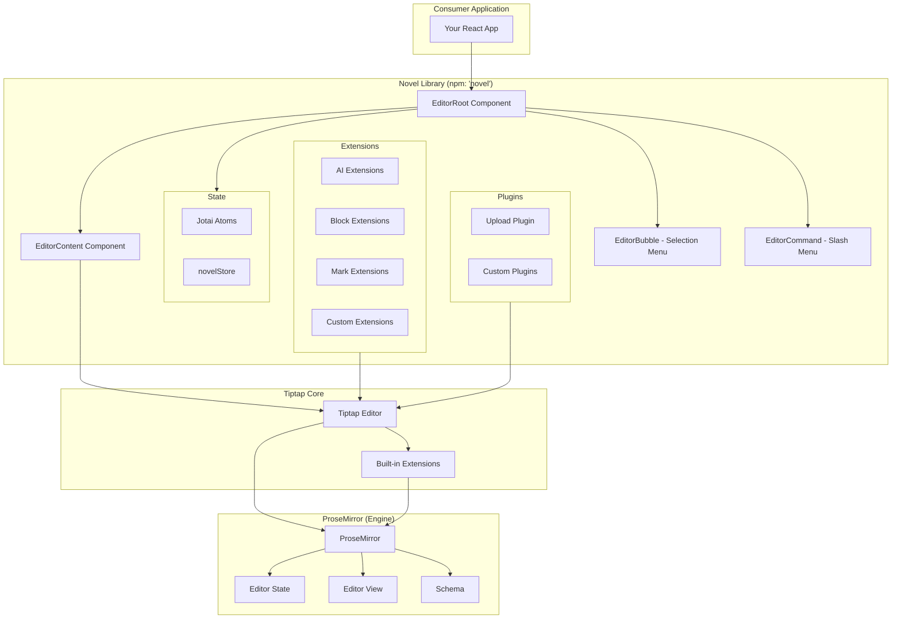
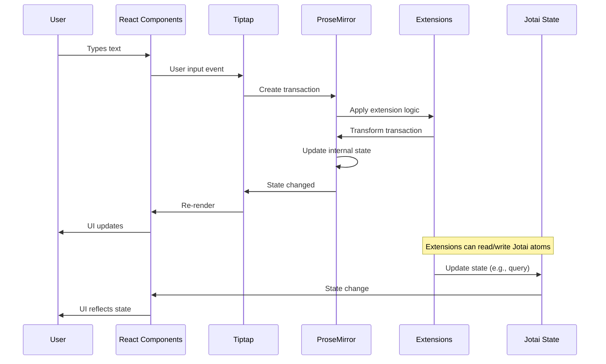
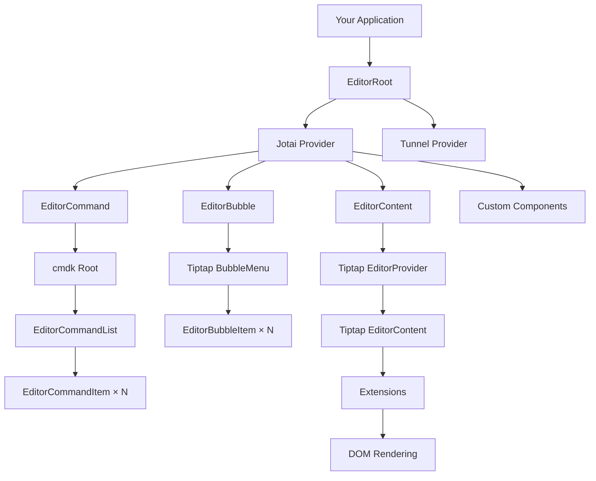
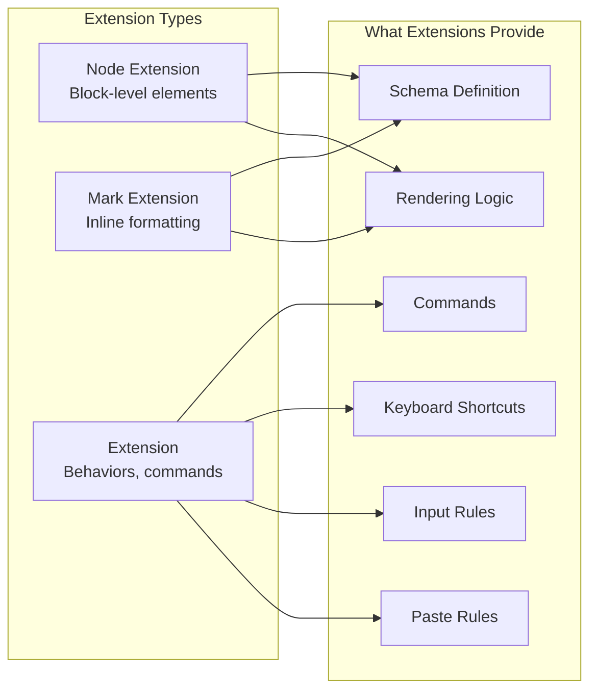
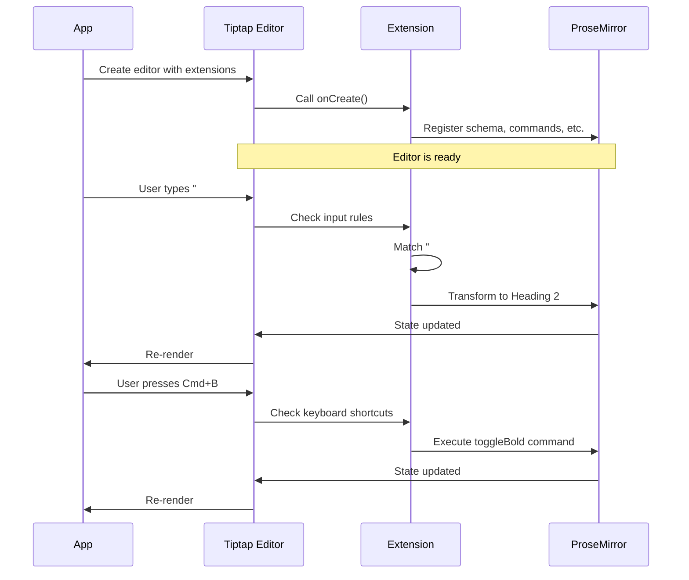
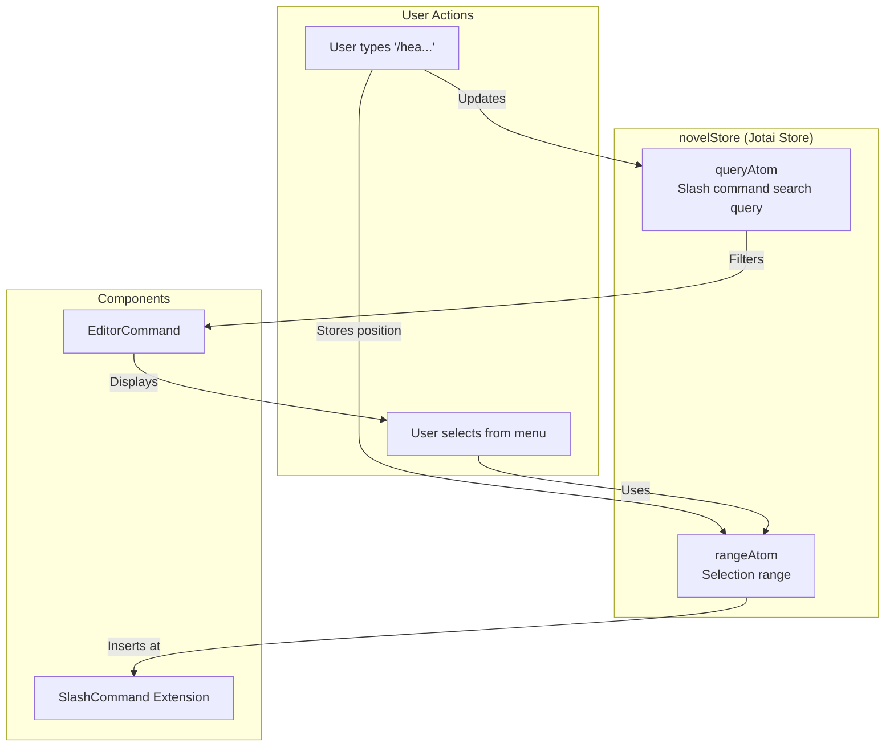
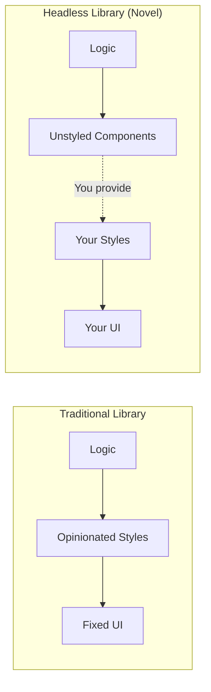
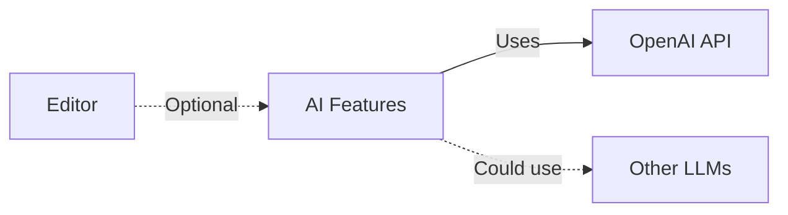

# Architecture Overview

**Last Updated:** November 19, 2025
**Tech Stack Research:** [View Current Tech Stack](./TECH_STACK_RESEARCH.md)
**Target Audience:** All developers (beginner → advanced)

This document provides a comprehensive overview of Novel's architecture, design patterns, and system organization.

---

## Table of Contents

1. [Executive Summary](#executive-summary)
2. [High-Level Architecture](#high-level-architecture)
3. [Monorepo Design](#monorepo-design)
4. [Component Architecture](#component-architecture)
5. [Extension System](#extension-system)
6. [State Management](#state-management)
7. [Headless Pattern](#headless-pattern)
8. [Key Design Decisions](#key-design-decisions)
9. [Next Steps](#next-steps)

---

## Executive Summary

**What is Novel?**

Novel is a **Notion-style WYSIWYG editor** with **AI-powered autocompletions**, built as a **headless React component library** on top of **Tiptap** (which wraps ProseMirror).

**Architecture in One Sentence:**

> Novel is a **composable, extension-based, headless editor** that provides logic and structure while leaving styling to the consumer, organized as a **monorepo** with a core library and demo application.

**Key Characteristics:**

- ✅ **Headless**: Provides functionality without opinions on styling
- ✅ **Extensible**: Everything is a Tiptap extension (blocks, marks, behaviors)
- ✅ **Composable**: Built from small, reusable React components
- ✅ **Type-safe**: Full TypeScript support throughout
- ✅ **Monorepo**: Library + demo app in one repository
- ✅ **Modern Stack**: React 18, Next.js 15, Tailwind, Jotai

---

## High-Level Architecture

### System Diagram



**Key Layers:**

1. **Consumer Layer**: Your React application
2. **Novel Components**: High-level React components (EditorRoot, EditorContent, etc.)
3. **Extensions Layer**: Tiptap extensions for features (headings, lists, AI, etc.)
4. **Tiptap Layer**: React wrapper around ProseMirror
5. **ProseMirror Layer**: Low-level editor engine

---

### Information Flow



🧠 **Mental Model**: Think of it as layers of an onion:
- **Core**: ProseMirror (the powerful engine)
- **Wrapper**: Tiptap (makes ProseMirror React-friendly)
- **Components**: Novel (provides pre-built UI components)
- **Your App**: Uses Novel components with custom styling

---

## Monorepo Design

Novel uses **Turborepo** + **pnpm** workspaces for monorepo management.

### Repository Structure

```mermaid
graph LR
    subgraph "Monorepo Root"
        Root[novel/]
    end

    subgraph "Packages"
        Headless[packages/headless<br/>Core Library<br/>npm: 'novel']
        TSConfig[packages/tsconfig<br/>Shared TS Configs]
    end

    subgraph "Applications"
        Web[apps/web<br/>Next.js Demo]
    end

    subgraph "Build System"
        Turbo[Turborepo<br/>Task Orchestration]
        PNPM[pnpm Workspaces<br/>Dependency Management]
    end

    Root --> Packages
    Root --> Applications
    Root --> Build System

    Headless -.->|depends on| TSConfig
    Web -.->|depends on| Headless
    Web -.->|depends on| TSConfig

    Turbo -->|runs tasks| Headless
    Turbo -->|runs tasks| Web
    PNPM -->|manages| Headless
    PNPM -->|manages| Web
```

**Why Monorepo?**

✅ **Single source of truth**: Library and demo in sync
✅ **Fast development**: Changes to library instantly reflect in demo
✅ **Shared tooling**: One ESLint, TypeScript, Prettier config
✅ **Atomic commits**: Change library + demo in one commit
✅ **Easy testing**: Test library changes in demo immediately

🌉 **Compared to**: Nx, Lerna, or Yarn Workspaces - but Turborepo is faster and simpler.

📖 **Learn more**: [Project Structure Guide](./PROJECT_STRUCTURE.md)

---

### Package Relationships

```
┌─────────────────────────────────────────────┐
│  apps/web (Next.js Demo)                   │
│  - Showcases editor features               │
│  - Reference implementation                │
│  - NOT published to npm                    │
└─────────────┬───────────────────────────────┘
              │ depends on ↓
┌─────────────▼───────────────────────────────┐
│  packages/headless (Core Library)          │
│  - Published as "novel" on npm             │
│  - Headless components                     │
│  - Extensions, plugins, utilities          │
│  - Tree-shakeable, side-effect free        │
└─────────────┬───────────────────────────────┘
              │ depends on ↓
┌─────────────▼───────────────────────────────┐
│  packages/tsconfig (Shared Configs)        │
│  - base.json, react.json, next.json        │
│  - Ensures consistent TypeScript setup     │
└─────────────────────────────────────────────┘
```

**Build Pipeline:**

```bash
pnpm build
└── Turborepo orchestrates:
    ├── 1. Build packages/headless (library)
    │   └── tsup → dist/index.js (ESM) + dist/index.cjs (CJS)
    └── 2. Build apps/web (Next.js app)
        └── next build → .next/ directory
```

---

## Component Architecture

Novel uses a **composition-based** architecture with several key components.

### Component Hierarchy



**Key Components:**

| Component | Purpose | Location |
|-----------|---------|----------|
| **EditorRoot** | Top-level provider, sets up state | [src/components/editor.tsx](../../packages/headless/src/components/editor.tsx) |
| **EditorContent** | Main editor container | [src/components/editor.tsx](../../packages/headless/src/components/editor.tsx) |
| **EditorBubble** | Selection toolbar (appears on text selection) | [src/components/editor-bubble.tsx](../../packages/headless/src/components/editor-bubble.tsx) |
| **EditorCommand** | Slash command menu (triggered by `/`) | [src/components/editor-command.tsx](../../packages/headless/src/components/editor-command.tsx) |

---

### EditorRoot: The Provider Component

**Purpose:** Sets up the editor environment

**Responsibilities:**
- Creates Jotai store for state isolation
- Sets up tunnel-rat for portaling command menu
- Wraps children in providers

**Usage:**
```tsx
import { EditorRoot, EditorContent } from 'novel'

function MyEditor() {
  return (
    <EditorRoot>
      <EditorContent initialContent={content} />
      {/* Other editor components */}
    </EditorRoot>
  )
}
```

💡 **Think of it as**: The `<Provider>` in Redux or Context - sets up the environment.

---

### EditorContent: The Main Editor

**Purpose:** Renders the actual editor

**Responsibilities:**
- Accepts initial content (JSONContent format)
- Forwards props to Tiptap's EditorProvider
- Configures extensions
- Manages editor instance

**Usage:**
```tsx
<EditorContent
  initialContent={{
    type: 'doc',
    content: [...]
  }}
  extensions={[...customExtensions]}
  editorProps={{
    attributes: {
      class: 'prose prose-lg'
    }
  }}
/>
```

🔗 **Type:** `EditorContentProps` - [src/components/editor.tsx](../../packages/headless/src/components/editor.tsx)

---

### EditorBubble: Selection Toolbar

**Purpose:** Floating toolbar that appears when text is selected

**Built on:** Tiptap's BubbleMenu + Tippy.js

**Features:**
- Auto-positioning (above/below selection)
- Hides for images, empty selections, non-editable
- Manages focus state

**Usage:**
```tsx
<EditorBubble>
  <EditorBubbleItem onClick={...}>Bold</EditorBubbleItem>
  <EditorBubbleItem onClick={...}>Italic</EditorBubbleItem>
</EditorBubble>
```

🎯 **Use case**: Text formatting, link insertion, AI commands

---

### EditorCommand: Slash Command Menu

**Purpose:** Command palette triggered by typing `/`

**Built on:** cmdk (Command palette library)

**State Management:**
- `queryAtom` - Search query
- `rangeAtom` - Cursor position when menu opened

**Features:**
- Fuzzy search
- Keyboard navigation (↑↓, Enter, Esc)
- Custom suggestion items
- Extensible command list

**Usage:**
```tsx
<EditorCommand>
  <EditorCommandList>
    <EditorCommandItem onCommand={...}>
      Heading 1
    </EditorCommandItem>
  </EditorCommandList>
</EditorCommand>
```

🎯 **Use case**: Quick insertion of blocks (headings, lists, images, etc.)

---

## Extension System

Extensions are the **core of Novel's architecture**. Everything is an extension.

### Extension Concept



🧠 **Mental Model**: Extensions are like **plugins** in VS Code or **middleware** in Express.

Each extension can:
- Define new content types (nodes/marks)
- Add commands (e.g., `setHeading`, `toggleBold`)
- Add keyboard shortcuts
- Add input rules (e.g., `##` → Heading 2)
- Add paste rules (e.g., paste URL → create link)
- Customize rendering

---

### Built-in vs Custom Extensions

**Novel includes these extension categories:**

1. **Tiptap Built-ins** (from @tiptap packages)
   - StarterKit (paragraph, heading, bold, italic, etc.)
   - CodeBlockLowlight (syntax highlighting)
   - Image, Link, TaskList, etc.

2. **Novel Custom Extensions** (in `/packages/headless/src/extensions`)
   - AIHighlight - Highlights AI-generated text
   - SlashCommand - Slash command system
   - CustomKeymap - Custom keyboard shortcuts
   - Twitter - Embed tweets
   - Mathematics - LaTeX math expressions
   - UpdatedImage - Enhanced image with resizing

**Extension Composition:**

```tsx
const editor = useEditor({
  extensions: [
    // Core functionality
    StarterKit,

    // Formatting
    Underline,
    TextStyle,
    Color,
    Highlight,

    // Blocks
    CodeBlockLowlight,
    Image,
    TaskList,
    TaskItem,

    // Custom
    AIHighlight,
    SlashCommand,
    Mathematics,
    Twitter,
  ]
})
```

📖 **Learn more**: [Editor Core Guide](./EDITOR_CORE_GUIDE.md), [Extension Development](./EXTENSION_DEVELOPMENT.md)

---

### Extension Lifecycle



---

## State Management

Novel uses **Jotai** for state management - an atomic, bottom-up approach.

### Why Jotai?

✅ **Lightweight**: 2kb core
✅ **No boilerplate**: No actions, reducers, providers
✅ **Atomic**: Fine-grained state updates
✅ **Type-safe**: Full TypeScript support
✅ **Isolated**: Each editor instance has its own store

🌉 **Compared to**:
- **Redux**: Jotai is simpler, no actions/reducers
- **Zustand**: Jotai is more granular (atoms vs single store)
- **React Context**: Jotai avoids unnecessary re-renders

---

### State Architecture



**Atoms Used:**

| Atom | Type | Purpose | Location |
|------|------|---------|----------|
| `queryAtom` | `string` | Slash command search query | [src/utils/atoms.ts](../../packages/headless/src/utils/atoms.ts) |
| `rangeAtom` | `Range \| null` | Cursor range when menu opened | [src/utils/atoms.ts](../../packages/headless/src/utils/atoms.ts) |

**Store Instance:**

```typescript
// One store per editor instance
export const novelStore = createStore()
```

💡 **Why isolated stores?**: Allows multiple independent editor instances on one page.

📖 **Learn more**: [State Management Guide](./STATE_MANAGEMENT.md)

---

## Headless Pattern

Novel is **headless** - it provides functionality without dictating appearance.

### What "Headless" Means



**Novel Provides:**
- ✅ Editor logic (typing, undo/redo, commands)
- ✅ Component structure (EditorRoot, EditorContent, etc.)
- ✅ Extension system
- ✅ State management
- ✅ Keyboard shortcuts
- ✅ Accessibility

**You Provide:**
- 🎨 CSS/Tailwind classes
- 🎨 Color scheme (light/dark modes)
- 🎨 Typography
- 🎨 Spacing, borders, shadows

**Example:**

```tsx
// Novel doesn't dictate styling
<EditorContent
  className="my-custom-editor prose prose-lg dark:prose-invert"
  editorProps={{
    attributes: {
      class: 'focus:outline-none min-h-[500px]'
    }
  }}
/>
```

🎯 **Benefit**: Use Novel with Tailwind, CSS Modules, styled-components, or any styling approach.

🌉 **Compared to**:
- **Headless UI**: Radix UI, Headless UI (same pattern)
- **Not headless**: Material-UI, Ant Design (opinionated styles)

📖 **Learn more**: [Frontend Architecture Guide](./FRONTEND_ARCHITECTURE.md)

---

## Key Design Decisions

### 1. **Tiptap over Draft.js / Slate / Quill**

**Why Tiptap?**
- ✅ Built on ProseMirror (battle-tested, powerful)
- ✅ Extensible architecture (everything is a plugin)
- ✅ Great TypeScript support
- ✅ Active community and maintenance
- ✅ React-friendly API

**Trade-offs:**
- ⚠️ Steeper learning curve than Quill
- ⚠️ More complex than Draft.js for simple use cases

---

### 2. **Monorepo with Turborepo**

**Why Turborepo?**
- ✅ Fast builds with caching
- ✅ Parallel task execution
- ✅ Simple configuration
- ✅ Great DX (developer experience)

**Trade-offs:**
- ⚠️ More complex than single-package repo
- ⚠️ Requires understanding of workspace concepts

---

### 3. **Jotai for State Management**

**Why Jotai?**
- ✅ Minimal API surface
- ✅ Store isolation (multiple editors)
- ✅ No provider hell
- ✅ Excellent TypeScript support

**Trade-offs:**
- ⚠️ Less common than Redux (smaller community)
- ⚠️ Atomic approach requires mindset shift

---

### 4. **Headless Pattern**

**Why headless?**
- ✅ Maximum flexibility for consumers
- ✅ Works with any styling system
- ✅ Smaller bundle (no CSS shipped)
- ✅ Easier to maintain (no style opinions)

**Trade-offs:**
- ⚠️ More setup required for consumers
- ⚠️ Need to provide own styles

---

### 5. **AI Integration (Optional)**

**Why optional AI?**
- ✅ Core editor works without API keys
- ✅ Consumers can use their own AI providers
- ✅ No vendor lock-in

**Architecture:**


---

## Design Patterns Used

### 1. **Composition Pattern**

Components compose together:

```tsx
<EditorRoot>
  <EditorContent />
  <EditorBubble>
    <BubbleItems />
  </EditorBubble>
  <EditorCommand>
    <CommandItems />
  </EditorCommand>
</EditorRoot>
```

🧠 **Mental Model**: Like building blocks - each component has one job.

---

### 2. **Provider Pattern**

Context provided at the root:

```tsx
// EditorRoot provides:
<Provider store={novelStore}>
  <TunnelProvider>
    {children}
  </TunnelProvider>
</Provider>
```

🧠 **Mental Model**: Like React Context or Redux Provider.

---

### 3. **Extension Pattern**

Features added via extensions:

```typescript
const MyExtension = Extension.create({
  name: 'myExtension',
  addCommands() { ... },
  addKeyboardShortcuts() { ... },
})
```

🧠 **Mental Model**: Like middleware in Express or plugins in Babel.

---

### 4. **Headless Component Pattern**

Logic without styling:

```tsx
// Novel provides structure
<Component {...logicProps} />

// You provide styling
<Component className="your-styles" />
```

🧠 **Mental Model**: Like Radix UI or Headless UI.

---

## Next Steps

Now that you understand the architecture:

1. **Explore the Code**
   - [Project Structure](./PROJECT_STRUCTURE.md) - Navigate the codebase
   - [Code Tours](./CODE_TOURS.md) - Follow features through code

2. **Learn the Stack**
   - [Tech Stack Guide](./TECH_STACK_GUIDE.md) - Deep dive into technologies
   - [Tech Stack Research](./TECH_STACK_RESEARCH.md) - Version analysis

3. **Understand Data Flow**
   - [Data Flow Guide](./DATA_FLOW_GUIDE.md) - How data moves through the system

4. **Deep Dives**
   - [Editor Core Guide](./EDITOR_CORE_GUIDE.md) - Tiptap and extensions
   - [State Management](./STATE_MANAGEMENT.md) - Jotai patterns
   - [Frontend Architecture](./FRONTEND_ARCHITECTURE.md) - UI and styling

5. **Hands-On**
   - [How-To Guide](./HOW_TO_GUIDE.md) - Practical tasks
   - [Extension Development](./EXTENSION_DEVELOPMENT.md) - Build custom extensions

---

## Summary

**Novel's architecture is:**

- ✅ **Layered**: ProseMirror → Tiptap → Novel → Your App
- ✅ **Extensible**: Everything is an extension
- ✅ **Composable**: Small, focused components
- ✅ **Headless**: You control styling
- ✅ **Type-safe**: Full TypeScript support
- ✅ **Monorepo**: Library + demo in sync
- ✅ **Modern**: React 18, Next.js 15, Jotai

**Key Takeaways:**

1. **Extensions are everything**: Understand the extension system to understand Novel
2. **Composition over configuration**: Build your editor from small components
3. **Headless = flexibility**: Bring your own styles
4. **State is isolated**: Each editor has its own Jotai store
5. **Monorepo structure**: Library (`packages/headless`) + demo (`apps/web`)

---

**Ready to dive deeper?** Pick your path from the [Learning Path README](./README.md).

---

**Last Updated:** November 19, 2025
**Covers:** Novel v1.0.0 Architecture
**Status:** ✅ All diagrams and code references verified
