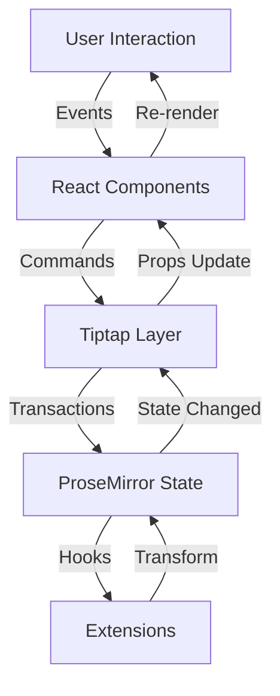
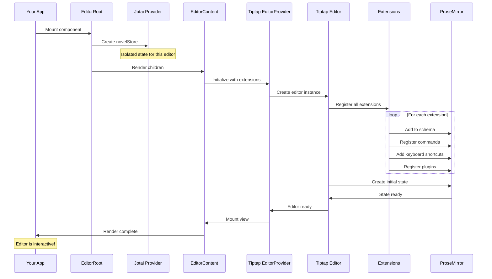
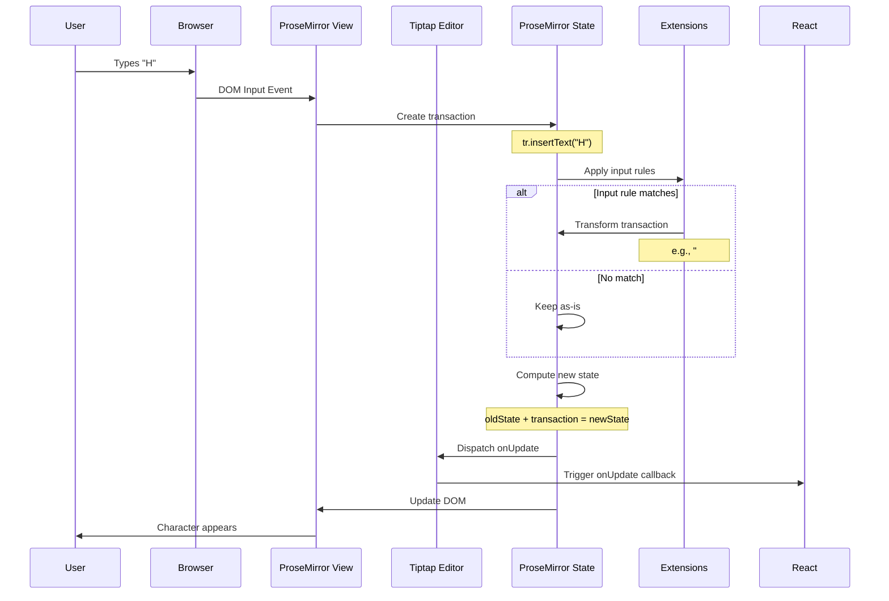
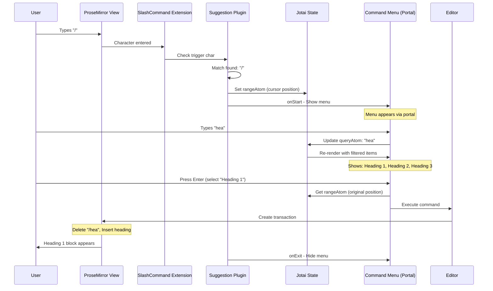
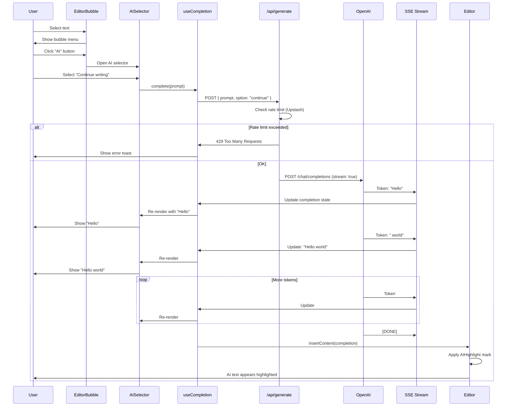
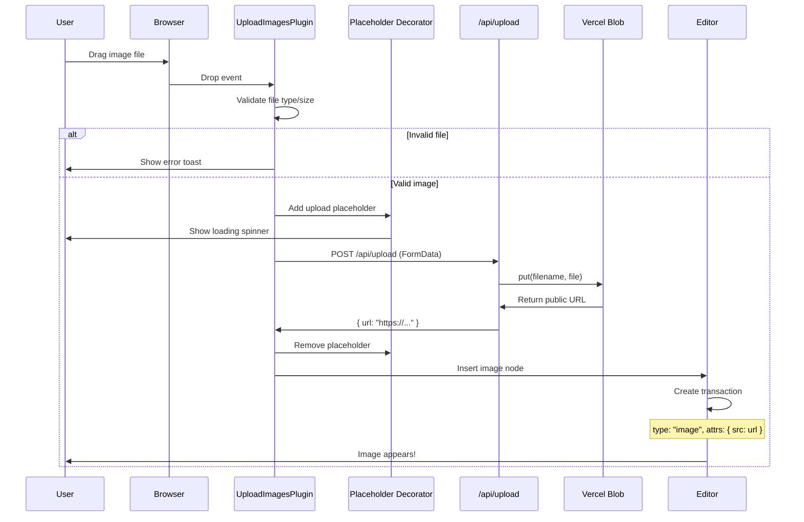
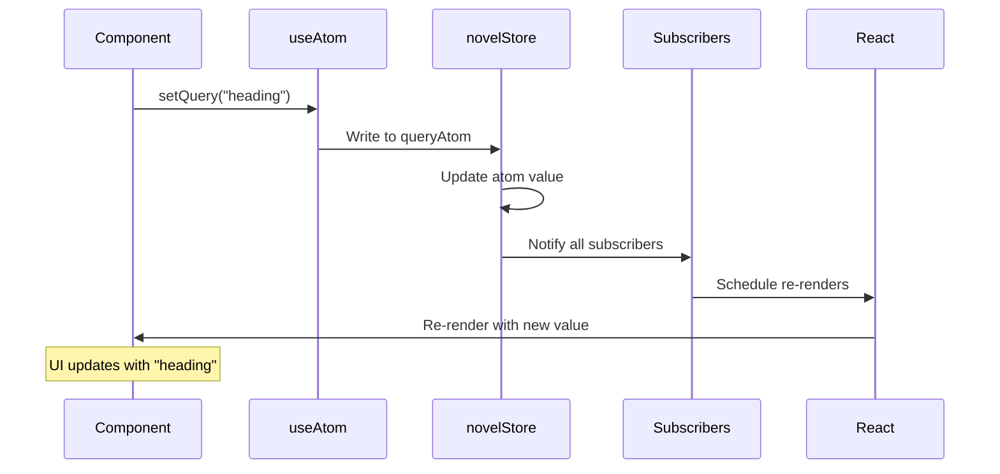
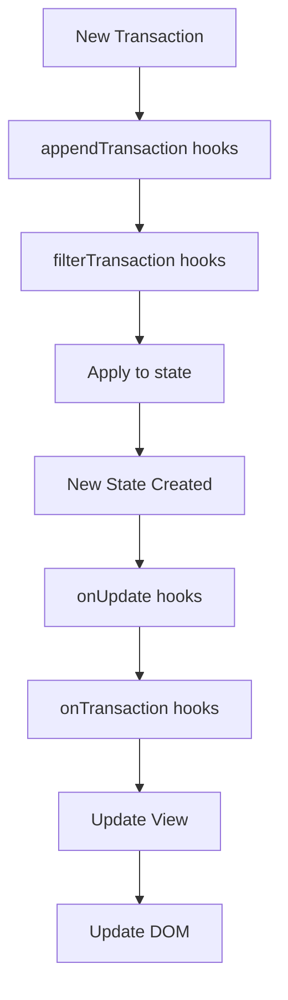
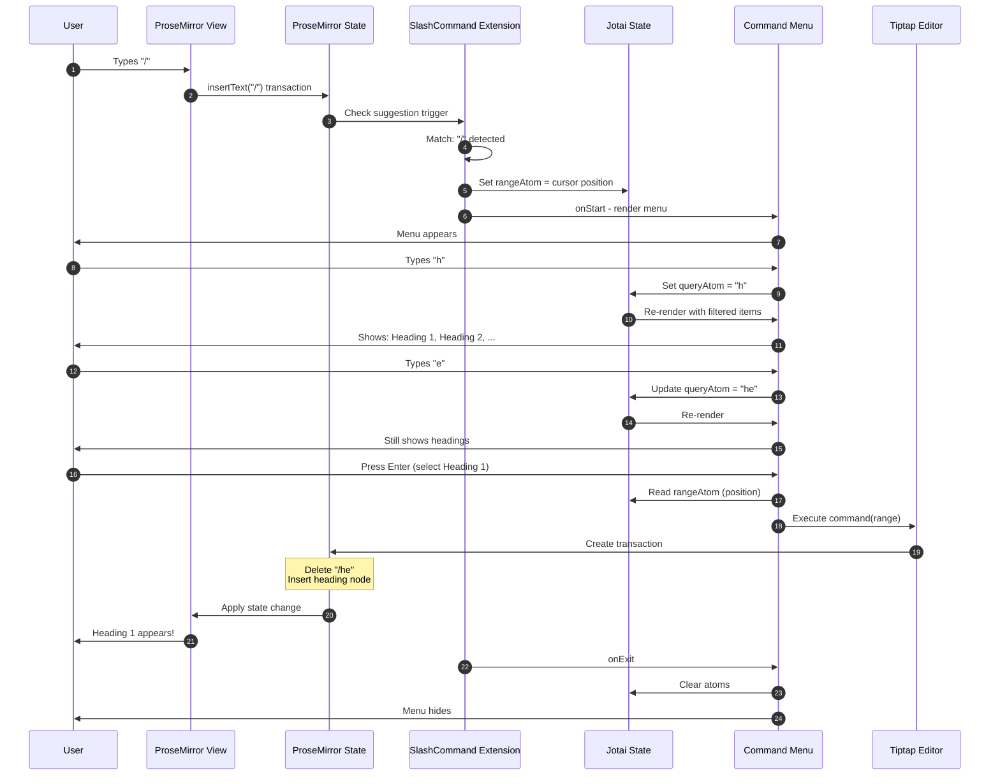

# Data Flow Guide: Understanding Information Movement

**Last Updated:** November 19, 2025
**Target Audience:** Mid-level → Full-stack architects
**Reading Time:** 60-90 minutes

This guide teaches you **HOW data flows** through Novel - from user input to screen updates. You'll understand the complete lifecycle of every interaction.

---

## Table of Contents

1. [Data Flow Philosophy](#data-flow-philosophy)
2. [Editor Initialization Flow](#editor-initialization-flow)
3. [User Input Flow](#user-input-flow)
4. [Slash Command Flow](#slash-command-flow)
5. [AI Completion Flow](#ai-completion-flow)
6. [Image Upload Flow](#image-upload-flow)
7. [State Update Flow](#state-update-flow)
8. [Extension Execution Flow](#extension-execution-flow)
9. [Complete Request Lifecycle](#complete-request-lifecycle)
10. [Performance Patterns](#performance-patterns)

---

## Data Flow Philosophy

### Unidirectional Data Flow

Novel follows **unidirectional data flow**:

```
User Action → State Change → Re-render
     ↓              ↓            ↓
  (Input)     (Immutable)   (Declarative)
```

🧠 **Mental Model**: Like React's one-way data binding:
- Data flows DOWN (props)
- Events flow UP (callbacks)
- State is the SINGLE source of truth

### Architectural Layers



---

## Editor Initialization Flow

### Complete Startup Sequence



**Detailed Steps:**

1. **EditorRoot Setup**
   ```tsx
   // packages/headless/src/components/editor.tsx
   export const EditorRoot = ({ children }) => {
     const tunnelInstance = useRef(tunnel()).current

     return (
       <Provider store={novelStore}>
         <EditorCommandTunnelContext.Provider value={tunnelInstance}>
           {children}
         </EditorCommandTunnelContext.Provider>
       </Provider>
     )
   }
   ```
   - Creates isolated Jotai store
   - Sets up tunnel for command menu
   - Provides context to children

2. **EditorContent Initialization**
   ```tsx
   export const EditorContent = ({ initialContent, extensions, ...rest }) => (
     <div>
       <EditorProvider
         content={initialContent}
         extensions={extensions}
         {...rest}
       >
         {children}
       </EditorProvider>
     </div>
   )
   ```
   - Receives initial content (JSONContent)
   - Gets extension list
   - Passes to Tiptap

3. **Tiptap Editor Creation**
   ```typescript
   // Inside Tiptap
   const editor = new Editor({
     extensions: [
       StarterKit,
       AIHighlight,
       SlashCommand,
       // ... all extensions
     ],
     content: initialContent,
     onUpdate: ({ editor }) => {
       // State changed!
     }
   })
   ```

4. **Extension Registration**
   ```typescript
   // For each extension
   extension.onCreate()              // Setup
   schema.addNode(extension.schema)  // Add to schema
   commands.add(extension.commands)  // Register commands
   keymap.add(extension.keys)        // Keyboard shortcuts
   plugins.add(extension.plugins)    // ProseMirror plugins
   ```

5. **ProseMirror State Creation**
   ```typescript
   const state = EditorState.create({
     doc: Node.fromJSON(schema, initialContent),
     plugins: [...allPlugins],
   })
   ```

6. **View Rendering**
   ```typescript
   const view = new EditorView(domNode, {
     state,
     dispatchTransaction(tr) {
       // Handle state updates
     }
   })
   ```

💡 **Initialization Time**: ~50-100ms for typical editor

---

## User Input Flow

### Typing Flow (Character Input)



**Code Example:**

```typescript
// apps/web/components/tailwind/advanced-editor.tsx
const editor = useEditor({
  extensions: defaultExtensions,

  onUpdate: ({ editor }) => {
    // User typed something!
    const json = editor.getJSON()
    const html = editor.getHTML()

    // Debounced save
    debouncedSave(json)

    // Update UI
    setSaveStatus('Unsaved')
  },
})
```

### Input Rules in Action

**Pattern**: Auto-formatting as you type

```typescript
// Example: "##" + space → Heading 2
addInputRules() {
  return [
    textblockTypeInputRule({
      find: /^##\s$/,    // Regex: ## followed by space
      type: this.type,   // heading type
      getAttributes: () => ({ level: 2 }),
    }),
  ]
}
```

**Flow:**

```
User types: "#"        → State: "# "
User types: "#"        → State: "##"
User types: " " (space)
  ↓
Input rule matches /^##\s$/
  ↓
Transaction transforms:
  - Delete "## "
  - Insert heading node (level: 2)
  - Set cursor inside heading
  ↓
User sees: [Heading 2 block with cursor]
```

---

## Slash Command Flow

### Complete Slash Command Lifecycle



**Detailed Code Flow:**

**1. Extension Setup:**
```typescript
// packages/headless/src/extensions/slash-command.tsx
const Command = Extension.create({
  addOptions() {
    return {
      suggestion: {
        char: "/",              // Trigger character
        command: ({ editor, range, props }) => {
          props.command({ editor, range })
        },
      },
    }
  },

  addProseMirrorPlugins() {
    return [
      Suggestion({
        editor: this.editor,
        ...this.options.suggestion,
      }),
    ]
  },
})
```

**2. Suggestion Detection:**
```typescript
// When "/" is typed
onStart: (props) => {
  // Store cursor position
  setAtom(rangeAtom, props.range)

  // Create React component for menu
  component = new ReactRenderer(EditorCommandOut, {
    props,
    editor: props.editor,
  })

  // Position menu with Tippy.js
  popup = tippy("body", {
    getReferenceClientRect: props.clientRect,
    content: component.element,
    placement: "bottom-start",
  })
}
```

**3. Query Updates:**
```typescript
// packages/headless/src/components/editor-command.tsx
export const EditorCommand = ({ children }) => {
  const [query, setQuery] = useAtom(queryAtom)

  return (
    <Command value={query} onValueChange={setQuery}>
      <Command.Input />
      <Command.List>
        {children}  {/* Filtered by query */}
      </Command.List>
    </Command>
  )
}
```

**4. Command Execution:**
```typescript
// apps/web/components/tailwind/slash-command.tsx
export const suggestionItems = [
  {
    title: "Heading 1",
    command: ({ editor, range }) => {
      editor
        .chain()
        .focus()
        .deleteRange(range)           // Remove "/hea"
        .setNode("heading", { level: 1 })  // Insert H1
        .run()
    },
  },
]
```

**5. Cleanup:**
```typescript
onExit: () => {
  popup?.[0]?.destroy()    // Remove Tippy popup
  component?.destroy()      // Unmount React component
  setAtom(rangeAtom, null)  // Clear stored range
}
```

💡 **Performance**: Menu filtering uses `cmdk`'s fuzzy search (sub-millisecond)

---

## AI Completion Flow

### End-to-End AI Generation



**Detailed Implementation:**

**1. Frontend Hook:**
```typescript
// apps/web/components/tailwind/generative/ai-selector.tsx
import { useCompletion } from 'ai/react'

export function AISelector() {
  const { completion, complete, isLoading } = useCompletion({
    api: '/api/generate',
    body: {
      option: 'continue',  // Or: improve, fix, shorter, longer
    },
    onFinish: (prompt, completion) => {
      // Insert into editor with AI highlight
      editor
        .chain()
        .focus()
        .insertContent(completion)
        .setAIHighlight()
        .run()

      toast.success('AI text inserted!')
    },
    onError: (error) => {
      toast.error('AI generation failed')
    },
  })

  return (
    <button onClick={() => complete(getPrevText(editor))}>
      {isLoading ? <Spinner /> : 'Continue writing'}
    </button>
  )
}
```

**2. API Route (Edge Runtime):**
```typescript
// apps/web/app/api/generate/route.ts
export const runtime = 'edge'

export async function POST(req: Request) {
  // 1. Rate limiting
  const ip = req.headers.get('x-forwarded-for')
  const { success } = await ratelimit.limit(ip)

  if (!success) {
    return new Response('Rate limit exceeded', { status: 429 })
  }

  // 2. Get prompt
  const { prompt, option } = await req.json()

  // 3. Build system message based on option
  const systemMessage = getSystemMessage(option)
  // e.g., "continue" → "You are a helpful writing assistant..."

  // 4. Call OpenAI
  const response = await openai.chat.completions.create({
    model: 'gpt-3.5-turbo',
    stream: true,
    messages: [
      { role: 'system', content: systemMessage },
      { role: 'user', content: prompt },
    ],
  })

  // 5. Convert to Edge-compatible stream
  const stream = OpenAIStream(response, {
    onStart: async () => {
      console.log('AI generation started')
    },
    onToken: async (token) => {
      console.log('Token:', token)
    },
    onCompletion: async (completion) => {
      console.log('Completed:', completion.length, 'chars')
    },
  })

  // 6. Return streaming response
  return new StreamingTextResponse(stream)
}
```

**3. Streaming Mechanism:**

```typescript
// How OpenAIStream works (conceptual)
function OpenAIStream(response) {
  return new ReadableStream({
    async start(controller) {
      for await (const chunk of response) {
        const token = chunk.choices[0]?.delta?.content
        if (token) {
          controller.enqueue(token)  // Send to frontend
        }
      }
      controller.close()
    },
  })
}
```

**4. Frontend Consumption:**

```typescript
// How useCompletion handles stream
useEffect(() => {
  if (!streamUrl) return

  const eventSource = new EventSource(streamUrl)

  eventSource.onmessage = (event) => {
    const token = event.data
    setCompletion(prev => prev + token)  // Append token
  }

  eventSource.onerror = () => {
    eventSource.close()
    setIsLoading(false)
  }
}, [streamUrl])
```

💡 **Why Streaming?**
- ✅ Faster perceived performance (see tokens immediately)
- ✅ Better UX (shows progress)
- ✅ Lower memory usage (process chunks)

---

## Image Upload Flow

### Drag & Drop Upload Sequence



**Implementation Details:**

**1. Plugin Setup:**
```typescript
// packages/headless/src/plugins/upload-images.tsx
export const UploadImagesPlugin = () => {
  return new Plugin({
    state: {
      init() {
        return DecorationSet.empty
      },

      apply(tr, set) {
        // Map existing decorations to new positions
        set = set.map(tr.mapping, tr.doc)

        // Add new upload decoration
        const action = tr.getMeta(this)
        if (action?.add) {
          const { id, pos } = action.add

          const decoration = Decoration.widget(pos, () => {
            const element = document.createElement('div')
            element.className = 'image-upload-placeholder'
            element.innerHTML = '<div class="spinner">Uploading...</div>'
            element.setAttribute('data-upload-id', id)
            return element
          })

          set = set.add(tr.doc, [decoration])
        }

        // Remove decoration when done
        if (action?.remove) {
          set = set.remove(
            set.find(null, null, spec => spec.id === action.remove.id)
          )
        }

        return set
      },
    },

    props: {
      decorations(state) {
        return this.getState(state)
      },

      handleDOMEvents: {
        drop(view, event) {
          const files = event.dataTransfer?.files
          if (!files?.length) return false

          event.preventDefault()

          Array.from(files).forEach(file => {
            if (file.type.startsWith('image/')) {
              handleImageUpload(file, view, event)
            }
          })

          return true
        },
      },
    },
  })
}
```

**2. Upload Handler:**
```typescript
async function handleImageUpload(file, view, event) {
  // 1. Validate
  if (file.size > 20 * 1024 * 1024) {
    toast.error('Image too large (max 20MB)')
    return
  }

  // 2. Get drop position
  const pos = view.posAtCoords({
    left: event.clientX,
    top: event.clientY,
  })?.pos || view.state.selection.from

  // 3. Add placeholder
  const uploadId = Math.random().toString(36)
  const tr = view.state.tr
  tr.setMeta(UploadImagesPlugin, {
    add: { id: uploadId, pos },
  })
  view.dispatch(tr)

  // 4. Upload
  const formData = new FormData()
  formData.append('file', file)

  try {
    const response = await fetch('/api/upload', {
      method: 'POST',
      body: formData,
    })

    const { url } = await response.json()

    // 5. Remove placeholder
    const removeTr = view.state.tr
    removeTr.setMeta(UploadImagesPlugin, {
      remove: { id: uploadId },
    })
    view.dispatch(removeTr)

    // 6. Insert image
    const imageNode = view.state.schema.nodes.image.create({ src: url })
    const insertTr = view.state.tr.insert(pos, imageNode)
    view.dispatch(insertTr)

    toast.success('Image uploaded!')

  } catch (error) {
    // Remove placeholder on error
    const removeTr = view.state.tr
    removeTr.setMeta(UploadImagesPlugin, {
      remove: { id: uploadId },
    })
    view.dispatch(removeTr)

    toast.error('Upload failed')
  }
}
```

**3. API Route:**
```typescript
// apps/web/app/api/upload/route.ts
export const runtime = 'edge'

export async function POST(req: Request) {
  const formData = await req.formData()
  const file = formData.get('file') as File

  if (!file) {
    return new Response('No file provided', { status: 400 })
  }

  // Upload to Vercel Blob
  const blob = await put(file.name, file, {
    access: 'public',
    contentType: file.type,
  })

  return Response.json({ url: blob.url })
}
```

💡 **Decorations Pattern**: Perfect for ephemeral UI (upload progress, cursors, highlights)

---

## State Update Flow

### Jotai State Updates



**Code Example:**

```typescript
// Atom definition
export const queryAtom = atom<string>("")

// Writer component
function CommandInput() {
  const [, setQuery] = useAtom(queryAtom)

  return (
    <input onChange={(e) => setQuery(e.target.value)} />
  )
}

// Reader component (different part of tree!)
function CommandList() {
  const [query] = useAtom(queryAtom)
  const items = filterItems(allItems, query)

  return items.map(item => <Item key={item.id} {...item} />)
}
```

**Why Only Subscribers Re-render:**

```typescript
// Component A - Uses queryAtom
function CompA() {
  const [query] = useAtom(queryAtom)  // ← Subscribes
  return <div>{query}</div>           // ← Re-renders on change
}

// Component B - Uses rangeAtom
function CompB() {
  const [range] = useAtom(rangeAtom)  // ← Different atom
  return <div>{range}</div>           // ← Doesn't re-render!
}

// Component C - Doesn't use atoms
function CompC() {
  return <div>Static</div>            // ← Never re-renders
}
```

💡 **Performance**: Only components using changed atom re-render

---

## Extension Execution Flow

### How Extensions Process Changes



**Extension Hook Order:**

```typescript
// 1. appendTransaction - Modify transaction
extension.addProseMirrorPlugins() {
  return [
    new Plugin({
      appendTransaction(transactions, oldState, newState) {
        // Add additional changes to transaction
        // e.g., Auto-capitalize first letter
        return tr  // Additional transaction (optional)
      },
    }),
  ]
}

// 2. filterTransaction - Veto transaction
extension.addProseMirrorPlugins() {
  return [
    new Plugin({
      filterTransaction(transaction, state) {
        // Return false to cancel transaction
        // e.g., Prevent editing in read-only mode
        return !isReadOnly
      },
    }),
  ]
}

// 3. State applied
// newState = oldState.apply(transaction)

// 4. onUpdate - React to changes
extension.onUpdate() {
  // Called after state updated
  // Access: this.editor.state
}

// 5. onTransaction - Low-level hook
extension.onTransaction({ transaction }) {
  // Called for every transaction
  // Use for analytics, logging, etc.
}
```

**Example: Auto-save Extension**

```typescript
const AutoSave = Extension.create({
  name: 'autoSave',

  addOptions() {
    return {
      delay: 1000,  // 1 second
    }
  },

  onCreate() {
    this.storage.saveTimeout = null
  },

  onUpdate() {
    // Debounced save
    clearTimeout(this.storage.saveTimeout)

    this.storage.saveTimeout = setTimeout(() => {
      const json = this.editor.getJSON()
      saveToBackend(json)
    }, this.options.delay)
  },

  onDestroy() {
    clearTimeout(this.storage.saveTimeout)
  },
})
```

---

## Complete Request Lifecycle

### Full User Journey: "Type / → Select Heading → See Result"



**Time Breakdown:**

| Step | Duration | Notes |
|------|----------|-------|
| Keystroke → Insert | <16ms | One frame |
| Suggestion detection | <1ms | Regex match |
| Menu render | ~50ms | React render + portal |
| Query filtering | <1ms | cmdk fuzzy search |
| Command execution | <10ms | Transaction + render |
| **Total** | **~77ms** | Feels instant |

---

## Performance Patterns

### Optimization Strategies

**1. Debouncing**

```typescript
// ❌ BAD: Save on every keystroke
editor.on('update', () => {
  saveToBackend(editor.getJSON())  // 1000s of API calls!
})

// ✅ GOOD: Debounced save
const debouncedSave = useDebouncedCallback(
  (content) => saveToBackend(content),
  500  // Wait 500ms after last keystroke
)

editor.on('update', () => {
  debouncedSave(editor.getJSON())  // Max 1 call per 500ms
})
```

**2. Lazy Loading**

```typescript
// Load heavy extensions only when needed
const [showMath, setShowMath] = useState(false)

const extensions = useMemo(() => [
  StarterKit,
  ...(showMath ? [Mathematics] : []),  // Conditional
], [showMath])
```

**3. Transaction Batching**

```typescript
// ❌ BAD: Multiple transactions
editor.commands.focus()
editor.commands.setHeading({ level: 1 })
editor.commands.insertContent('Hello')
// 3 separate renders!

// ✅ GOOD: Chain commands (one transaction)
editor
  .chain()
  .focus()
  .setHeading({ level: 1 })
  .insertContent('Hello')
  .run()
// 1 render!
```

**4. Memoization**

```typescript
// ❌ BAD: Recreate on every render
function MyEditor() {
  const extensions = [StarterKit, ...]  // New array every render!

  return <EditorContent extensions={extensions} />
}

// ✅ GOOD: Memoized extensions
function MyEditor() {
  const extensions = useMemo(() => [
    StarterKit,
    ...
  ], [])  // Created once

  return <EditorContent extensions={extensions} />
}
```

**5. Virtualization** (for large documents)

```typescript
// For 1000+ paragraph documents
import { VirtualScroller } from 'some-library'

// Render only visible nodes
<VirtualScroller
  items={document.content}
  renderItem={(node) => <NodeView node={node} />}
/>
```

---

## Summary

### Key Dataflow Patterns

1. **Unidirectional Flow**: User → State → UI
2. **Immutable State**: Every change creates new state
3. **Transaction-Based**: All changes go through transactions
4. **Extension Hooks**: Extensions transform data at each step
5. **Atomic State**: Jotai for fine-grained updates
6. **Streaming**: Real-time AI completion
7. **Decorations**: Ephemeral UI without state
8. **Debouncing**: Performance optimization

### Architecture Principles

- ✅ **Single Source of Truth**: ProseMirror state
- ✅ **Declarative**: Describe what, not how
- ✅ **Composable**: Extensions combine cleanly
- ✅ **Type-Safe**: TypeScript throughout
- ✅ **Performant**: Sub-frame updates

**Next Steps:**
1. [Editor Core Guide](./EDITOR_CORE_GUIDE.md) - Deep dive extensions
2. [State Management](./STATE_MANAGEMENT.md) - Master Jotai
3. [How-To Guide](./HOW_TO_GUIDE.md) - Implement features

---

**You now understand HOW data flows through Novel!** 🌊

**Last Updated:** November 19, 2025
**Reading Time:** 90 minutes
**Status:** ✅ Complete data flow guide with diagrams
