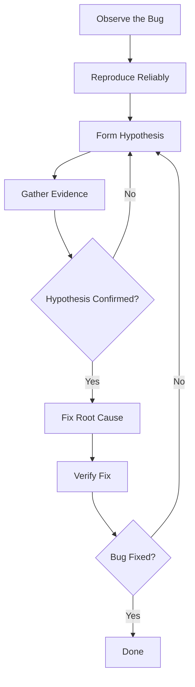

# Debugging Guide

> **Document Version**: 1.0
> **Last Updated**: November 2025
> **Audience**: Developers learning systematic debugging techniques

---

## Introduction

### What This Guide Covers

Debugging is a critical skill that separates junior developers from senior developers. This guide will teach you **systematic debugging techniques** that work across all levels of the stack.

**You'll learn**:
- **Debugging Philosophy** - How to think like a debugger, not a guesser
- **Browser DevTools** - Mastering Chrome/Firefox DevTools for frontend debugging
- **React Debugging** - React DevTools, component inspection, hooks debugging
- **Editor Debugging** - Tiptap/ProseMirror state inspection and transaction logging
- **State Management Debugging** - Jotai DevTools and atom tracking
- **Backend Debugging** - API route debugging, logging, error tracking
- **Build Issues** - TypeScript errors, bundling problems, dependency conflicts
- **Performance Debugging** - React Profiler, Lighthouse, bundle analysis
- **Common Error Patterns** - Hydration errors, circular dependencies, memory leaks
- **Debugging Tools** - VS Code debugger, Chrome DevTools, browser extensions

### Debugging Mindset

**Novice Developer Approach**:
> "It's broken. Let me try random things until it works."
> - Change code blindly
> - Console.log everywhere
> - Ask "Why doesn't it work?"
> - Give up and ask for help

**Professional Developer Approach**:
> "Something unexpected happened. Let me investigate systematically."
> - Reproduce the issue reliably
> - Form a hypothesis about the cause
> - Test the hypothesis with evidence
> - Fix the root cause, not symptoms
> - Verify the fix doesn't break anything else

---

## Table of Contents

- [Part 1: Debugging Fundamentals](#part-1-debugging-fundamentals)
- [Part 2: Browser DevTools](#part-2-browser-devtools)
- [Part 3: Debugging React Components](#part-3-debugging-react-components)
- [Part 4: Debugging Editor & Tiptap](#part-4-debugging-editor--tiptap)
- [Part 5: Debugging State Management](#part-5-debugging-state-management)
- [Part 6: Debugging Backend API Routes](#part-6-debugging-backend-api-routes)
- [Part 7: Debugging Build Issues](#part-7-debugging-build-issues)
- [Part 8: Performance Debugging](#part-8-performance-debugging)
- [Part 9: Common Error Patterns](#part-9-common-error-patterns)
- [Part 10: Debugging Tools Setup](#part-10-debugging-tools-setup)
- [Part 11: Logging Best Practices](#part-11-logging-best-practices)

---

## Part 1: Debugging Fundamentals

### The Scientific Method for Debugging

Debugging is like being a detective. Follow these steps:



#### Step 1: Observe the Bug

**Bad Observation**:
> "The editor is broken."

**Good Observation**:
> "When I type '/' and press Enter without selecting a command, the editor crashes with 'Cannot read property of undefined' in the console. This happens 100% of the time in Chrome 120 on macOS."

**What makes a good observation?**
- **Specific** - Exact behavior, not vague
- **Reproducible** - Steps to make it happen
- **Contextual** - Browser, OS, environment
- **Evidence** - Error messages, screenshots, console logs

#### Step 2: Reproduce Reliably

You can't fix what you can't reproduce.

**Create a minimal reproduction**:

```typescript
// ❌ Bad: Too much code, hard to isolate
function testEverything() {
  setupEditor();
  loadContent();
  triggerSlashCommand();
  filterCommands();
  selectCommand();
  executeCommand();
  // Which step causes the bug?
}

// ✅ Good: Minimal steps to reproduce
function testBug() {
  const editor = new Editor({ extensions: [SlashCommand] });
  editor.commands.insertContent('/');
  editor.commands.enter(); // Bug happens here
}
```

#### Step 3: Form a Hypothesis

Based on evidence, what do you think is wrong?

**Example**:
- **Observation**: Editor crashes when pressing Enter after "/"
- **Hypothesis**: The command selection logic assumes a command is always selected, but pressing Enter immediately doesn't select anything
- **Prediction**: If hypothesis is true, `selectedCommand` will be `undefined`

#### Step 4: Gather Evidence

Use debugging tools to test your hypothesis:

```typescript
// Add strategic logging
editor.commands.enter = () => {
  const selectedCommand = getSelectedCommand();
  console.log('Selected command:', selectedCommand); // Evidence gathering

  if (!selectedCommand) {
    console.error('No command selected!'); // Hypothesis confirmed
    return;
  }

  executeCommand(selectedCommand);
};
```

#### Step 5: Fix Root Cause

Don't fix symptoms - fix the underlying problem.

```typescript
// ❌ Bad: Fixes symptom
editor.commands.enter = () => {
  try {
    executeCommand(selectedCommand);
  } catch (e) {
    // Swallow error - bug still exists
  }
};

// ✅ Good: Fixes root cause
editor.commands.enter = () => {
  const selectedCommand = getSelectedCommand();

  if (!selectedCommand) {
    console.warn('No command selected');
    return; // Early return prevents crash
  }

  executeCommand(selectedCommand);
};
```

### Debugging Strategies

#### Binary Search Debugging

When you don't know where a bug is, eliminate half the code at a time:

```typescript
// Bug: Function returns wrong result
function complexFunction(input: string) {
  const step1 = processInput(input);
  console.log('After step 1:', step1); // Checkpoint

  const step2 = transformData(step1);
  console.log('After step 2:', step2); // Checkpoint

  const step3 = validateOutput(step2);
  console.log('After step 3:', step3); // Checkpoint

  return step3;
}

// Binary search:
// - If step1 is wrong → bug is in processInput
// - If step1 is correct but step2 is wrong → bug is in transformData
// - etc.
```

#### Rubber Duck Debugging

Explain your code out loud (to a rubber duck, or colleague):

```typescript
// "This function should filter commands based on query..."
function filterCommands(query: string) {
  return commands.filter(cmd => cmd.name.includes(query));
  // "Wait - includes() is case-sensitive! That's the bug."
}
```

Often, explaining the problem reveals the solution.

#### Working Backward

Start from the error and work backward to the cause:

```
Error: Cannot read property 'execute' of undefined
  at executeCommand (slash-command.tsx:45)
  at handleEnter (editor-command.tsx:120)
  at onKeyDown (editor.tsx:89)

Working backward:
1. Line 45: `command.execute()` fails because `command` is undefined
2. Line 120: `executeCommand()` is called with undefined
3. Line 89: Where does the undefined value come from?
4. Found: `getSelectedCommand()` returns undefined when no selection
```

---

## Part 2: Browser DevTools

### Chrome DevTools Basics

Open DevTools: `F12` or `Cmd+Option+I` (Mac) / `Ctrl+Shift+I` (Windows)

#### Console Tab

The console is your best friend for debugging.

**1. Basic Logging**:

```typescript
console.log('Simple message');
console.log('Value:', value);
console.log('Multiple values:', value1, value2, value3);

// Object logging
console.log('User:', { name: 'John', age: 30 });

// Table format for arrays
console.table([
  { name: 'Heading 1', value: 'h1' },
  { name: 'Heading 2', value: 'h2' },
]);
```

**2. Log Levels**:

```typescript
console.log('Info message'); // White
console.info('Information'); // Blue
console.warn('Warning'); // Yellow
console.error('Error'); // Red
console.debug('Debug info'); // Gray
```

**3. Grouped Logs**:

```typescript
console.group('User Actions');
console.log('Action 1: Click button');
console.log('Action 2: Type text');
console.groupEnd();

// Collapsed by default
console.groupCollapsed('Details');
console.log('Hidden details');
console.groupEnd();
```

**4. Timing**:

```typescript
console.time('Operation');
// Do expensive operation
performHeavyCalculation();
console.timeEnd('Operation');
// Output: Operation: 1234.56ms
```

**5. Conditional Logging**:

```typescript
console.assert(value > 0, 'Value must be positive');
// Only logs if assertion fails
```

**6. Trace**:

```typescript
function a() {
  b();
}

function b() {
  c();
}

function c() {
  console.trace('How did we get here?');
}

a();
// Shows full call stack: a → b → c
```

#### Sources Tab - Breakpoints

Breakpoints pause code execution so you can inspect state.

**1. Line Breakpoints**:
- Click line number in Sources tab
- Code pauses when that line executes
- Inspect variables in Scope panel

**2. Conditional Breakpoints**:
- Right-click line number → "Add conditional breakpoint"
- Enter condition: `user.id === 123`
- Only pauses when condition is true

**3. Logpoints**:
- Right-click line number → "Add logpoint"
- Enter: `"User:", user.name`
- Logs without pausing (like console.log but no code changes)

**4. DOM Breakpoints**:
- Right-click element in Elements tab
- "Break on" → "Subtree modifications" / "Attribute modifications"
- Pauses when element changes

**Example Debugging Session**:

```typescript
// Bug: User name not updating
function updateUser(userId: number, name: string) {
  const user = users.find(u => u.id === userId); // Add breakpoint here

  if (user) {
    user.name = name; // Step through to here
    saveUser(user); // And here
  }
}

// When breakpoint hits:
// 1. Check `userId` in Scope panel → 123 ✓
// 2. Check `users` array → Has user with id 123 ✓
// 3. Check `user` → undefined ✗ (Bug found!)
// 4. Reason: users.find() not finding user
// 5. Check condition: u.id === userId → "123" === 123 (string vs number!)
```

#### Network Tab

Debug API calls and network requests.

**1. Filter Requests**:
- Filter by type: XHR, JS, CSS, Img, Media, Font, Doc, WS
- Search by URL
- Show only errors

**2. Inspect Request**:
Click request → Tabs appear:
- **Headers** - Request/response headers, status code
- **Preview** - Formatted response
- **Response** - Raw response
- **Timing** - Time breakdown

**Example - Debugging Failed API Call**:

```typescript
// POST /api/generate returns 400 Bad Request

// In Network tab:
// 1. Click failed request
// 2. Headers tab shows:
//    Status Code: 400 Bad Request
// 3. Response tab shows:
//    "Invalid prompt"
// 4. Payload tab shows request body:
//    { prompt: undefined }  ← Bug! prompt is undefined
```

**3. Throttling**:
- Simulate slow network
- Network tab → Throttling dropdown
- Options: Fast 3G, Slow 3G, Offline
- Tests loading states, timeouts

#### Application Tab

Inspect client-side storage.

**1. Local Storage**:
```
Application → Local Storage → http://localhost:3000
```

View/edit/delete localStorage items:
- Check saved editor content
- Verify auth tokens
- Debug persistence issues

**2. Session Storage**:
Similar to localStorage but session-only.

**3. Cookies**:
View/edit cookies (useful for auth debugging).

#### Performance Tab

Record and analyze performance.

**Steps**:
1. Click record (●)
2. Perform slow action
3. Stop recording
4. Analyze timeline

**What to look for**:
- Long tasks (>50ms)
- Layout thrashing
- Expensive renders

---

## Part 3: Debugging React Components

### React DevTools

Install: [Chrome Extension](https://chrome.google.com/webstore) → Search "React Developer Tools"

#### Components Tab

Inspect React component tree.

**1. Select Component**:
- Click component in tree
- Or click "Select element in page" (crosshair icon) and click on page

**2. Inspect Props**:
```tsx
<EditorCommand
  value="heading-1"
  onCommand={handleCommand}
  isSelected={true}
/>
```

In React DevTools:
```
Props
  value: "heading-1"
  onCommand: ƒ handleCommand()
  isSelected: true
```

**3. Inspect State**:
```tsx
const [query, setQuery] = useState('');
const [selectedIndex, setSelectedIndex] = useState(0);
```

Shows:
```
Hooks
  State: ""
  State: 0
```

**4. Edit Props/State**:
- Double-click value
- Change to test different scenarios
- See component re-render with new values

**5. Component Source**:
- Right side shows component definition
- Click to jump to source in DevTools

**6. Component Stack**:
Shows component hierarchy:
```
<EditorRoot>
  <EditorContent>
    <EditorCommand>
      <EditorCommandItem> ← You are here
```

#### Debugging Hooks

**Problem**: Which hook is causing re-renders?

```tsx
function MyComponent() {
  const [count, setCount] = useState(0);
  const [name, setName] = useState('');
  const value = useExpensiveComputation(count);

  // Which hook is causing unnecessary renders?
}
```

**Solution**: React DevTools Profiler

1. Open Profiler tab
2. Click record (●)
3. Interact with component
4. Stop recording
5. See which renders and why

**Profiler shows**:
```
MyComponent rendered 10 times
├─ Render 1: State change (hook 0: count)
├─ Render 2: State change (hook 0: count)
├─ Render 3: State change (hook 1: name) ← Unnecessary?
└─ ...
```

### Common React Debugging Patterns

#### 1. Component Not Rendering

**Symptom**: Component doesn't appear on screen.

**Debug Steps**:
```tsx
function MyComponent({ isVisible }: { isVisible: boolean }) {
  console.log('MyComponent rendering, isVisible:', isVisible);

  if (!isVisible) {
    console.log('Component hidden by condition');
    return null;
  }

  return <div>Content</div>;
}

// Check:
// 1. Is component called? (console.log appears)
// 2. What is isVisible value?
// 3. Is return statement reached?
// 4. Is parent rendering?
```

#### 2. Component Rendering Too Many Times

**Symptom**: Performance issues, infinite loops.

**Debug**:
```tsx
function MyComponent({ data }: { data: object }) {
  console.count('MyComponent render'); // Shows render count

  useEffect(() => {
    console.log('Effect ran');
  }, [data]); // ← Bug: data is new object every render

  return <div>{data.value}</div>;
}

// Output:
// MyComponent render: 1
// Effect ran
// MyComponent render: 2
// Effect ran
// MyComponent render: 3  ← Infinite loop!
```

**Solution**:
```tsx
// Problem: Parent creates new object every render
<MyComponent data={{ value: 'test' }} /> // ← New object

// Fix: Memoize or use primitive values
const data = useMemo(() => ({ value: 'test' }), []);
<MyComponent data={data} />
```

#### 3. State Not Updating

**Symptom**: setState called but component doesn't re-render.

**Debug**:
```tsx
function MyComponent() {
  const [count, setCount] = useState(0);

  const handleClick = () => {
    console.log('Before setState:', count);
    setCount(count + 1);
    console.log('After setState:', count); // Still old value!
  };

  console.log('Render, count:', count);

  return <button onClick={handleClick}>Count: {count}</button>;
}

// Why? setState is async, doesn't update immediately
// Component will re-render with new value

// Click output:
// Before setState: 0
// After setState: 0  ← Still old
// Render, count: 1   ← Updated on next render
```

#### 4. Props Not Updating

**Symptom**: Parent passes new props but child doesn't update.

**Debug**:
```tsx
// Parent
function Parent() {
  const [value, setValue] = useState(0);
  console.log('Parent render, value:', value);

  return <Child value={value} />;
}

// Child
const Child = React.memo(({ value }: { value: number }) => {
  console.log('Child render, value:', value);
  return <div>{value}</div>;
});

// Check console:
// Parent render, value: 1
// Child render, value: 1 ← Updates correctly

// If child doesn't render:
// Problem: React.memo preventing render
// Solution: Check memo dependencies or remove memo
```

---

## Part 4: Debugging Editor & Tiptap

### Understanding Editor State

Tiptap/ProseMirror has complex internal state. Here's how to inspect it.

#### Accessing Editor State

```typescript
// Get editor instance
const editor = useEditor({
  extensions: [StarterKit],
  content: '<p>Hello</p>',
});

// Inspect state
console.log('Editor state:', editor?.state);
console.log('Document:', editor?.state.doc);
console.log('Selection:', editor?.state.selection);
console.log('Plugins:', editor?.state.plugins);
```

**Key State Properties**:

```typescript
editor.state = {
  doc: Node,           // Document content (ProseMirror Node)
  selection: Selection, // Current cursor/selection
  tr: Transaction,     // Current transaction (if any)
  storedMarks: Mark[], // Marks to apply to next input
  schema: Schema,      // Document schema (allowed nodes/marks)
  plugins: Plugin[],   // Active plugins
}
```

#### Debugging Document Content

**Problem**: Content not rendering correctly.

```typescript
// Check document structure
console.log('Document JSON:', editor.state.doc.toJSON());
// Output:
// {
//   type: 'doc',
//   content: [
//     { type: 'paragraph', content: [{ type: 'text', text: 'Hello' }] }
//   ]
// }

// Check HTML output
console.log('HTML:', editor.getHTML());
// Output: <p>Hello</p>

// Check plain text
console.log('Text:', editor.state.doc.textContent);
// Output: Hello
```

#### Debugging Selection

**Problem**: Commands not applying to correct range.

```typescript
const { selection } = editor.state;

console.log('Selection type:', selection.constructor.name);
// Output: TextSelection | NodeSelection | AllSelection

console.log('From:', selection.from, 'To:', selection.to);
// Output: From: 1 To: 6

console.log('Empty?', selection.empty);
// true = cursor, false = range selected

// Get selected text
const selectedText = editor.state.doc.textBetween(
  selection.from,
  selection.to
);
console.log('Selected text:', selectedText);
```

#### Transaction Logging

See every change to the editor:

```typescript
editor.on('transaction', ({ transaction }) => {
  console.group('Transaction');
  console.log('Steps:', transaction.steps.length);

  transaction.steps.forEach((step, index) => {
    console.log(`Step ${index}:`, step.toJSON());
  });

  console.log('Selection changed:', transaction.selectionSet);
  console.log('Document changed:', transaction.docChanged);
  console.groupEnd();
});

// Now interact with editor:
// Type "hello"
// Console shows:
// Transaction
//   Steps: 1
//   Step 0: { stepType: "replace", from: 1, to: 1, slice: ... }
//   Selection changed: true
//   Document changed: true
```

#### Debugging Commands

**Problem**: Command not executing.

```typescript
// Check if command exists
console.log('setHeading command:', editor.commands.setHeading);

// Try executing with logging
const result = editor.chain()
  .focus()
  .setHeading({ level: 1 })
  .run();

console.log('Command succeeded:', result);
// false = command failed

// Check why it failed
if (!result) {
  // Check selection
  console.log('Selection:', editor.state.selection);

  // Check if heading is allowed at this position
  const { $from } = editor.state.selection;
  console.log('Can insert heading:', $from.parent.type.name);

  // Check schema
  console.log('Allowed nodes:', editor.schema.spec.nodes);
}
```

#### Debugging Extensions

**Problem**: Extension not working.

```typescript
// Check extension is registered
console.log('Extensions:', editor.extensionManager.extensions.map(e => e.name));
// Output: ['doc', 'paragraph', 'text', 'heading', 'bold', ...]

// Check extension config
const heading = editor.extensionManager.extensions.find(e => e.name === 'heading');
console.log('Heading config:', heading?.options);

// Test extension command
if (editor.can().setHeading({ level: 1 })) {
  console.log('Can set heading');
} else {
  console.log('Cannot set heading at current position');
}
```

### ProseMirror DevTools

Install browser extension for deep inspection:
- Chrome: [ProseMirror DevTools](https://chrome.google.com/webstore)

Features:
- Visualize document structure
- Inspect node attributes
- See transaction history
- Test queries interactively

---

## Part 5: Debugging State Management

### Debugging Jotai Atoms

Novel uses Jotai for state management. Here's how to debug it.

#### Accessing Atom Values

```typescript
import { useAtomValue, useSetAtom } from 'jotai';
import { queryAtom, rangeAtom } from './atoms';

function DebugPanel() {
  const query = useAtomValue(queryAtom);
  const range = useAtomValue(rangeAtom);

  return (
    <div style={{ position: 'fixed', bottom: 0, right: 0, background: 'white' }}>
      <h3>Debug Panel</h3>
      <div>Query: {query}</div>
      <div>Range: {JSON.stringify(range)}</div>
    </div>
  );
}

// Add to your app during development
<EditorRoot>
  <EditorContent />
  {process.env.NODE_ENV === 'development' && <DebugPanel />}
</EditorRoot>
```

#### Atom Update Tracking

**Problem**: Atom updating unexpectedly.

```typescript
import { atom } from 'jotai';

// Wrap atom with logging
export const queryAtom = atom(
  (get) => {
    const value = baseQueryAtom.read(get);
    console.log('queryAtom read:', value);
    return value;
  },
  (get, set, newValue) => {
    console.log('queryAtom write:', newValue);
    console.trace('Update source'); // Shows call stack
    set(baseQueryAtom, newValue);
  }
);
```

#### Jotai DevTools

Install [jotai-devtools](https://jotai.org/docs/tools/devtools):

```bash
pnpm add -D jotai-devtools
```

```tsx
import { DevTools } from 'jotai-devtools';

function App() {
  return (
    <>
      <YourApp />
      {process.env.NODE_ENV === 'development' && <DevTools />}
    </>
  );
}
```

**Features**:
- See all atoms and their values
- Time-travel debugging
- Atom dependency graph
- Update history

### Common State Issues

#### 1. Stale Closure

**Problem**: State value is old inside callback.

```typescript
function MyComponent() {
  const [count, setCount] = useState(0);

  useEffect(() => {
    const interval = setInterval(() => {
      console.log('Count:', count); // Always logs 0!
      setCount(count + 1); // Uses stale value
    }, 1000);

    return () => clearInterval(interval);
  }, []); // ← Empty deps = closure captures initial count (0)

  return <div>{count}</div>;
}

// Fix: Use functional update
setCount(prevCount => prevCount + 1);

// Or: Include count in dependencies
}, [count]);
```

#### 2. State Not Shared

**Problem**: Components don't share state.

```typescript
// ❌ Each component has its own state
function ComponentA() {
  const [value] = useState('test');
  return <div>{value}</div>;
}

function ComponentB() {
  const [value] = useState('test'); // Different state!
  return <div>{value}</div>;
}

// ✅ Use shared atom
const valueAtom = atom('test');

function ComponentA() {
  const [value] = useAtom(valueAtom);
  return <div>{value}</div>;
}

function ComponentB() {
  const [value] = useAtom(valueAtom); // Same state!
  return <div>{value}</div>;
}
```

---

## Part 6: Debugging Backend API Routes

### Edge Runtime Debugging

Next.js Edge runtime has different debugging than Node.js.

#### Logging in Edge Runtime

```typescript
export const runtime = 'edge';

export async function POST(req: Request) {
  // console.log works in Edge runtime
  console.log('Request received');

  try {
    const body = await req.json();
    console.log('Request body:', body);

    // ... process request

    return new Response('Success');
  } catch (error) {
    // Log full error details
    console.error('Error details:', {
      message: error.message,
      stack: error.stack,
      name: error.name,
    });

    return new Response('Error', { status: 500 });
  }
}
```

**View logs**:
- Development: Terminal where `pnpm dev` is running
- Production: Vercel Dashboard → Logs tab

#### Request/Response Debugging

**Problem**: API returns unexpected response.

```typescript
export async function POST(req: Request) {
  // Log incoming request
  console.log('=== Request Debug ===');
  console.log('URL:', req.url);
  console.log('Method:', req.method);
  console.log('Headers:', Object.fromEntries(req.headers));

  const body = await req.json();
  console.log('Body:', body);

  // Validate request
  if (!body.prompt) {
    console.error('Validation failed: missing prompt');
    return new Response('Missing prompt', { status: 400 });
  }

  // Process and log response
  const result = await processRequest(body);
  console.log('Result:', result);

  const response = new Response(JSON.stringify(result), {
    status: 200,
    headers: { 'Content-Type': 'application/json' },
  });

  console.log('Response status:', response.status);
  console.log('=== End Request ===');

  return response;
}
```

#### Testing API Routes Locally

**Use curl or Postman**:

```bash
# Test POST /api/generate
curl -X POST http://localhost:3000/api/generate \
  -H "Content-Type: application/json" \
  -d '{"prompt": "Test prompt", "option": "continue"}'

# View response
# {"success": true, "data": "..."}

# Test error cases
curl -X POST http://localhost:3000/api/generate \
  -H "Content-Type: application/json" \
  -d '{}' # Missing prompt

# Expected: 400 Bad Request
```

**Or use VS Code REST Client**:

Create `test.http`:
```http
### Test generate API
POST http://localhost:3000/api/generate
Content-Type: application/json

{
  "prompt": "Write a story",
  "option": "continue"
}

### Test with missing prompt
POST http://localhost:3000/api/generate
Content-Type: application/json

{}
```

Click "Send Request" above each request.

#### Debugging Rate Limiting

**Problem**: Request blocked by rate limit.

```typescript
import { Ratelimit } from '@upstash/ratelimit';

export async function POST(req: Request) {
  const ratelimit = new Ratelimit({
    redis,
    limiter: Ratelimit.slidingWindow(10, '10 s'),
  });

  const ip = req.headers.get('x-forwarded-for') ?? 'unknown';

  console.log('Checking rate limit for IP:', ip);

  const { success, remaining, reset } = await ratelimit.limit(ip);

  console.log('Rate limit result:', {
    success,
    remaining,
    reset: new Date(reset).toISOString(),
  });

  if (!success) {
    console.warn('Rate limit exceeded for IP:', ip);
    return new Response('Rate limit exceeded', {
      status: 429,
      headers: {
        'X-RateLimit-Remaining': remaining.toString(),
        'X-RateLimit-Reset': reset.toString(),
      },
    });
  }

  // Process request...
}
```

#### Debugging Streaming Responses

**Problem**: Streaming not working.

```typescript
import { streamText } from 'ai';

export async function POST(req: Request) {
  console.log('Starting stream');

  const result = streamText({
    model: openai('gpt-4'),
    messages: [{ role: 'user', content: 'Hello' }],
  });

  // Check stream chunks (development only)
  const response = result.toDataStreamResponse();

  if (process.env.NODE_ENV === 'development') {
    // Log stream in development
    const reader = response.body?.getReader();
    if (reader) {
      while (true) {
        const { done, value } = await reader.read();
        if (done) break;
        console.log('Stream chunk:', new TextDecoder().decode(value));
      }
    }
  }

  return response;
}
```

### Backend Error Patterns

#### 1. Environment Variables Not Set

```typescript
export async function POST(req: Request) {
  // Always validate env vars
  const apiKey = process.env.OPENAI_API_KEY;

  if (!apiKey) {
    console.error('OPENAI_API_KEY not set');
    console.log('Available env vars:', Object.keys(process.env));
    return new Response('Server misconfigured', { status: 500 });
  }
}
```

#### 2. CORS Issues

```typescript
export async function POST(req: Request) {
  // Add CORS headers for debugging
  const headers = {
    'Access-Control-Allow-Origin': '*',
    'Access-Control-Allow-Methods': 'POST, OPTIONS',
    'Access-Control-Allow-Headers': 'Content-Type',
  };

  // Handle preflight
  if (req.method === 'OPTIONS') {
    console.log('CORS preflight request');
    return new Response(null, { status: 200, headers });
  }

  // Process request...
  return new Response(data, { headers });
}
```

---

## Part 7: Debugging Build Issues

### TypeScript Errors

#### Error: "Type 'X' is not assignable to type 'Y'"

**Example**:
```typescript
// Error: Type 'string' is not assignable to type 'number'
const age: number = "25";
```

**Debug Steps**:
1. Check the types
   ```typescript
   console.log(typeof "25"); // "string"
   ```

2. Fix the type
   ```typescript
   const age: number = 25; // Remove quotes
   // Or parse
   const age: number = parseInt("25", 10);
   ```

**Real-world example from Novel**:
```typescript
// Error in slash-command.tsx
const range: { from: number; to: number } = {
  from: "10", // ← Error: string instead of number
  to: "20",
};

// Fix: Ensure numbers
const range = {
  from: Number(fromStr),
  to: Number(toStr),
};
```

#### Error: "Cannot find module 'X'"

**Example**:
```typescript
import { Editor } from '@tiptap/core';
// Error: Cannot find module '@tiptap/core'
```

**Debug Steps**:

1. Check if package is installed:
   ```bash
   pnpm list @tiptap/core
   ```

2. If not installed:
   ```bash
   pnpm add @tiptap/core
   ```

3. Check import path:
   ```typescript
   // ❌ Wrong
   import { Editor } from 'tiptap/core';

   // ✅ Correct
   import { Editor } from '@tiptap/core';
   ```

4. Check tsconfig.json paths:
   ```json
   {
     "compilerOptions": {
       "paths": {
         "@/*": ["./src/*"]
       }
     }
   }
   ```

#### Error: "Object is possibly 'null'" or "'undefined'"

**Example**:
```typescript
const editor = useEditor();
editor.commands.focus(); // Error: Object is possibly 'null'
```

**Fix with optional chaining**:
```typescript
editor?.commands.focus();

// Or check first
if (editor) {
  editor.commands.focus();
}

// Or provide default
const safeEditor = editor ?? createDefaultEditor();
safeEditor.commands.focus();
```

### Build Errors

#### Error: "Module not found"

**Symptom**: Build fails with "Module not found" but dev works fine.

**Cause**: Case-sensitive imports.

```typescript
// Works on Mac (case-insensitive filesystem)
import { Editor } from './Editor'; // Actual file: editor.tsx

// Fails in production (Linux, case-sensitive)
// Fix: Match exact case
import { Editor } from './editor';
```

**Debug**:
```bash
# Find all imports
grep -r "from './Editor'" .

# Check actual filename
ls src/components/
# Output: editor.tsx (lowercase!)
```

#### Error: "Maximum call stack size exceeded"

**Symptom**: Build fails or runtime crash.

**Cause**: Circular dependency.

```typescript
// file-a.ts
import { functionB } from './file-b';

export function functionA() {
  functionB();
}

// file-b.ts
import { functionA } from './file-a'; // ← Circular!

export function functionB() {
  functionA();
}
```

**Fix**:
1. **Find the cycle**:
   ```bash
   # Use circular-dependency-plugin
   pnpm add -D circular-dependency-plugin
   ```

2. **Break the cycle**:
   ```typescript
   // Extract shared code to separate file
   // shared.ts
   export function sharedLogic() { }

   // file-a.ts
   import { sharedLogic } from './shared';

   // file-b.ts
   import { sharedLogic } from './shared';
   ```

#### Error: "Out of memory"

**Symptom**: Build fails with heap out of memory.

```bash
FATAL ERROR: Reached heap limit Allocation failed - JavaScript heap out of memory
```

**Fix**:
```bash
# Increase Node.js memory limit
export NODE_OPTIONS="--max-old-space-size=4096"

# Or in package.json script
"build": "NODE_OPTIONS='--max-old-space-size=4096' next build"
```

---

## Part 8: Performance Debugging

### React Profiler

Find components that render unnecessarily.

#### Using Profiler

1. Open React DevTools → Profiler tab
2. Click record (●)
3. Interact with app
4. Stop recording
5. Analyze results

**Interpreting Results**:

```
Components that rendered:
├─ EditorRoot: 1.2ms (1 render)
├─ EditorContent: 45.3ms (10 renders) ← Expensive!
│   └─ Why?: Props changed
└─ EditorCommand: 0.8ms (1 render)
```

**Fix Unnecessary Renders**:

```typescript
// Problem: Component renders on every parent render
function SlowComponent({ data }: { data: string }) {
  return <div>{expensiveOperation(data)}</div>;
}

// Fix 1: Memoize component
const SlowComponent = React.memo(({ data }: { data: string }) => {
  return <div>{expensiveOperation(data)}</div>;
});

// Fix 2: Memoize expensive operation
function SlowComponent({ data }: { data: string }) {
  const result = useMemo(() => expensiveOperation(data), [data]);
  return <div>{result}</div>;
}

// Fix 3: Move expensive operation outside
const result = expensiveOperation(data); // Do once
function SlowComponent({ result }: { result: string }) {
  return <div>{result}</div>;
}
```

### Bundle Analysis

Find what's making your bundle large.

```bash
# Install bundle analyzer
pnpm add -D @next/bundle-analyzer

# Configure next.config.js
const withBundleAnalyzer = require('@next/bundle-analyzer')({
  enabled: process.env.ANALYZE === 'true',
});

module.exports = withBundleAnalyzer({
  // your config
});

# Run analysis
ANALYZE=true pnpm build
```

Opens browser showing bundle composition:
- Which packages are largest
- Duplicate dependencies
- Code that should be lazy-loaded

**Common Issues**:

1. **Large Dependencies**:
   ```
   lodash: 547 KB ← Too big! Use lodash-es or individual imports
   moment: 232 KB ← Use date-fns or dayjs instead
   ```

2. **Duplicate Code**:
   ```
   react: 145 KB (2 copies) ← Multiple versions!
   ```

   Fix: Check `pnpm why react`, dedupe dependencies

3. **Unused Code**:
   ```typescript
   // Importing entire library
   import _ from 'lodash'; // Bundles all of lodash

   // Fix: Import only what you need
   import debounce from 'lodash/debounce';
   ```

### Lighthouse

Measure overall performance.

1. Open DevTools → Lighthouse tab
2. Select categories: Performance, Accessibility, Best Practices
3. Click "Analyze page load"
4. Review scores and recommendations

**Key Metrics**:
- **FCP** (First Contentful Paint): < 1.8s
- **LCP** (Largest Contentful Paint): < 2.5s
- **TTI** (Time to Interactive): < 3.8s
- **TBT** (Total Blocking Time): < 200ms
- **CLS** (Cumulative Layout Shift): < 0.1

**Common Issues**:
1. **Slow FCP**: Optimize critical CSS, reduce JS bundle
2. **Slow LCP**: Optimize images, lazy load below fold
3. **High TBT**: Break up long tasks, defer non-critical JS
4. **High CLS**: Set image dimensions, avoid layout shifts

---

## Part 9: Common Error Patterns

### Hydration Errors

**Error Message**:
```
Warning: Text content did not match. Server: "X" Client: "Y"
Hydration failed because the initial UI does not match what was rendered on the server.
```

**Cause**: Server and client render different HTML.

**Common Causes**:

1. **Random Values**:
   ```tsx
   // ❌ Bad: Different on server vs client
   function Component() {
     return <div>{Math.random()}</div>;
   }

   // ✅ Fix: Use useEffect for client-only values
   function Component() {
     const [value, setValue] = useState(0);

     useEffect(() => {
       setValue(Math.random());
     }, []);

     return <div>{value}</div>;
   }
   ```

2. **Date/Time**:
   ```tsx
   // ❌ Bad: Server time ≠ client time
   function Component() {
     return <div>{new Date().toISOString()}</div>;
   }

   // ✅ Fix: Client-only rendering
   function Component() {
     const [mounted, setMounted] = useState(false);

     useEffect(() => {
       setMounted(true);
     }, []);

     if (!mounted) return null;

     return <div>{new Date().toISOString()}</div>;
   }
   ```

3. **localStorage**:
   ```tsx
   // ❌ Bad: localStorage not available on server
   function Component() {
     const theme = localStorage.getItem('theme');
     return <div className={theme}>Content</div>;
   }

   // ✅ Fix: useEffect
   function Component() {
     const [theme, setTheme] = useState('light');

     useEffect(() => {
       setTheme(localStorage.getItem('theme') ?? 'light');
     }, []);

     return <div className={theme}>Content</div>;
   }
   ```

### Memory Leaks

**Symptom**: App gets slower over time, browser tab uses more memory.

**Common Causes**:

1. **Event Listeners Not Removed**:
   ```typescript
   useEffect(() => {
     const handleResize = () => console.log('resize');
     window.addEventListener('resize', handleResize);

     // ❌ Missing cleanup
   }, []);

   // ✅ Fix: Remove listener
   useEffect(() => {
     const handleResize = () => console.log('resize');
     window.addEventListener('resize', handleResize);

     return () => window.removeEventListener('resize', handleResize);
   }, []);
   ```

2. **Timers Not Cleared**:
   ```typescript
   useEffect(() => {
     const interval = setInterval(() => {
       console.log('tick');
     }, 1000);

     // ❌ Interval keeps running
   }, []);

   // ✅ Fix: Clear interval
   useEffect(() => {
     const interval = setInterval(() => {
       console.log('tick');
     }, 1000);

     return () => clearInterval(interval);
   }, []);
   ```

3. **References to Unmounted Components**:
   ```typescript
   function Component() {
     const [data, setData] = useState(null);

     useEffect(() => {
       fetchData().then(result => {
         setData(result); // ❌ Might call on unmounted component
       });
     }, []);
   }

   // ✅ Fix: Check if mounted
   useEffect(() => {
     let mounted = true;

     fetchData().then(result => {
       if (mounted) {
         setData(result);
       }
     });

     return () => { mounted = false; };
   }, []);
   ```

### "Cannot read property of undefined"

Most common JavaScript error.

**Example**:
```typescript
const user = getUser();
console.log(user.name); // Error: Cannot read property 'name' of undefined
```

**Debug**:
```typescript
// Add defensive checks
const user = getUser();
console.log('User:', user); // Check what user actually is

if (user) {
  console.log('User name:', user.name);
} else {
  console.error('User is undefined!');
}

// Or use optional chaining
console.log('User name:', user?.name); // undefined instead of error
```

**Find the Source**:
```typescript
// Where does undefined come from?
function getUser() {
  const users = fetchUsers();
  console.log('Users:', users); // Check this

  const user = users.find(u => u.id === 123);
  console.log('Found user:', user); // And this

  return user; // Returns undefined if not found
}

// Fix: Handle not found case
function getUser() {
  const user = users.find(u => u.id === 123);

  if (!user) {
    throw new Error('User not found');
  }

  return user;
}
```

---

## Part 10: Debugging Tools Setup

### VS Code Debugger

Set up VS Code to debug your app with breakpoints.

#### Configure Launch Settings

Create `.vscode/launch.json`:

```json
{
  "version": "0.2.0",
  "configurations": [
    {
      "name": "Next.js: debug server-side",
      "type": "node-terminal",
      "request": "launch",
      "command": "pnpm dev"
    },
    {
      "name": "Next.js: debug client-side",
      "type": "chrome",
      "request": "launch",
      "url": "http://localhost:3000",
      "webRoot": "${workspaceFolder}/apps/web"
    },
    {
      "name": "Next.js: debug full stack",
      "type": "node-terminal",
      "request": "launch",
      "command": "pnpm dev",
      "serverReadyAction": {
        "pattern": "started server on .+, url: (https?://.+)",
        "uriFormat": "%s",
        "action": "debugWithChrome"
      }
    }
  ]
}
```

**Usage**:
1. Set breakpoints (click left of line number)
2. Press F5 or Run → Start Debugging
3. Code pauses at breakpoints
4. Inspect variables, step through code

### Browser Extension Tools

**Essential Extensions**:

1. **React Developer Tools**
   - Inspect component tree
   - View props/state
   - Profile renders

2. **Redux DevTools** (if using Redux)
   - Time-travel debugging
   - Action history
   - State diff

3. **Jotai DevTools**
   - Atom values
   - Atom dependencies

4. **ProseMirror DevTools**
   - Document structure
   - Transaction log

5. **Lighthouse**
   - Performance audit
   - Accessibility check

---

## Part 11: Logging Best Practices

### Structured Logging

**Bad Logging**:
```typescript
console.log('user logged in');
console.log(user);
console.log('time: ' + new Date());
```

**Good Logging**:
```typescript
console.log('[Auth] User logged in', {
  userId: user.id,
  email: user.email,
  timestamp: new Date().toISOString(),
  sessionId: session.id,
});
```

**Why?**
- Structured data is searchable
- Includes context
- Machine-readable (for log aggregation)

### Log Levels

Use appropriate log levels:

```typescript
// DEBUG: Detailed info for development
console.debug('Fetching user', { userId: 123 });

// INFO: General information
console.info('User logged in', { userId: 123 });

// WARN: Something unexpected but not breaking
console.warn('Slow query', { duration: 5000 });

// ERROR: Something broke
console.error('Failed to fetch user', { error, userId: 123 });
```

**Production**: Only log WARN and ERROR
**Development**: Log everything

### Conditional Logging

```typescript
// Only log in development
if (process.env.NODE_ENV === 'development') {
  console.log('Debug info:', data);
}

// Or create debug utility
const debug = (message: string, data?: any) => {
  if (process.env.NODE_ENV === 'development') {
    console.log(`[DEBUG] ${message}`, data);
  }
};

debug('User data:', user);
```

### Logging Helper

Create `lib/logger.ts`:

```typescript
type LogLevel = 'debug' | 'info' | 'warn' | 'error';

class Logger {
  private shouldLog(level: LogLevel): boolean {
    if (process.env.NODE_ENV === 'production') {
      return level === 'warn' || level === 'error';
    }
    return true;
  }

  debug(message: string, data?: any) {
    if (this.shouldLog('debug')) {
      console.debug(`[DEBUG] ${message}`, data);
    }
  }

  info(message: string, data?: any) {
    if (this.shouldLog('info')) {
      console.info(`[INFO] ${message}`, data);
    }
  }

  warn(message: string, data?: any) {
    if (this.shouldLog('warn')) {
      console.warn(`[WARN] ${message}`, data);
    }
  }

  error(message: string, error?: Error, data?: any) {
    if (this.shouldLog('error')) {
      console.error(`[ERROR] ${message}`, {
        error: {
          name: error?.name,
          message: error?.message,
          stack: error?.stack,
        },
        ...data,
      });
    }
  }
}

export const logger = new Logger();
```

**Usage**:
```typescript
import { logger } from '@/lib/logger';

logger.debug('Processing request', { userId: 123 });
logger.info('Request completed', { duration: 45 });
logger.warn('Slow response', { duration: 5000 });
logger.error('Request failed', error, { userId: 123 });
```

---

## Summary

### Debugging Checklist

**Before You Start**:
- [ ] Can you reproduce the bug reliably?
- [ ] Do you have error messages or logs?
- [ ] What changed recently?

**Systematic Debugging**:
1. **Observe** - What exactly is broken?
2. **Reproduce** - Minimal steps to trigger bug
3. **Hypothesize** - What might be wrong?
4. **Gather Evidence** - Logs, breakpoints, inspection
5. **Fix** - Address root cause
6. **Verify** - Confirm fix works

**Tools to Use**:
- **Console** - console.log, console.error, console.trace
- **Breakpoints** - Pause code, inspect variables
- **React DevTools** - Component props/state
- **Network Tab** - API requests/responses
- **Profiler** - Performance issues
- **ProseMirror DevTools** - Editor state
- **Jotai DevTools** - Atom values

**Common Issues**:
- **Component not rendering** - Check props, conditionals, parent
- **State not updating** - Check setState calls, async timing
- **API errors** - Check request/response, validation, auth
- **Hydration errors** - Check server vs client differences
- **Memory leaks** - Check event listeners, timers, cleanup
- **Performance** - Check unnecessary renders, bundle size

### Debugging Resources

**Documentation**:
- [Chrome DevTools Docs](https://developer.chrome.com/docs/devtools/)
- [React DevTools Guide](https://react.dev/learn/react-developer-tools)
- [Next.js Debugging](https://nextjs.org/docs/advanced-features/debugging)

**Tools**:
- React DevTools Extension
- Redux DevTools Extension
- ProseMirror DevTools
- Lighthouse (built into Chrome)

---

**Document Version**: 1.0
**Last Updated**: November 2025
**Related Guides**:
- [TESTING_GUIDE.md](./TESTING_GUIDE.md) - Write tests to prevent bugs
- [DEVELOPMENT_WORKFLOW.md](./DEVELOPMENT_WORKFLOW.md) - Development best practices
- [PATTERNS_AND_CONVENTIONS.md](./PATTERNS_AND_CONVENTIONS.md) - Code patterns

---

*Remember: Debugging is a skill that improves with practice. Every bug you fix teaches you something new. Stay curious, stay systematic, and don't give up!* 🔍

