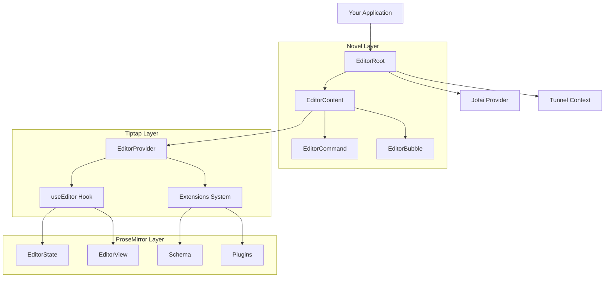
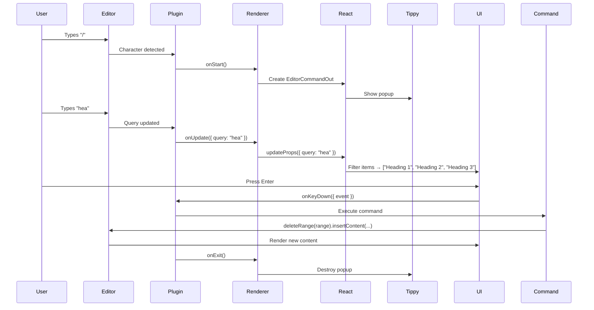
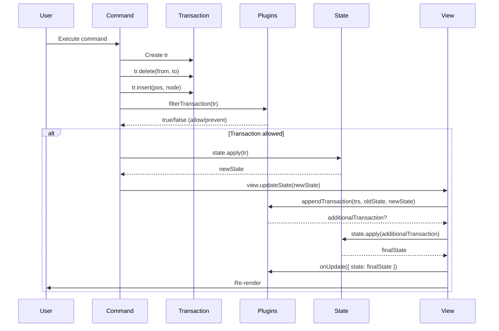
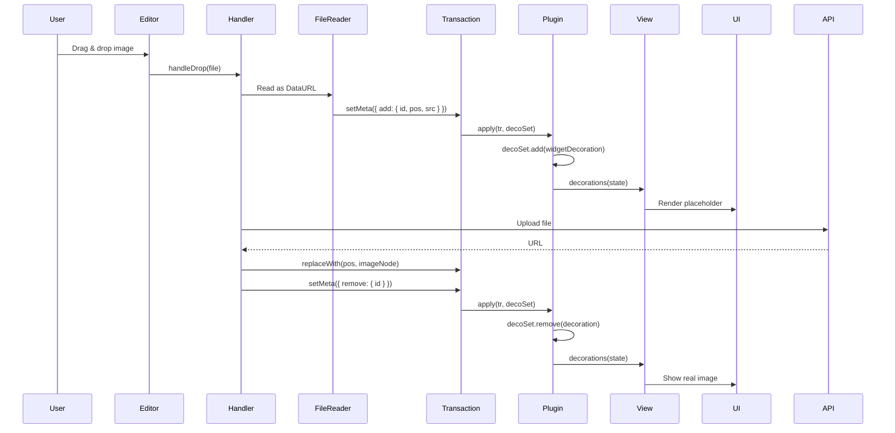

# Editor Core Guide: Tiptap & ProseMirror Deep Dive

> **Target Audience**: Mid-level React developer learning rich text editor architecture
>
> **Prerequisites**: Understanding of React, TypeScript, and component patterns
>
> **What You'll Learn**: Tiptap architecture, ProseMirror fundamentals, extension system, transactions, plugins, and building custom extensions

---

## Table of Contents

1. [Overview](#overview)
2. [Novel's Editor Architecture](#novels-editor-architecture)
3. [Tiptap Fundamentals](#tiptap-fundamentals)
4. [Extension System](#extension-system)
5. [ProseMirror Layer](#prosemirror-layer)
6. [Commands & Transactions](#commands--transactions)
7. [Plugins & Decorations](#plugins--decorations)
8. [Node Views](#node-views)
9. [Building Custom Extensions](#building-custom-extensions)
10. [Advanced Patterns](#advanced-patterns)

---

## Overview

Novel's editor is built on **Tiptap**, which is itself built on **ProseMirror**. Understanding this three-layer architecture is crucial:

```
Novel (Headless React Components)
  ↓
Tiptap (Extension-based Editor Framework)
  ↓
ProseMirror (Low-level Editor Engine)
```

### Mental Model

Think of this architecture like a **car**:

- **ProseMirror** = Engine (raw power, complex to use directly)
- **Tiptap** = Car body & controls (makes the engine usable, extensible)
- **Novel** = Custom dashboard & features (React wrapper, UI components)

### Why This Matters

**ProseMirror alone**:
- ✅ Extremely powerful and flexible
- ❌ Low-level API (steep learning curve)
- ❌ Requires deep understanding of state/transactions

**Tiptap on ProseMirror**:
- ✅ High-level, intuitive API
- ✅ Extension-based (modular, composable)
- ✅ React integration built-in

**Novel on Tiptap**:
- ✅ Headless components (bring your own UI)
- ✅ Jotai state management
- ✅ Pre-built AI features

---

## Novel's Editor Architecture

### Component Hierarchy

**File**: `packages/headless/src/components/editor.tsx:1-50`

```typescript
import { Provider } from "jotai";
import { EditorProvider } from "@tiptap/react";
import { tunnel } from "tunnel-rat";

// Layer 1: EditorRoot - Context & State Provider
export const EditorRoot: FC<EditorRootProps> = ({ children }) => {
  const tunnelInstance = useRef(tunnel()).current;

  return (
    <Provider store={novelStore}>
      <EditorCommandTunnelContext.Provider value={tunnelInstance}>
        {children}
      </EditorCommandTunnelContext.Provider>
    </Provider>
  );
};

// Layer 2: EditorContent - Tiptap Wrapper
export const EditorContent = forwardRef<HTMLDivElement, EditorContentProps>(
  ({ className, children, initialContent, extensions, ...rest }, ref) => (
    <div ref={ref} className={className}>
      <EditorProvider
        extensions={extensions}
        content={initialContent}
        {...rest}
      >
        {children}
      </EditorProvider>
    </div>
  ),
);
```

**Architecture Diagram**:



### Key Architectural Decisions

**1. Tunnel Pattern** (`tunnel-rat`)

**Why?** Slash commands need to render **outside** the editor DOM but still receive editor context.

```typescript
// Create tunnel
const tunnelInstance = useRef(tunnel()).current;

// Provide tunnel
<EditorCommandTunnelContext.Provider value={tunnelInstance}>

// Render entry point (inside editor)
<tunnelInstance.In>
  <SlashCommandMenu />
</tunnelInstance.In>

// Render exit point (portaled to body)
<tunnelInstance.Out />
```

**Mental Model**: Like a **wormhole** in space. Content enters at one DOM location, exits at another, but maintains context.

**2. Jotai for UI State**

**Why?** Slash command state needs to be shared between:
- `EditorCommandOut` (receives query from Tiptap plugin)
- `EditorCommand` (filters items based on query)
- `EditorCommandItem` (uses range to execute commands)

```typescript
// Store
export const novelStore = createStore();

// Atoms
export const queryAtom = atom("");
export const rangeAtom = atom<Range | null>(null);
```

**3. Headless Pattern**

Novel provides **zero styling**. All UI is your responsibility.

```tsx
// Novel provides components
<EditorBubble>
  {/* You provide UI */}
  <Button onClick={() => editor.chain().focus().toggleBold().run()}>
    Bold
  </Button>
</EditorBubble>
```

**Why?** Maximum flexibility. Use any UI library (shadcn/ui, MUI, Chakra, etc.)

---

## Tiptap Fundamentals

### Editor Instance

The editor instance is the **central object** you'll interact with:

```typescript
import { useEditor } from "novel";

const MyComponent = () => {
  const { editor } = useEditor();

  // Editor API
  editor.chain().focus().toggleBold().run();
  editor.getHTML();
  editor.getJSON();
  editor.commands.setContent("New content");
  editor.isActive("bold");

  return <div>{/* UI */}</div>;
};
```

**Editor Instance Structure**:

```typescript
interface Editor {
  // Commands (high-level actions)
  commands: {
    setContent(content): boolean;
    focus(): boolean;
    blur(): boolean;
    insertContent(content): boolean;
    deleteRange(range): boolean;
    toggleBold(): boolean;
    // ... 100+ built-in commands
  };

  // Chainable commands
  chain(): ChainedCommands;

  // State queries
  isActive(name, attrs?): boolean;
  can(): CanCommands;
  getAttributes(name): Record<string, any>;

  // Content getters
  getHTML(): string;
  getJSON(): JSONContent;
  getText(): string;

  // Low-level access
  state: EditorState;      // ProseMirror state
  view: EditorView;        // ProseMirror view
  schema: Schema;          // Document schema

  // Storage (extension-specific data)
  storage: Record<string, any>;

  // Extensions
  extensionManager: ExtensionManager;
}
```

### Extensions Array

Extensions are the **building blocks** of your editor:

```typescript
// File: apps/web/components/tailwind/extensions.ts
import {
  StarterKit,
  TiptapLink,
  TiptapImage,
  Placeholder,
  SlashCommand,
  AIHighlight,
  Mathematics,
  // ... more
} from "novel";

export const defaultExtensions = [
  // 1. Core functionality
  StarterKit.configure({
    bulletList: { HTMLAttributes: { class: "list-disc" } },
    orderedList: { HTMLAttributes: { class: "list-decimal" } },
    // ... configure each extension
  }),

  // 2. UI features
  Placeholder.configure({
    placeholder: ({ node }) => {
      if (node.type.name === "heading") return "Heading";
      return "Press '/' for commands";
    },
  }),

  // 3. Enhancements
  TiptapLink.configure({
    HTMLAttributes: { class: "text-blue-500 underline" },
  }),

  // 4. Custom extensions
  SlashCommand,
  AIHighlight,
  Mathematics,
];
```

**Mental Model**: Extensions are like **plugins in VS Code**. Each adds specific functionality.

### Extension Types

| Type | Purpose | Examples |
|------|---------|----------|
| **Mark** | Inline formatting (can overlap) | Bold, Italic, Link, Highlight |
| **Node** | Content blocks or atoms | Paragraph, Heading, Image, Code Block |
| **Extension** | Editor behavior (no content) | History, Keymap, Placeholder |

**Visual Example**:

```html
<!-- Marks: can overlap -->
<p>
  This is <strong class="bold">bold and <em class="italic">italic</em></strong> text.
</p>

<!-- Nodes: hierarchical structure -->
<doc>
  <heading level="1">Title</heading>
  <paragraph>Content</paragraph>
  <codeBlock language="js">code</codeBlock>
</doc>
```

---

## Extension System

### Extension Anatomy

Every extension has up to 8 lifecycle hooks:

```typescript
import { Mark } from "@tiptap/core";

export const AIHighlight = Mark.create<AIHighlightOptions>({
  // 1. NAME - Unique identifier
  name: "ai-highlight",

  // 2. OPTIONS - Configuration
  addOptions() {
    return {
      HTMLAttributes: {},
    };
  },

  // 3. ATTRIBUTES - Data stored with mark/node
  addAttributes() {
    return {
      color: {
        default: null,
        parseHTML: (element) => element.getAttribute("data-color"),
        renderHTML: (attributes) => ({
          "data-color": attributes.color,
          style: `background-color: ${attributes.color}`,
        }),
      },
    };
  },

  // 4. PARSING - HTML → ProseMirror
  parseHTML() {
    return [{ tag: "mark" }];
  },

  // 5. RENDERING - ProseMirror → HTML
  renderHTML({ HTMLAttributes }) {
    return ["mark", HTMLAttributes, 0];
    //              ↑                ↑
    //          tag name         content hole
  },

  // 6. COMMANDS - User actions
  addCommands() {
    return {
      setAIHighlight: (attrs) => ({ commands }) => {
        return commands.setMark(this.name, attrs);
      },
      toggleAIHighlight: (attrs) => ({ commands }) => {
        return commands.toggleMark(this.name, attrs);
      },
    };
  },

  // 7. KEYBOARD SHORTCUTS
  addKeyboardShortcuts() {
    return {
      "Mod-Shift-h": () => this.editor.commands.toggleAIHighlight(),
    };
  },

  // 8. INPUT/PASTE RULES - Auto-formatting
  addInputRules() {
    return [
      markInputRule({
        find: /(?:^|\s)((?:==)((?:[^~=]+))(?:==))$/,
        type: this.type,
      }),
    ];
  },
});
```

**File**: `packages/headless/src/extensions/ai-highlight.ts:1-150`

### Mark Extension Deep Dive

**What is a Mark?** Inline annotation that can overlap with other marks.

**Example Use Cases**:
- Text formatting (bold, italic, underline)
- Links
- Text/background colors
- AI highlights (Novel's custom mark)

**Complete Implementation**:

```typescript
// File: packages/headless/src/extensions/ai-highlight.ts
import { Mark, mergeAttributes } from "@tiptap/core";
import { markInputRule, markPasteRule } from "@tiptap/core";

export interface AIHighlightOptions {
  HTMLAttributes: Record<string, any>;
}

// Regex patterns
const inputRegex = /(?:^|\s)((?:==)((?:[^~=]+))(?:==))$/;
const pasteRegex = /(?:^|\s)((?:==)((?:[^~=]+))(?:==))/g;

export const AIHighlight = Mark.create<AIHighlightOptions>({
  name: "ai-highlight",

  addOptions() {
    return {
      HTMLAttributes: {},
    };
  },

  addAttributes() {
    return {
      color: {
        default: null,
        parseHTML: (element) =>
          element.getAttribute("data-color") || element.style.backgroundColor,
        renderHTML: (attributes) => {
          if (!attributes.color) return {};
          return {
            "data-color": attributes.color,
            style: `background-color: ${attributes.color}; color: inherit`,
          };
        },
      },
    };
  },

  parseHTML() {
    return [
      {
        tag: "mark",
        // Only parse marks with data-type="ai-highlight"
        getAttrs: (element) => {
          const hasDataType =
            (element as HTMLElement).hasAttribute?.("data-type");
          return hasDataType ? null : false;
        },
      },
    ];
  },

  renderHTML({ HTMLAttributes }) {
    return [
      "mark",
      mergeAttributes(
        this.options.HTMLAttributes,
        HTMLAttributes,
        { "data-type": "ai-highlight" }
      ),
      0,  // Content hole (where inner content goes)
    ];
  },

  addCommands() {
    return {
      setAIHighlight: (attributes) => ({ commands }) => {
        return commands.setMark(this.name, attributes);
      },
      toggleAIHighlight: (attributes) => ({ commands }) => {
        return commands.toggleMark(this.name, attributes);
      },
      unsetAIHighlight: () => ({ commands }) => {
        return commands.unsetMark(this.name);
      },
    };
  },

  addKeyboardShortcuts() {
    return {
      "Mod-Shift-h": () => this.editor.commands.toggleAIHighlight(),
    };
  },

  addInputRules() {
    return [
      markInputRule({
        find: inputRegex,
        type: this.type,
      }),
    ];
  },

  addPasteRules() {
    return [
      markPasteRule({
        find: pasteRegex,
        type: this.type,
      }),
    ];
  },
});
```

**Usage**:

```typescript
// Programmatic
editor.commands.setAIHighlight({ color: "#c1ecf970" });
editor.commands.toggleAIHighlight();
editor.commands.unsetAIHighlight();

// Keyboard shortcut
// User presses Cmd+Shift+H → toggles highlight

// Auto-formatting
// User types: ==highlighted text==
// Result: <mark data-type="ai-highlight">highlighted text</mark>
```

**Helper Functions**:

```typescript
// File: packages/headless/src/extensions/ai-highlight.ts
export const addAIHighlight = (editor: Editor, color?: string) => {
  editor
    .chain()
    .focus()
    .setAIHighlight({ color: color ?? "#c1ecf970" })
    .run();
};

export const removeAIHighlight = (editor: Editor) => {
  // Direct transaction manipulation for performance
  const tr = editor.state.tr;
  tr.removeMark(
    0,
    editor.state.doc.nodeSize - 2,
    editor.state.schema.marks["ai-highlight"]
  );
  editor.view.dispatch(tr);
};
```

---

### Node Extension Deep Dive

**What is a Node?** Block or inline content element with specific structure.

**Example Use Cases**:
- Block nodes: Paragraph, Heading, Code Block, Image
- Inline nodes: Mention, Emoji (atomic, non-editable)

**Complete Implementation: Twitter Embed**

**File**: `packages/headless/src/extensions/twitter.tsx:1-150`

```typescript
import { Node, mergeAttributes } from "@tiptap/core";
import { ReactNodeViewRenderer } from "@tiptap/react";
import { NodeViewWrapper } from "@tiptap/react";
import { Tweet } from "react-tweet";

export interface TwitterOptions {
  addPasteHandler: boolean;
  inline: boolean;
  HTMLAttributes: Record<string, any>;
}

export interface SetTweetOptions {
  src: string;
}

const TWITTER_REGEX = /^https?:\/\/(twitter\.com|x\.com)\/(?:#!\/)?(\w+)\/status(?:es)?\/(\d+)/;
const TWITTER_REGEX_GLOBAL = /https?:\/\/(twitter\.com|x\.com)\/(?:#!\/)?(\w+)\/status(?:es)?\/(\d+)/g;

export const isValidTwitterUrl = (url: string) => {
  return url.match(TWITTER_REGEX);
};

export const Twitter = Node.create<TwitterOptions>({
  name: "twitter",

  addOptions() {
    return {
      addPasteHandler: true,
      inline: false,
      HTMLAttributes: {},
    };
  },

  // CRITICAL: React component for rendering
  addNodeView() {
    return ReactNodeViewRenderer(TweetComponent, {
      attrs: this.options.HTMLAttributes,
    });
  },

  inline() {
    return this.options.inline;
  },

  group() {
    return this.options.inline ? "inline" : "block";
  },

  draggable: true,

  addAttributes() {
    return {
      src: {
        default: null,
      },
    };
  },

  parseHTML() {
    return [
      {
        tag: "div[data-twitter]",
      },
    ];
  },

  addCommands() {
    return {
      setTweet: (options: SetTweetOptions) => ({ commands }) => {
        if (!isValidTwitterUrl(options.src)) {
          return false;
        }

        return commands.insertContent({
          type: this.name,
          attrs: options,
        });
      },
    };
  },

  addPasteRules() {
    if (!this.options.addPasteHandler) {
      return [];
    }

    return [
      nodePasteRule({
        find: TWITTER_REGEX_GLOBAL,
        type: this.type,
        getAttributes: (match) => {
          return { src: match.input };
        },
      }),
    ];
  },

  renderHTML({ HTMLAttributes }) {
    return [
      "div",
      mergeAttributes(this.options.HTMLAttributes, HTMLAttributes, {
        "data-twitter": "",
      }),
    ];
  },
});

// React component for node view
const TweetComponent = ({ node }: { node: any }) => {
  const url = node.attrs.src;
  const tweetId = url?.split("/").pop();

  if (!tweetId) return null;

  return (
    <NodeViewWrapper className="twitter-component">
      <div contentEditable={false} data-twitter="">
        <Tweet id={tweetId} />
      </div>
    </NodeViewWrapper>
  );
};
```

**Key Patterns**:

1. **Node View Renderer**: Uses React component for rendering
2. **Paste Rules**: Auto-embeds when pasting Twitter URL
3. **Draggable**: Can be moved around document
4. **Group**: Defines where node can appear (`block` or `inline`)
5. **contentEditable={false}**: Embed is read-only

**Usage**:

```typescript
// Programmatic insertion
editor.commands.setTweet({
  src: "https://twitter.com/user/status/123456789"
});

// Paste handling
// User pastes: https://twitter.com/user/status/123456789
// Result: Embedded tweet appears automatically
```

---

### Extension (Behavior) Deep Dive

**What is an Extension?** Adds editor behavior without defining content types.

**Example Use Cases**:
- Keyboard shortcuts
- Plugins (drag/drop, decorations)
- Storage (custom data)
- Event handlers

**Complete Implementation: Custom Keymap**

**File**: `packages/headless/src/extensions/custom-keymap.ts:1-100`

```typescript
import { Extension } from "@tiptap/core";

export const CustomKeymap = Extension.create({
  name: "customKeymap",

  addCommands() {
    return {
      // Custom command: Select all text within current node
      selectTextWithinNodeBoundaries: () => ({ editor, commands }) => {
        const { state } = editor;
        const { tr } = state;

        const startNodePos = tr.selection.$from.start();
        const endNodePos = tr.selection.$to.end();

        return commands.setTextSelection({
          from: startNodePos,
          to: endNodePos,
        });
      },
    };
  },

  addKeyboardShortcuts() {
    return {
      // Override Cmd+A behavior
      "Mod-a": ({ editor }) => {
        const { state } = editor;
        const { tr } = state;

        const startSelectionPos = tr.selection.from;
        const endSelectionPos = tr.selection.to;
        const startNodePos = tr.selection.$from.start();
        const endNodePos = tr.selection.$to.end();

        // Check if selection doesn't extend to node boundaries
        const isNotFullySelected =
          startSelectionPos > startNodePos ||
          endSelectionPos < endNodePos;

        if (isNotFullySelected) {
          // First Cmd+A: Select within node
          editor.chain().selectTextWithinNodeBoundaries().run();
          return true;  // Prevent default
        }

        // Second Cmd+A: Let browser handle (select all)
        return false;
      },
    };
  },
});
```

**Behavior**:

```
User in heading: "Hello World" (cursor at "Wo|rld")

Press Cmd+A (first time)
  → Selects entire heading: "|Hello World|"

Press Cmd+A (second time)
  → Selects entire document (browser default)
```

---

### Extension with Plugin: Slash Command

**File**: `packages/headless/src/extensions/slash-command.tsx:1-200`

```typescript
import { Extension } from "@tiptap/core";
import { Suggestion, SuggestionOptions } from "@tiptap/suggestion";
import { ReactRenderer } from "@tiptap/react";
import tippy, { Instance, Props } from "tippy.js";

const Command = Extension.create({
  name: "slash-command",

  addOptions() {
    return {
      suggestion: {
        char: "/",
        command: ({ editor, range, props }) => {
          props.command({ editor, range });
        },
      } as Partial<SuggestionOptions>,
    };
  },

  addProseMirrorPlugins() {
    return [
      Suggestion({
        editor: this.editor,
        ...this.options.suggestion,
      }),
    ];
  },
});

export const renderItems = (elementRef?: RefObject<Element> | null) => {
  let component: ReactRenderer | null = null;
  let popup: Instance<Props>[] | null = null;

  return {
    // Called when "/" is typed
    onStart: (props: { editor: Editor; clientRect: DOMRect }) => {
      component = new ReactRenderer(EditorCommandOut, {
        props,
        editor: props.editor,
      });

      const { selection } = props.editor.state;
      const parentNode = selection.$from.node(selection.$from.depth);
      const blockType = parentNode.type.name;

      // Don't show in code blocks
      if (blockType === "codeBlock") {
        return false;
      }

      // Create popup
      popup = tippy("body", {
        getReferenceClientRect: props.clientRect,
        appendTo: () => elementRef?.current ?? document.body,
        content: component.element,
        showOnCreate: true,
        interactive: true,
        trigger: "manual",
        placement: "bottom-start",
      });
    },

    // Called as user types after "/"
    onUpdate: (props: { editor: Editor; clientRect: GetReferenceClientRect }) => {
      component?.updateProps(props);

      popup?.[0]?.setProps({
        getReferenceClientRect: props.clientRect,
      });
    },

    // Keyboard navigation
    onKeyDown: (props: { event: KeyboardEvent }) => {
      if (props.event.key === "Escape") {
        popup?.[0]?.hide();
        return true;
      }

      return component?.ref?.onKeyDown(props);
    },

    // Cleanup
    onExit: () => {
      popup?.[0]?.destroy();
      component?.destroy();
    },
  };
};

export const SlashCommand = Command.configure({
  suggestion: {
    items: ({ query }) => {
      return [
        { title: "Text", command: ({ editor, range }) => { /* ... */ } },
        { title: "Heading 1", command: ({ editor, range }) => { /* ... */ } },
        // ... more items
      ].filter(item =>
        item.title.toLowerCase().startsWith(query.toLowerCase())
      );
    },
    render: renderItems,
  },
});
```

**Flow**:



---

## ProseMirror Layer

### State & Transactions

**ProseMirror uses immutable state**. Every change creates a new state via transactions.

```typescript
// Current state
const currentState = editor.state;

// Create transaction
const tr = currentState.tr;
tr.insertText("Hello", 0);
tr.setSelection(TextSelection.create(tr.doc, 0, 5));

// Apply transaction → new state
const newState = currentState.apply(tr);

// Update view
editor.view.updateState(newState);
```

**Mental Model**: Like **Redux**. State is immutable, transactions are actions, apply() is the reducer.

### Editor State Structure

```typescript
interface EditorState {
  // Document tree
  doc: Node;

  // Current selection
  selection: Selection;

  // Stored marks (formatting for next input)
  storedMarks: Mark[] | null;

  // Document schema
  schema: Schema;

  // Active plugins
  plugins: Plugin[];

  // Plugin states
  [pluginKey: string]: any;
}
```

### Selection Types

```typescript
// Text selection (cursor or range)
const textSel = TextSelection.create(doc, from, to);

// Node selection (entire node selected)
const nodeSel = NodeSelection.create(doc, pos);

// All selection (entire document)
const allSel = AllSelection(doc);
```

**Resolved Positions** (`$from`, `$to`):

```typescript
const $pos = editor.state.selection.$from;

// Position info
$pos.pos         // Absolute position in document
$pos.depth       // Nesting depth
$pos.parent      // Parent node
$pos.start()     // Start of parent node
$pos.end()       // End of parent node
$pos.node(depth) // Ancestor at depth
$pos.before()    // Position before node
$pos.after()     // Position after node
```

**Example**:

```
Document structure:
<doc>
  <heading>Hello</heading>    ← depth 1
  <paragraph>                 ← depth 1
    <text>World</text>        ← depth 2 (inside paragraph)
  </paragraph>
</doc>

Cursor at "Wor|ld":
  $pos.pos = 10          (absolute position)
  $pos.depth = 1         (inside paragraph)
  $pos.parent = <paragraph> node
  $pos.start() = 7       (start of paragraph)
  $pos.end() = 12        (end of paragraph)
```

### Document Schema

The schema defines **what nodes and marks are allowed**:

```typescript
// Simplified schema
const schema = new Schema({
  nodes: {
    doc: { content: "block+" },
    paragraph: {
      content: "inline*",
      group: "block",
    },
    heading: {
      content: "inline*",
      group: "block",
      attrs: { level: { default: 1 } },
    },
    text: { group: "inline" },
    image: {
      group: "block",
      attrs: { src: {}, alt: { default: null } },
    },
  },
  marks: {
    bold: {},
    italic: {},
    link: {
      attrs: { href: {} },
    },
  },
});
```

**Content Expressions**:

| Expression | Meaning |
|------------|---------|
| `block+` | One or more block nodes |
| `inline*` | Zero or more inline nodes |
| `heading paragraph*` | Heading followed by any number of paragraphs |
| `(paragraph \| heading)+` | Paragraphs or headings (at least one) |

---

## Commands & Transactions

### High-Level Commands (Tiptap)

**Chaining Pattern**:

```typescript
editor
  .chain()                  // Start chain
  .focus()                  // Focus editor
  .deleteRange(range)       // Delete specified range
  .insertContent({          // Insert new content
    type: "heading",
    attrs: { level: 1 },
    content: [{ type: "text", text: "Hello" }],
  })
  .setTextSelection(10)     // Move cursor to position 10
  .run();                   // Execute all commands
```

**Why Chain?** Combines multiple commands into **one transaction** (one undo step, better performance).

### Command Structure

```typescript
// Command signature
type Command = (options?: any) => (props: CommandProps) => boolean;

// CommandProps
interface CommandProps {
  editor: Editor;
  commands: Commands;
  can: () => CanCommands;
  chain: () => ChainedCommands;
  state: EditorState;
  view: EditorView;
  tr: Transaction;
  dispatch?: (tr: Transaction) => void;
}
```

**Custom Command Example**:

```typescript
addCommands() {
  return {
    myCustomCommand: (attributes) => ({ editor, state, tr, dispatch }) => {
      // Validate
      if (!attributes.required) return false;

      // Modify transaction
      const { from, to } = state.selection;
      tr.insertText(attributes.text, from, to);

      // Optional: Dispatch (if provided, command is executed)
      if (dispatch) {
        dispatch(tr);
      }

      return true;  // Success
    },
  };
}
```

### Low-Level Transactions (ProseMirror)

**Direct Transaction Manipulation**:

**File**: `packages/headless/src/extensions/ai-highlight.ts:120-130`

```typescript
export const removeAIHighlight = (editor: Editor) => {
  // Create transaction
  const tr = editor.state.tr;

  // Remove mark from entire document
  tr.removeMark(
    0,                              // from position
    editor.state.doc.nodeSize - 2,  // to position (nodeSize - 2 = end)
    editor.state.schema.marks["ai-highlight"]
  );

  // Dispatch transaction
  editor.view.dispatch(tr);
};
```

**Transaction Methods**:

```typescript
const tr = state.tr;

// Content changes
tr.insertText("text", pos);
tr.delete(from, to);
tr.replaceWith(from, to, node);
tr.insert(pos, node);

// Mark changes
tr.addMark(from, to, mark);
tr.removeMark(from, to, markType);

// Selection changes
tr.setSelection(selection);
tr.setTextSelection(pos);

// Metadata (for plugins)
tr.setMeta(pluginKey, data);
const data = tr.getMeta(pluginKey);

// Scrolling
tr.scrollIntoView();

// Steps (for undo/redo)
tr.steps;  // Array of transformation steps
```

### Transaction Lifecycle



---

## Plugins & Decorations

### Plugin Architecture

**File**: `packages/headless/src/plugins/upload-images.tsx:1-150`

```typescript
import { Plugin, PluginKey } from "@tiptap/pm/state";
import { Decoration, DecorationSet } from "@tiptap/pm/view";

const uploadKey = new PluginKey("upload-image");

export const UploadImagesPlugin = ({ imageClass }: { imageClass: string }) =>
  new Plugin({
    key: uploadKey,

    // STATE MANAGEMENT
    state: {
      // Initialize plugin state
      init() {
        return DecorationSet.empty;
      },

      // Update plugin state on transaction
      apply(tr, set) {
        // Map decorations to new positions
        set = set.map(tr.mapping, tr.doc);

        // Check transaction metadata
        const action = tr.getMeta(this);

        if (action?.add) {
          const { id, pos, src } = action.add;

          // Create placeholder element
          const placeholder = document.createElement("div");
          placeholder.setAttribute("class", "img-placeholder");
          const image = document.createElement("img");
          image.setAttribute("class", imageClass);
          image.src = src;
          placeholder.appendChild(image);

          // Create widget decoration
          const deco = Decoration.widget(pos + 1, placeholder, { id });
          set = set.add(tr.doc, [deco]);

        } else if (action?.remove) {
          // Find and remove decoration by ID
          set = set.remove(
            set.find(undefined, undefined, (spec) => spec.id == action.remove.id)
          );
        }

        return set;
      },
    },

    // PROPS
    props: {
      // Provide decorations to view
      decorations(state) {
        return this.getState(state);
      },
    },
  });
```

**Using the Plugin**:

```typescript
// File: packages/headless/src/extensions/image-upload.ts
export const createImageUpload =
  ({ validateFn, onUpload }: ImageUploadOptions): UploadFn =>
  (file, view, pos) => {
    // Validate file
    const validated = validateFn?.(file);
    if (!validated) return;

    const id = {};  // Unique ID (object reference)

    const tr = view.state.tr;
    if (!tr.selection.empty) tr.deleteSelection();

    // Read file as data URL
    const reader = new FileReader();
    reader.readAsDataURL(file);

    reader.onload = () => {
      // Add placeholder decoration via metadata
      tr.setMeta(uploadKey, {
        add: {
          id,
          pos,
          src: reader.result,  // Base64 image
        },
      });
      view.dispatch(tr);
    };

    // Upload file
    onUpload(file).then(
      (src) => {
        // Success: Replace placeholder with real image
        const { schema } = view.state;
        const pos = findPlaceholder(view.state, id);

        if (pos == null) return;

        const imageSrc = typeof src === "object" ? reader.result : src;
        const node = schema.nodes.image?.create({ src: imageSrc });
        if (!node) return;

        const transaction = view.state.tr
          .replaceWith(pos, pos, node)
          .setMeta(uploadKey, { remove: { id } });
        view.dispatch(transaction);
      },
      () => {
        // Error: Remove placeholder
        const transaction = view.state.tr
          .delete(pos, pos)
          .setMeta(uploadKey, { remove: { id } });
        view.dispatch(transaction);
      }
    );
  };

// Helper: Find decoration by ID
function findPlaceholder(state: EditorState, id: {}) {
  const decos = uploadKey.getState(state);
  const found = decos.find(undefined, undefined, (spec) => spec.id === id);
  return found.length ? found[0].from : null;
}
```

**Flow**:



### Decoration Types

**1. Widget Decorations**: Insert DOM element at position

```typescript
const widget = Decoration.widget(pos, domElement, {
  id: uniqueId,
  side: 1,  // 1 = after, -1 = before
});
```

**2. Inline Decorations**: Style inline content

```typescript
const inline = Decoration.inline(from, to, {
  class: "highlight",
  style: "background: yellow",
});
```

**3. Node Decorations**: Style entire node

```typescript
const node = Decoration.node(from, to, {
  class: "selected-node",
});
```

**Key Concept: Decoration Mapping**

Decorations must be **mapped** when document changes:

```typescript
apply(tr, set) {
  // CRITICAL: Map decorations through transaction
  set = set.map(tr.mapping, tr.doc);

  // Then apply changes to set
  // ...

  return set;
}
```

**Why?** If you add decoration at position 10, then user types at position 5, decoration should move to position 11.

---

## Node Views

### React Node Views

**File**: `packages/headless/src/extensions/mathematics.ts:1-200`

```typescript
import { Node } from "@tiptap/core";
import katex from "katex";

export const Mathematics = Node.create<MathematicsOptions>({
  name: "math",
  inline: true,
  group: "inline",
  atom: true,       // Cannot be directly edited
  selectable: true,
  marks: "",        // No marks allowed inside

  addAttributes() {
    return {
      latex: {
        default: "",
      },
    };
  },

  // CUSTOM DOM NODE VIEW
  addNodeView() {
    return ({ node, HTMLAttributes, getPos, editor }) => {
      const dom = document.createElement("span");
      const latex: string = node.attrs["latex"] ?? "";

      // Apply attributes
      Object.entries(this.options.HTMLAttributes).forEach(([key, value]) => {
        dom.setAttribute(key, value);
      });

      // Make non-editable
      dom.contentEditable = "false";

      // Click handler for selection
      dom.addEventListener("click", (evt) => {
        if (editor.isEditable && typeof getPos === "function") {
          const pos = getPos();
          const nodeSize = node.nodeSize;
          editor.commands.setTextSelection({ from: pos, to: pos + nodeSize });
        }
      });

      // Render KaTeX
      dom.innerHTML = katex.renderToString(latex, this.options.katexOptions);

      return {
        dom,              // DOM element to render
        update: (node) => {
          // Re-render on node update
          const newLatex = node.attrs["latex"] ?? "";
          dom.innerHTML = katex.renderToString(newLatex, this.options.katexOptions);
          return true;
        },
        destroy: () => {
          // Cleanup
          dom.removeEventListener("click", () => {});
        },
      };
    };
  },

  parseHTML() {
    return [{ tag: "span[data-math]" }];
  },

  renderHTML({ HTMLAttributes }) {
    return ["span", mergeAttributes(HTMLAttributes, { "data-math": "" })];
  },

  addCommands() {
    return {
      setLatex: ({ latex }) => ({ chain, state }) => {
        if (!latex) return false;

        const { from, to } = state.selection;

        return chain()
          .insertContentAt(
            { from, to },
            { type: "math", attrs: { latex } }
          )
          .setTextSelection({ from, to: from + 1 })
          .run();
      },

      unsetLatex: () => ({ editor, state, chain }) => {
        const latex = editor.getAttributes(this.name).latex;
        if (typeof latex !== "string") return false;

        const { from, to } = state.selection;

        return chain()
          .command(({ tr }) => {
            tr.insertText(latex, from, to);
            return true;
          })
          .setTextSelection({ from, to: from + latex.length })
          .run();
      },
    };
  },
});
```

**Usage**:

```typescript
// Insert math node
editor.commands.setLatex({ latex: "E = mc^2" });

// Result in DOM:
// <span data-math contenteditable="false">
//   <!-- KaTeX rendered HTML -->
// </span>
```

**Node View Methods**:

```typescript
interface NodeView {
  dom: HTMLElement;                    // Element to render
  contentDOM?: HTMLElement;            // Container for editable content
  update?(node: Node): boolean;        // Update view when node changes
  selectNode?(): void;                 // Node selected
  deselectNode?(): void;               // Node deselected
  destroy?(): void;                    // Cleanup
  stopEvent?(event: Event): boolean;   // Handle events
  ignoreMutation?(mutation): boolean;  // Ignore DOM mutations
}
```

---

### React Node View Renderer

**File**: `packages/headless/src/extensions/twitter.tsx:50-80`

```typescript
import { ReactNodeViewRenderer, NodeViewWrapper } from "@tiptap/react";

export const Twitter = Node.create({
  // ...

  addNodeView() {
    return ReactNodeViewRenderer(TweetComponent);
  },
});

const TweetComponent = ({ node }: { node: any }) => {
  const url = node.attrs.src;
  const tweetId = url?.split("/").pop();

  return (
    <NodeViewWrapper className="twitter-component">
      <div contentEditable={false} data-twitter="">
        <Tweet id={tweetId} />
      </div>
    </NodeViewWrapper>
  );
};
```

**NodeViewWrapper**: Provides editor context to React component.

**Props Available**:

```typescript
interface NodeViewProps {
  node: Node;                          // ProseMirror node
  updateAttributes: (attrs) => void;   // Update node attributes
  deleteNode: () => void;              // Delete node
  editor: Editor;                      // Editor instance
  getPos: () => number;                // Node position
  selected: boolean;                   // Is node selected
}
```

---

## Building Custom Extensions

### Example: Callout Extension

Let's build a **callout/admonition** extension from scratch:

```typescript
import { Node, mergeAttributes } from "@tiptap/core";
import { ReactNodeViewRenderer, NodeViewWrapper, NodeViewContent } from "@tiptap/react";
import { Plugin, PluginKey } from "@tiptap/pm/state";

// 1. Define options
export interface CalloutOptions {
  types: ("info" | "warning" | "error" | "success")[];
  HTMLAttributes: Record<string, any>;
}

// 2. React component for rendering
const CalloutComponent = ({ node, updateAttributes }: any) => {
  const type = node.attrs.type;

  return (
    <NodeViewWrapper className={`callout callout-${type}`}>
      <div className="callout-header">
        <select
          value={type}
          onChange={(e) => updateAttributes({ type: e.target.value })}
          contentEditable={false}
        >
          <option value="info">ℹ️ Info</option>
          <option value="warning">⚠️ Warning</option>
          <option value="error">❌ Error</option>
          <option value="success">✅ Success</option>
        </select>
      </div>
      <NodeViewContent className="callout-content" />
    </NodeViewWrapper>
  );
};

// 3. Create extension
export const Callout = Node.create<CalloutOptions>({
  name: "callout",

  group: "block",

  content: "block+",  // Can contain block nodes

  defining: true,     // Maintains identity when copy/pasted

  addOptions() {
    return {
      types: ["info", "warning", "error", "success"],
      HTMLAttributes: {},
    };
  },

  addAttributes() {
    return {
      type: {
        default: "info",
        parseHTML: (element) => element.getAttribute("data-type"),
        renderHTML: (attributes) => ({
          "data-type": attributes.type,
          class: `callout-${attributes.type}`,
        }),
      },
    };
  },

  parseHTML() {
    return [
      {
        tag: "div[data-callout]",
        priority: 51,  // Higher than default paragraph
      },
    ];
  },

  renderHTML({ node, HTMLAttributes }) {
    return [
      "div",
      mergeAttributes(
        this.options.HTMLAttributes,
        HTMLAttributes,
        { "data-callout": "" }
      ),
      0,  // Content hole
    ];
  },

  addNodeView() {
    return ReactNodeViewRenderer(CalloutComponent);
  },

  addCommands() {
    return {
      setCallout: (attributes) => ({ commands }) => {
        return commands.wrapIn(this.name, attributes);
      },

      toggleCallout: (attributes) => ({ commands }) => {
        return commands.toggleWrap(this.name, attributes);
      },

      unsetCallout: () => ({ commands }) => {
        return commands.lift(this.name);
      },
    };
  },

  addKeyboardShortcuts() {
    return {
      "Mod-Shift-i": () => this.editor.commands.toggleCallout({ type: "info" }),
      "Mod-Shift-w": () => this.editor.commands.toggleCallout({ type: "warning" }),

      // Enter at end of callout: exit callout
      Enter: ({ editor }) => {
        const { selection, doc } = editor.state;
        const { $from } = selection;

        // Check if we're in a callout
        const calloutDepth = $from.depth >= 1 && $from.node($from.depth - 1).type.name === this.name
          ? $from.depth - 1
          : null;

        if (calloutDepth === null) return false;

        // Check if cursor is at end of callout
        const calloutEnd = $from.end(calloutDepth);
        if ($from.pos !== calloutEnd - 1) return false;

        // Exit callout
        return editor.commands.exitCode();
      },
    };
  },

  addInputRules() {
    return [
      nodeInputRule({
        find: /^:::(info|warning|error|success)\s$/,
        type: this.type,
        getAttributes: (match) => ({ type: match[1] }),
      }),
    ];
  },
});
```

**Usage**:

```typescript
// Add to extensions
const extensions = [
  // ... other extensions
  Callout,
];

// Use in editor
editor.commands.setCallout({ type: "warning" });

// Markdown-style input
// Type: :::warning
// Result: Callout block created with warning type

// HTML output
<div data-callout data-type="warning" class="callout-warning">
  <p>Warning content here</p>
</div>
```

---

## Advanced Patterns

### Pattern 1: Extension Communication

Extensions can communicate via **storage**:

```typescript
// Extension A: Stores data
export const ExtensionA = Extension.create({
  name: "extensionA",

  addStorage() {
    return {
      count: 0,
    };
  },

  addCommands() {
    return {
      incrementCount: () => ({ editor }) => {
        editor.storage.extensionA.count++;
        return true;
      },
    };
  },
});

// Extension B: Reads data
export const ExtensionB = Extension.create({
  name: "extensionB",

  addCommands() {
    return {
      logCount: () => ({ editor }) => {
        console.log(editor.storage.extensionA.count);
        return true;
      },
    };
  },
});
```

---

### Pattern 2: Transaction Filtering

Prevent certain transactions:

```typescript
export const NoDeleteExtension = Extension.create({
  name: "noDelete",

  addProseMirrorPlugins() {
    return [
      new Plugin({
        filterTransaction(transaction, state) {
          // Check if transaction deletes content
          let hasDelete = false;

          transaction.steps.forEach((step) => {
            if (step.slice?.content?.size === 0) {
              hasDelete = true;
            }
          });

          // Prevent deletion
          return !hasDelete;
        },
      }),
    ];
  },
});
```

---

### Pattern 3: Append Transactions

Add automatic transactions after user actions:

```typescript
export const AutoCapitalize = Extension.create({
  name: "autoCapitalize",

  addProseMirrorPlugins() {
    return [
      new Plugin({
        appendTransaction(transactions, oldState, newState) {
          // Only process text insertions
          const hasTextInsert = transactions.some((tr) =>
            tr.steps.some((step) => step instanceof ReplaceStep)
          );

          if (!hasTextInsert) return null;

          const { doc, tr } = newState;
          let modified = false;

          // Capitalize first letter of paragraphs
          doc.descendants((node, pos) => {
            if (node.type.name === "paragraph" && node.textContent.length > 0) {
              const firstChar = node.textContent[0];
              if (firstChar !== firstChar.toUpperCase()) {
                const from = pos + 1;
                const to = from + 1;
                tr.insertText(firstChar.toUpperCase(), from, to);
                modified = true;
              }
            }
          });

          return modified ? tr : null;
        },
      }),
    ];
  },
});
```

---

### Pattern 4: Collaborative Editing Setup

Using Y.js for real-time collaboration:

```typescript
import { Extension } from "@tiptap/core";
import Collaboration from "@tiptap/extension-collaboration";
import CollaborationCursor from "@tiptap/extension-collaboration-cursor";
import * as Y from "yjs";
import { WebrtcProvider } from "y-webrtc";

// Create shared document
const ydoc = new Y.Doc();

// Create WebRTC provider
const provider = new WebrtcProvider("room-name", ydoc);

// Extensions
const extensions = [
  // ... other extensions

  Collaboration.configure({
    document: ydoc,
  }),

  CollaborationCursor.configure({
    provider,
    user: {
      name: "John Doe",
      color: "#f783ac",
    },
  }),
];
```

---

## Summary & Key Takeaways

### Architecture Layers

```
Novel (React Components + Jotai State)
  ↓ EditorRoot, EditorContent, EditorBubble
Tiptap (Extension Framework)
  ↓ Extensions, Commands, Node Views
ProseMirror (Editor Engine)
  ↓ State, Transactions, Schema, Plugins
```

### Extension Types

| Type | Purpose | Has Content | Examples |
|------|---------|-------------|----------|
| **Mark** | Inline formatting | No | Bold, Link, Highlight |
| **Node** | Content blocks | Yes | Paragraph, Image, Tweet |
| **Extension** | Behavior | No | Keymap, History, Plugins |

### Command Patterns

```typescript
// High-level (most cases)
editor.chain().focus().toggleBold().run();

// Low-level (complex operations)
const tr = editor.state.tr;
tr.removeMark(from, to, markType);
editor.view.dispatch(tr);
```

### Plugin Patterns

```typescript
new Plugin({
  key: pluginKey,
  state: {
    init: () => initialState,
    apply: (tr, state) => newState,
  },
  props: {
    decorations: (state) => decorationSet,
  },
});
```

### Critical Concepts

1. **Immutable State**: Every change creates new state
2. **Transactions**: Units of change (like Redux actions)
3. **Resolved Positions**: `$from`, `$to` provide context
4. **Decorations**: Ephemeral UI (don't modify document)
5. **Node Views**: Custom rendering for nodes
6. **Chaining**: Combine multiple commands into one transaction

---

## Next Steps

1. **Explore**: Read extension source code in `packages/headless/src/extensions/`
2. **Experiment**: Build a custom mark extension (e.g., underline)
3. **Build**: Create a custom node extension (e.g., video embed)
4. **Advanced**: Implement a plugin with decorations
5. **Integrate**: Add collaborative editing with Y.js

---

## Additional Resources

### Official Documentation

- **Tiptap**: https://tiptap.dev/docs/editor/introduction
- **ProseMirror**: https://prosemirror.net/docs/guide/
- **ProseMirror Reference**: https://prosemirror.net/docs/ref/

### Novel-Specific

- **State Management**: See STATE_MANAGEMENT.md (next)
- **Integration Guide**: See INTEGRATION_GUIDE.md
- **Extension Development**: See EXTENSION_DEVELOPMENT.md (Phase 6)

### Code References

- **Main Editor**: `packages/headless/src/components/editor.tsx`
- **All Extensions**: `packages/headless/src/extensions/`
- **Upload Plugin**: `packages/headless/src/plugins/upload-images.tsx`
- **Example Usage**: `apps/web/components/tailwind/advanced-editor.tsx`

---

**Next Document**: STATE_MANAGEMENT.md - Deep dive into Jotai patterns and Novel's state architecture.
