# Testing Guide

> **Document Version**: 1.0
> **Last Updated**: November 2025
> **Audience**: Developers learning testing fundamentals and best practices

---

## Introduction

### What This Guide Covers

Testing is one of the most important skills for professional software development, yet it's often overlooked or misunderstood. This guide will transform you from someone who sees testing as "extra work" to someone who understands testing as **an essential part of building reliable, maintainable software**.

**You'll learn**:
- **Testing Fundamentals** - Why test? What to test? Mental models for testing
- **Setting Up Testing** - Complete Vitest configuration for Novel's monorepo
- **Unit Testing** - Testing utilities, functions, and isolated logic
- **Component Testing** - Testing React components with React Testing Library
- **Backend Testing** - Testing Next.js API routes and Edge runtime handlers
- **Integration Testing** - Testing complete workflows across multiple parts
- **Mocking Strategies** - Simulating dependencies, APIs, and external services
- **E2E Testing** - Testing full user flows with Playwright
- **Best Practices** - Patterns that lead to maintainable, valuable tests

### Current State of Novel's Testing

As of November 2025, **Novel does not have any tests**. This guide will walk you through:

1. Setting up testing infrastructure from scratch
2. Writing your first tests
3. Building a comprehensive test suite
4. Establishing testing best practices

**Think of this as an opportunity** - you're establishing testing conventions for a real-world, production-quality codebase.

---

## Table of Contents

- [Part 1: Testing Philosophy & Fundamentals](#part-1-testing-philosophy--fundamentals)
- [Part 2: Setting Up Testing Infrastructure](#part-2-setting-up-testing-infrastructure)
- [Part 3: Unit Testing Fundamentals](#part-3-unit-testing-fundamentals)
- [Part 4: Testing React Components](#part-4-testing-react-components)
- [Part 5: Testing Editor Components](#part-5-testing-editor-components)
- [Part 6: Testing Backend API Routes](#part-6-testing-backend-api-routes)
- [Part 7: Integration Testing](#part-7-integration-testing)
- [Part 8: E2E Testing with Playwright](#part-8-e2e-testing-with-playwright)
- [Part 9: Mocking Strategies](#part-9-mocking-strategies)
- [Part 10: Test Coverage & CI](#part-10-test-coverage--ci)
- [Part 11: Testing Best Practices](#part-11-testing-best-practices)

---

## Part 1: Testing Philosophy & Fundamentals

### Why Test? Mental Model Transformation

**Frontend Developer Mindset**:
> "I'll just click around in the browser to make sure it works. Testing takes too much time."

**Professional Developer Mindset**:
> "Tests give me confidence to refactor, catch bugs before users do, and serve as living documentation. Manual testing doesn't scale—automated tests do."

### The Real Value of Testing

#### 1. **Confidence to Refactor**

Without tests, refactoring is terrifying:
```typescript
// You want to refactor this:
function getPrevText(editor: Editor, { chars, offset = 0 }: { chars: number; offset?: number }) {
  return editor.state.doc.textBetween(
    Math.max(0, editor.state.selection.from - chars),
    editor.state.selection.from - offset,
    "\n"
  );
}

// But you're afraid to touch it because:
// - What if it breaks slash commands?
// - What if it breaks AI completions?
// - How do you know it still works?
```

With tests, refactoring is safe:
```typescript
// You have tests that verify behavior:
test('getPrevText returns correct text before cursor', () => {
  const editor = createTestEditor('Hello world');
  editor.commands.setTextSelection(5); // Position after "Hello"

  const result = getPrevText(editor, { chars: 5 });

  expect(result).toBe('Hello');
});

// Now you can refactor with confidence:
// - Tests will fail if you break behavior
// - Tests pass = refactor is safe
```

#### 2. **Bug Prevention**

Tests catch bugs before users do:

```typescript
// This function has a bug:
export function isValidUrl(url: string) {
  try {
    new URL(url);
    return true;
  } catch (e) {
    return false;
  }
}

// Bug: It returns true for "javascript:alert('xss')"
// Security vulnerability!

// A test would catch this:
test('isValidUrl rejects javascript: protocol', () => {
  expect(isValidUrl('javascript:alert("xss")')).toBe(false);
});
// ❌ Test fails - bug caught!
```

#### 3. **Living Documentation**

Tests show how code is meant to be used:

```typescript
// Instead of comments that become outdated:
/**
 * Creates an image upload handler
 * @param onUpload - Callback when upload completes
 * @returns Upload function
 */

// Tests show exact usage:
test('createImageUpload handles successful upload', async () => {
  const onUpload = vi.fn();
  const uploadFn = createImageUpload({ onUpload });

  const file = new File(['image'], 'test.png', { type: 'image/png' });
  await uploadFn(file, editor.view, { from: 0, to: 0 });

  expect(onUpload).toHaveBeenCalledWith({
    src: expect.stringContaining('blob:'),
    alt: 'test.png'
  });
});
// This test IS the documentation!
```

### What to Test? Decision Framework

Not everything needs testing. Here's a decision tree:

```mermaid
graph TD
    A[Should I test this?] --> B{Is it business logic?}
    B -->|Yes| C[✅ Test it]
    B -->|No| D{Does it handle user input?}
    D -->|Yes| C
    D -->|No| E{Is it a complex calculation?}
    E -->|Yes| C
    E -->|No| F{Is it a critical path?}
    F -->|Yes| C
    F -->|No| G{Is it a third-party integration?}
    G -->|Yes| C
    G -->|No| H[⚠️ Consider skipping]

    C --> I{What type of test?}
    I --> J[Pure function?] -->|Yes| K[Unit Test]
    I --> L[UI component?] -->|Yes| M[Component Test]
    I --> N[Full workflow?] -->|Yes| O[Integration/E2E Test]
```



**Examples from Novel**:

| Code | Test? | Why? |
|------|-------|------|
| `isValidUrl()` | ✅ Yes | Business logic, security-critical |
| `getPrevText()` | ✅ Yes | Core editor functionality, complex logic |
| `cn()` utility | ⚠️ Maybe | Simple wrapper, but critical for styling |
| `EditorCommand` | ✅ Yes | Complex user interaction, keyboard events |
| Default content JSON | ❌ No | Static data, no logic |
| Tailwind classes | ❌ No | Styling, not behavior |

### The Testing Pyramid

```
         /\
        /  \  E2E Tests
       /____\  (Few, Slow, Brittle)
      /      \
     / Integration\ Tests
    /____________\  (Some, Medium Speed)
   /              \
  /   Unit Tests   \
 /__________________\ (Many, Fast, Reliable)
```

**Recommended Distribution**:
- **70% Unit Tests** - Fast, isolated, test individual functions/components
- **20% Integration Tests** - Test interactions between parts
- **10% E2E Tests** - Test critical user flows end-to-end

**Why this distribution?**

1. **Unit tests are fast** - Run in milliseconds, give instant feedback
2. **Unit tests are reliable** - No network, no database, no flakiness
3. **Unit tests pinpoint failures** - Failed test = exact location of bug
4. **E2E tests are valuable but expensive** - Slow, brittle, hard to debug

**Example for Novel**:

```typescript
// 70% Unit Tests
✅ Test isValidUrl() - 5ms
✅ Test getPrevText() - 3ms
✅ Test getAllContent() - 4ms
✅ Test useLocalStorage() - 8ms
✅ Test atoms creation - 2ms

// 20% Integration Tests
✅ Test slash command flow - 45ms
✅ Test image upload workflow - 120ms
✅ Test AI completion flow - 200ms

// 10% E2E Tests
✅ Test user creates document - 2500ms
✅ Test user inserts image - 1800ms
```

### Testing Mindset: What Makes a Good Test?

**Bad Test** (Brittle, Implementation-Focused):
```typescript
test('EditorCommand renders correctly', () => {
  const { container } = render(<EditorCommand />);

  // ❌ Testing implementation details
  expect(container.querySelector('.command-wrapper')).toBeInTheDocument();
  expect(container.querySelector('.command-input')).toHaveAttribute('role', 'combobox');

  // What's wrong:
  // - Breaks when class names change
  // - Doesn't test user-facing behavior
  // - Doesn't verify functionality
});
```

**Good Test** (Robust, Behavior-Focused):
```typescript
test('EditorCommand shows filtered commands when user types', async () => {
  const user = userEvent.setup();
  render(<EditorCommand />);

  // ✅ Testing user-facing behavior
  const input = screen.getByRole('combobox');
  await user.type(input, 'head');

  // ✅ Verifying what users see
  expect(screen.getByText('Heading 1')).toBeVisible();
  expect(screen.getByText('Heading 2')).toBeVisible();
  expect(screen.queryByText('Bullet List')).not.toBeInTheDocument();

  // Why it's better:
  // - Tests actual user experience
  // - Survives refactoring
  // - Clear failure messages
});
```

**Characteristics of Good Tests**:

1. **Test behavior, not implementation**
   - ✅ "When user clicks X, Y happens"
   - ❌ "Component has prop X with value Y"

2. **Test from user's perspective**
   - ✅ Use screen.getByRole(), screen.getByText()
   - ❌ Use container.querySelector('.class-name')

3. **Be resilient to refactoring**
   - ✅ Test stays valid when you rename variables
   - ❌ Test breaks when you change internal structure

4. **Have clear failure messages**
   - ✅ "Expected 'Submit' button to be disabled"
   - ❌ "Expected true, got false"

5. **Test one thing at a time**
   - ✅ One assertion per concept
   - ❌ 20 assertions in one test

### Key Testing Principles

#### 1. **Arrange, Act, Assert (AAA Pattern)**

```typescript
test('isValidUrl accepts valid URLs', () => {
  // ARRANGE - Set up test data
  const validUrl = 'https://example.com';

  // ACT - Execute the code
  const result = isValidUrl(validUrl);

  // ASSERT - Verify the outcome
  expect(result).toBe(true);
});
```

#### 2. **Test Behavior, Not Implementation**

```typescript
// ❌ Bad: Testing implementation
test('useLocalStorage uses useState', () => {
  const { result } = renderHook(() => useLocalStorage('key', 'value'));
  expect(result.current[0]).toBe('value'); // Testing internal state
});

// ✅ Good: Testing behavior
test('useLocalStorage persists value to localStorage', () => {
  const { result } = renderHook(() => useLocalStorage('theme', 'dark'));

  act(() => {
    result.current[1]('light'); // Set new value
  });

  expect(localStorage.getItem('theme')).toBe(JSON.stringify('light'));
});
```

#### 3. **Make Tests Independent**

```typescript
// ❌ Bad: Tests depend on each other
let editor: Editor;

test('creates editor', () => {
  editor = new Editor(); // Creates shared state
  expect(editor).toBeDefined();
});

test('editor has content', () => {
  expect(editor.state.doc.textContent).toBe(''); // Depends on previous test
});

// ✅ Good: Each test is independent
test('creates editor with empty content', () => {
  const editor = createTestEditor();
  expect(editor.state.doc.textContent).toBe('');
});

test('creates editor with initial content', () => {
  const editor = createTestEditor('Hello world');
  expect(editor.state.doc.textContent).toBe('Hello world');
});
```

---

## Part 2: Setting Up Testing Infrastructure

### Step 1: Install Testing Dependencies

Novel uses **Vitest** (modern, fast, Vite-native test runner) and **React Testing Library** (user-centric testing for React).

#### Install in Headless Package

```bash
cd packages/headless

pnpm add -D vitest \
  @vitest/ui \
  @testing-library/react \
  @testing-library/jest-dom \
  @testing-library/user-event \
  jsdom \
  @tiptap/pm \
  @types/node
```

**Why these packages?**

| Package | Purpose |
|---------|---------|
| `vitest` | Test runner (like Jest but faster) |
| `@vitest/ui` | Beautiful web UI for test results |
| `@testing-library/react` | Test React components |
| `@testing-library/jest-dom` | Additional matchers (toBeInTheDocument, etc.) |
| `@testing-library/user-event` | Simulate user interactions |
| `jsdom` | Simulates browser environment in Node.js |
| `@tiptap/pm` | ProseMirror testing utilities |

#### Install in Web App

```bash
cd apps/web

pnpm add -D vitest \
  @vitest/ui \
  @testing-library/react \
  @testing-library/jest-dom \
  @testing-library/user-event \
  jsdom \
  @types/node
```

### Step 2: Create Vitest Configuration

#### For Headless Package

Create `packages/headless/vitest.config.ts`:

```typescript
import { defineConfig } from 'vitest/config';
import react from '@vitejs/plugin-react';
import path from 'path';

export default defineConfig({
  plugins: [react()],
  test: {
    // Browser-like environment
    environment: 'jsdom',

    // Setup files run before each test file
    setupFiles: ['./src/test/setup.ts'],

    // Globals like describe, test, expect without imports
    globals: true,

    // Coverage configuration
    coverage: {
      provider: 'v8',
      reporter: ['text', 'json', 'html'],
      exclude: [
        'node_modules/',
        'src/test/',
        '**/*.d.ts',
        '**/*.config.*',
        '**/index.ts', // Barrel exports
      ],
    },

    // Path aliases (match tsconfig.json)
    alias: {
      '@': path.resolve(__dirname, './src'),
    },
  },
});
```

**Configuration Explained**:

- **`environment: 'jsdom'`** - Simulates browser (DOM, window, document)
- **`globals: true`** - No need to import `describe`, `test`, `expect`
- **`setupFiles`** - Runs setup code before tests
- **`coverage`** - Measures how much code is tested

#### Setup File

Create `packages/headless/src/test/setup.ts`:

```typescript
import { expect, afterEach, vi } from 'vitest';
import { cleanup } from '@testing-library/react';
import * as matchers from '@testing-library/jest-dom/matchers';

// Extend Vitest's expect with React Testing Library matchers
expect.extend(matchers);

// Cleanup after each test
afterEach(() => {
  cleanup();
});

// Mock window.matchMedia (used by Tailwind/CSS)
Object.defineProperty(window, 'matchMedia', {
  writable: true,
  value: vi.fn().mockImplementation(query => ({
    matches: false,
    media: query,
    onchange: null,
    addListener: vi.fn(),
    removeListener: vi.fn(),
    addEventListener: vi.fn(),
    removeEventListener: vi.fn(),
    dispatchEvent: vi.fn(),
  })),
});

// Mock IntersectionObserver (used by editor)
global.IntersectionObserver = class IntersectionObserver {
  constructor() {}
  disconnect() {}
  observe() {}
  takeRecords() {
    return [];
  }
  unobserve() {}
} as any;

// Mock ResizeObserver (used by Tiptap)
global.ResizeObserver = class ResizeObserver {
  constructor() {}
  disconnect() {}
  observe() {}
  unobserve() {}
} as any;
```

**Why this setup?**

- **jest-dom matchers** - Enables `toBeInTheDocument()`, `toBeVisible()`, etc.
- **cleanup** - Prevents test pollution by unmounting components
- **matchMedia mock** - Required for responsive designs
- **IntersectionObserver/ResizeObserver** - Required by Tiptap/editor

### Step 3: Add Test Scripts to package.json

Update `packages/headless/package.json`:

```json
{
  "scripts": {
    "dev": "tsup --watch",
    "build": "tsup",
    "test": "vitest",
    "test:ui": "vitest --ui",
    "test:run": "vitest run",
    "test:coverage": "vitest run --coverage"
  }
}
```

**Script Explanations**:

| Script | Purpose | When to Use |
|--------|---------|-------------|
| `pnpm test` | Runs tests in watch mode | During development |
| `pnpm test:ui` | Opens web UI for tests | Visual feedback, debugging |
| `pnpm test:run` | Runs tests once, exits | CI/CD pipelines |
| `pnpm test:coverage` | Generates coverage report | Check test completeness |

### Step 4: Create Test Directory Structure

```bash
packages/headless/src/
├── components/
│   ├── editor.tsx
│   └── __tests__/
│       └── editor.test.tsx
├── utils/
│   ├── index.ts
│   └── __tests__/
│       └── utils.test.ts
├── extensions/
│   ├── slash-command.tsx
│   └── __tests__/
│       └── slash-command.test.tsx
└── test/
    ├── setup.ts (global setup)
    ├── utils.tsx (test helpers)
    └── mocks/
        ├── editor.ts (mock editor)
        └── tiptap.ts (mock Tiptap)
```

**Why `__tests__` folders?**

- **Co-location** - Tests live next to code they test
- **Easy to find** - Obvious where tests are
- **Clear imports** - `import { Editor } from '../editor'`

### Step 5: Create Test Utilities

Create `packages/headless/src/test/utils.tsx`:

```typescript
import React, { ReactElement } from 'react';
import { render, RenderOptions } from '@testing-library/react';
import { Provider } from 'jotai';
import { novelStore } from '../utils/store';

/**
 * Custom render that includes Jotai Provider
 * Use this instead of RTL's render for components that use atoms
 */
export function renderWithProviders(
  ui: ReactElement,
  options?: Omit<RenderOptions, 'wrapper'>,
) {
  function Wrapper({ children }: { children: React.ReactNode }) {
    return <Provider store={novelStore}>{children}</Provider>;
  }

  return render(ui, { wrapper: Wrapper, ...options });
}

// Re-export everything from React Testing Library
export * from '@testing-library/react';
```

**Why custom render?**

Novel uses Jotai for state management. Components that use atoms need the `Provider`. This wrapper ensures all tests have the provider without repeating boilerplate.

```typescript
// ❌ Without custom render (repetitive)
test('component works', () => {
  render(
    <Provider store={novelStore}>
      <EditorCommand />
    </Provider>
  );
});

// ✅ With custom render (clean)
test('component works', () => {
  renderWithProviders(<EditorCommand />);
});
```

### Step 6: Verify Setup

Create a simple test to verify everything works:

Create `packages/headless/src/utils/__tests__/utils.test.ts`:

```typescript
import { describe, test, expect } from 'vitest';
import { isValidUrl } from '../index';

describe('isValidUrl', () => {
  test('returns true for valid URLs', () => {
    expect(isValidUrl('https://example.com')).toBe(true);
  });

  test('returns false for invalid URLs', () => {
    expect(isValidUrl('not a url')).toBe(false);
  });
});
```

Run the test:

```bash
cd packages/headless
pnpm test
```

You should see:

```
✓ src/utils/__tests__/utils.test.ts (2)
  ✓ isValidUrl (2)
    ✓ returns true for valid URLs
    ✓ returns false for invalid URLs

Test Files  1 passed (1)
     Tests  2 passed (2)
  Start at  12:00:00
  Duration  234ms
```

🎉 **Testing infrastructure is ready!**

---

## Part 3: Unit Testing Fundamentals

Unit tests are the foundation of your test suite. They test individual functions/components in isolation.

### Testing Pure Functions

Pure functions are the easiest to test because:
- **No side effects** - Don't modify external state
- **Deterministic** - Same input = same output
- **No dependencies** - Don't rely on external systems

#### Example 1: Testing URL Validation

File: `packages/headless/src/utils/__tests__/utils.test.ts`

```typescript
import { describe, test, expect } from 'vitest';
import { isValidUrl, getUrlFromString } from '../index';

describe('isValidUrl', () => {
  test('returns true for valid HTTP URLs', () => {
    expect(isValidUrl('http://example.com')).toBe(true);
  });

  test('returns true for valid HTTPS URLs', () => {
    expect(isValidUrl('https://example.com')).toBe(true);
  });

  test('returns true for URLs with paths', () => {
    expect(isValidUrl('https://example.com/path/to/page')).toBe(true);
  });

  test('returns true for URLs with query parameters', () => {
    expect(isValidUrl('https://example.com?key=value')).toBe(true);
  });

  test('returns false for invalid URLs', () => {
    expect(isValidUrl('not a url')).toBe(false);
    expect(isValidUrl('example.com')).toBe(false); // Missing protocol
    expect(isValidUrl('')).toBe(false);
  });

  test('returns false for dangerous protocols', () => {
    // Security: Prevent XSS attacks
    expect(isValidUrl('javascript:alert("xss")')).toBe(true); // ⚠️ Bug!
    // This test would fail, revealing a security issue
    // Fix: Add protocol validation to isValidUrl()
  });
});

describe('getUrlFromString', () => {
  test('extracts URL from string with http://', () => {
    const result = getUrlFromString('Check out http://example.com');
    expect(result).toBe('http://example.com');
  });

  test('extracts URL from string with https://', () => {
    const result = getUrlFromString('Visit https://example.com/page');
    expect(result).toBe('https://example.com/page');
  });

  test('returns null when no URL found', () => {
    const result = getUrlFromString('No URL here');
    expect(result).toBeNull();
  });

  test('extracts first URL when multiple present', () => {
    const result = getUrlFromString('https://first.com and https://second.com');
    expect(result).toBe('https://first.com');
  });
});
```

**Test Structure Explained**:

```typescript
describe('isValidUrl', () => {
  //     ^
  //     Group related tests together

  test('returns true for valid HTTP URLs', () => {
    //  ^
    //  Descriptive name: "it returns true for valid HTTP URLs"

    expect(isValidUrl('http://example.com')).toBe(true);
    //     ^                                   ^
    //     Execute function                    Expected result
  });
});
```

**Common Assertions**:

| Assertion | Meaning | Example |
|-----------|---------|---------|
| `.toBe(value)` | Strict equality (===) | `expect(result).toBe(5)` |
| `.toEqual(value)` | Deep equality | `expect(obj).toEqual({ a: 1 })` |
| `.toBeTruthy()` | Truthy value | `expect(value).toBeTruthy()` |
| `.toBeFalsy()` | Falsy value | `expect(value).toBeFalsy()` |
| `.toBeNull()` | Exactly null | `expect(value).toBeNull()` |
| `.toBeUndefined()` | Exactly undefined | `expect(value).toBeUndefined()` |
| `.toContain(item)` | Array/string contains | `expect(arr).toContain('item')` |
| `.toThrow()` | Function throws error | `expect(() => fn()).toThrow()` |

#### Example 2: Testing Editor Utilities

File: `packages/headless/src/utils/__tests__/editor-utils.test.ts`

```typescript
import { describe, test, expect, beforeEach } from 'vitest';
import { Editor } from '@tiptap/core';
import { getPrevText, getAllContent } from '../index';
import { createTestEditor } from '../../test/mocks/editor';

describe('getPrevText', () => {
  let editor: Editor;

  beforeEach(() => {
    // Create fresh editor for each test
    editor = createTestEditor('Hello world from Novel editor');
  });

  test('returns text before cursor with specified length', () => {
    // Position cursor after "Hello " (position 6)
    editor.commands.setTextSelection(6);

    const result = getPrevText(editor, { chars: 5 });

    expect(result).toBe('Hello');
  });

  test('returns text with offset', () => {
    editor.commands.setTextSelection(11); // After "Hello world"

    const result = getPrevText(editor, { chars: 11, offset: 6 });

    expect(result).toBe('Hello');
  });

  test('handles cursor at start of document', () => {
    editor.commands.setTextSelection(0);

    const result = getPrevText(editor, { chars: 5 });

    expect(result).toBe('');
  });

  test('does not go beyond document start', () => {
    editor.commands.setTextSelection(3); // Position 3

    const result = getPrevText(editor, { chars: 10 }); // Request more than available

    expect(result).toBe('Hel'); // Only returns what's available
  });

  test('preserves newlines in multiline content', () => {
    editor = createTestEditor('Line 1\nLine 2\nLine 3');
    editor.commands.setTextSelection(20); // End of document

    const result = getPrevText(editor, { chars: 20 });

    expect(result).toContain('\n');
    expect(result).toBe('Line 1\nLine 2\nLine 3');
  });
});

describe('getAllContent', () => {
  test('returns empty string for empty editor', () => {
    const editor = createTestEditor('');

    const result = getAllContent(editor);

    expect(result).toBe('');
  });

  test('returns full document content', () => {
    const editor = createTestEditor('Complete document content');

    const result = getAllContent(editor);

    expect(result).toBe('Complete document content');
  });

  test('preserves formatting markers', () => {
    const editor = createTestEditor('**bold** and *italic*');

    const result = getAllContent(editor);

    expect(result).toContain('**bold**');
    expect(result).toContain('*italic*');
  });
});
```

**Test Patterns Explained**:

1. **`beforeEach`** - Runs before each test
   ```typescript
   beforeEach(() => {
     editor = createTestEditor(); // Fresh editor for each test
   });
   ```

2. **Arrange-Act-Assert**:
   ```typescript
   test('returns text before cursor', () => {
     // ARRANGE
     editor.commands.setTextSelection(6);

     // ACT
     const result = getPrevText(editor, { chars: 5 });

     // ASSERT
     expect(result).toBe('Hello');
   });
   ```

3. **Edge Cases**:
   ```typescript
   test('handles cursor at start of document', () => {
     // Testing boundary condition
   });

   test('does not go beyond document start', () => {
     // Testing invalid input handling
   });
   ```

### Testing with TypeScript

TypeScript helps catch errors in tests too!

```typescript
// ❌ TypeScript catches errors
test('type error in test', () => {
  const result = getPrevText(editor, { chars: '5' }); // Error: chars must be number
  expect(result).toBe('Hello');
});

// ✅ Correct types
test('correct types', () => {
  const result = getPrevText(editor, { chars: 5, offset: 0 });
  expect(result).toBe('Hello');
});
```

**Type-safe test helpers**:

```typescript
// Create type-safe mock factory
function createMockEditor(content: string = ''): Editor {
  // Implementation...
}

// TypeScript ensures correct usage
const editor = createMockEditor('Hello'); // ✅
const editor2 = createMockEditor(123); // ❌ Error: Expected string
```

---

## Part 4: Testing React Components

Testing components is different from testing functions. You need to:
1. Render the component
2. Interact with it (click, type, etc.)
3. Assert what the user sees

### React Testing Library Philosophy

**Key Principle**: *Test components like a user would interact with them.*

```typescript
// ❌ Bad: Testing implementation
test('component has correct state', () => {
  const wrapper = shallow(<Button />);
  expect(wrapper.state('clicked')).toBe(false);
});

// ✅ Good: Testing user experience
test('button is not pressed initially', () => {
  render(<Button />);
  const button = screen.getByRole('button');
  expect(button).not.toHaveAttribute('aria-pressed', 'true');
});
```

### Query Methods

React Testing Library provides queries to find elements:

| Query | Returns | Throws Error? | Wait? |
|-------|---------|---------------|-------|
| `getBy...` | Single element | Yes if not found | No |
| `queryBy...` | Single element or null | No | No |
| `findBy...` | Promise<element> | Yes if not found | Yes |
| `getAllBy...` | Array of elements | Yes if none found | No |
| `queryAllBy...` | Array of elements | No (returns []) | No |
| `findAllBy...` | Promise<array> | Yes if none found | Yes |

**Which to use?**

```typescript
// Element SHOULD be there
const button = screen.getByRole('button');

// Element might not be there
const error = screen.queryByText('Error message');
expect(error).not.toBeInTheDocument();

// Element will appear after async operation
const result = await screen.findByText('Success');
```

### Query Priority

Use queries in this priority order:

1. **`getByRole`** - Most accessible, matches how screen readers work
2. **`getByLabelText`** - Forms, inputs
3. **`getByPlaceholderText`** - Inputs when no label
4. **`getByText`** - Non-interactive elements
5. **`getByTestId`** - Last resort

```typescript
// ✅ Best: Role-based (accessible)
const button = screen.getByRole('button', { name: 'Submit' });

// ✅ Good: Label-based
const input = screen.getByLabelText('Email');

// ⚠️ OK: Text-based
const heading = screen.getByText('Welcome');

// ❌ Avoid: Test ID (not user-facing)
const element = screen.getByTestId('submit-btn');
```

### Example: Testing EditorCommandItem Component

File: `packages/headless/src/components/__tests__/editor-command-item.test.tsx`

```typescript
import { describe, test, expect, vi } from 'vitest';
import { renderWithProviders, screen } from '../../test/utils';
import userEvent from '@testing-library/user-event';
import { EditorCommandItem } from '../editor-command-item';

describe('EditorCommandItem', () => {
  test('renders command title and description', () => {
    renderWithProviders(
      <EditorCommandItem
        value="heading-1"
        onCommand={vi.fn()}
      >
        <div>
          <p>Heading 1</p>
          <p>Big section heading</p>
        </div>
      </EditorCommandItem>
    );

    expect(screen.getByText('Heading 1')).toBeInTheDocument();
    expect(screen.getByText('Big section heading')).toBeInTheDocument();
  });

  test('calls onCommand when clicked', async () => {
    const user = userEvent.setup();
    const onCommand = vi.fn();

    renderWithProviders(
      <EditorCommandItem
        value="heading-1"
        onCommand={onCommand}
      >
        <div>Heading 1</div>
      </EditorCommandItem>
    );

    const item = screen.getByText('Heading 1');
    await user.click(item);

    expect(onCommand).toHaveBeenCalledTimes(1);
    expect(onCommand).toHaveBeenCalledWith('heading-1');
  });

  test('calls onCommand when Enter key pressed', async () => {
    const user = userEvent.setup();
    const onCommand = vi.fn();

    renderWithProviders(
      <EditorCommandItem
        value="heading-1"
        onCommand={onCommand}
      >
        <div>Heading 1</div>
      </EditorCommandItem>
    );

    const item = screen.getByText('Heading 1');
    item.focus();
    await user.keyboard('{Enter}');

    expect(onCommand).toHaveBeenCalledTimes(1);
  });

  test('applies selected styles when isSelected is true', () => {
    const { container } = renderWithProviders(
      <EditorCommandItem
        value="heading-1"
        onCommand={vi.fn()}
        isSelected={true}
      >
        <div>Heading 1</div>
      </EditorCommandItem>
    );

    // Check for selected state (accessible attribute)
    const item = screen.getByText('Heading 1').closest('[role="option"]');
    expect(item).toHaveAttribute('aria-selected', 'true');
  });
});
```

**Key Testing Techniques**:

1. **Mock Functions with `vi.fn()`**:
   ```typescript
   const onCommand = vi.fn(); // Creates mock function

   await user.click(item);

   expect(onCommand).toHaveBeenCalledTimes(1); // Verify it was called
   expect(onCommand).toHaveBeenCalledWith('heading-1'); // Verify arguments
   ```

2. **User Interactions with `userEvent`**:
   ```typescript
   const user = userEvent.setup(); // Setup user event simulator

   await user.click(element); // Simulate click
   await user.type(input, 'text'); // Simulate typing
   await user.keyboard('{Enter}'); // Simulate keyboard
   ```

3. **Accessibility Testing**:
   ```typescript
   // Use ARIA attributes instead of classes
   expect(item).toHaveAttribute('aria-selected', 'true');
   expect(button).toHaveAttribute('aria-pressed', 'false');
   ```

### Testing Hooks

Testing custom hooks requires `renderHook` from React Testing Library.

#### Example: Testing useLocalStorage Hook

File: `apps/web/hooks/__tests__/use-local-storage.test.ts`

```typescript
import { describe, test, expect, beforeEach, afterEach, vi } from 'vitest';
import { renderHook, act } from '@testing-library/react';
import { useLocalStorage } from '../use-local-storage';

describe('useLocalStorage', () => {
  beforeEach(() => {
    // Clear localStorage before each test
    localStorage.clear();
  });

  afterEach(() => {
    // Clean up after each test
    localStorage.clear();
  });

  test('returns initial value when no stored value exists', () => {
    const { result } = renderHook(() => useLocalStorage('theme', 'light'));

    expect(result.current[0]).toBe('light');
  });

  test('returns stored value from localStorage', () => {
    // Pre-populate localStorage
    localStorage.setItem('theme', JSON.stringify('dark'));

    const { result } = renderHook(() => useLocalStorage('theme', 'light'));

    expect(result.current[0]).toBe('dark');
  });

  test('updates localStorage when value changes', () => {
    const { result } = renderHook(() => useLocalStorage('theme', 'light'));

    act(() => {
      result.current[1]('dark'); // Call setter
    });

    expect(localStorage.getItem('theme')).toBe(JSON.stringify('dark'));
    expect(result.current[0]).toBe('dark');
  });

  test('handles complex objects', () => {
    const initialValue = { fontSize: 16, lineHeight: 1.5 };
    const { result } = renderHook(() => useLocalStorage('settings', initialValue));

    act(() => {
      result.current[1]({ fontSize: 18, lineHeight: 1.6 });
    });

    expect(result.current[0]).toEqual({ fontSize: 18, lineHeight: 1.6 });
    expect(JSON.parse(localStorage.getItem('settings')!)).toEqual({
      fontSize: 18,
      lineHeight: 1.6,
    });
  });

  test('handles localStorage errors gracefully', () => {
    // Mock localStorage.setItem to throw error
    const setItemSpy = vi.spyOn(Storage.prototype, 'setItem');
    setItemSpy.mockImplementation(() => {
      throw new Error('QuotaExceededError');
    });

    const { result } = renderHook(() => useLocalStorage('theme', 'light'));

    // Should not crash when localStorage fails
    act(() => {
      result.current[1]('dark');
    });

    expect(result.current[0]).toBe('light'); // Falls back to previous value

    setItemSpy.mockRestore();
  });

  test('syncs across multiple hook instances', () => {
    const { result: result1 } = renderHook(() => useLocalStorage('theme', 'light'));
    const { result: result2 } = renderHook(() => useLocalStorage('theme', 'light'));

    act(() => {
      result1.current[1]('dark');
    });

    // Both hooks should have the same value
    expect(result1.current[0]).toBe('dark');
    expect(result2.current[0]).toBe('dark');
  });
});
```

**Hook Testing Patterns**:

1. **`renderHook()`** - Render hook in test environment
   ```typescript
   const { result } = renderHook(() => useLocalStorage('key', 'value'));
   //      ^
   //      Access hook return value via result.current
   ```

2. **`act()`** - Wrap state updates
   ```typescript
   act(() => {
     result.current[1]('new value'); // Update state
   });
   // State update is flushed before continuing
   ```

3. **Testing Side Effects**:
   ```typescript
   test('updates localStorage', () => {
     const { result } = renderHook(() => useLocalStorage('key', 'value'));

     act(() => {
       result.current[1]('new');
     });

     // Verify side effect
     expect(localStorage.getItem('key')).toBe(JSON.stringify('new'));
   });
   ```

### Testing Components with Jotai State

Novel uses Jotai for state management. Components using atoms need the Provider.

#### Example: Testing EditorCommand with Atoms

File: `packages/headless/src/components/__tests__/editor-command.test.tsx`

```typescript
import { describe, test, expect, beforeEach } from 'vitest';
import { renderWithProviders, screen, waitFor } from '../../test/utils';
import userEvent from '@testing-library/user-event';
import { EditorCommand } from '../editor-command';
import { useAtom } from 'jotai';
import { queryAtom, rangeAtom } from '../../utils/atoms';

describe('EditorCommand', () => {
  test('renders command input', () => {
    renderWithProviders(<EditorCommand />);

    const input = screen.getByRole('combobox');
    expect(input).toBeInTheDocument();
  });

  test('updates query atom when user types', async () => {
    const user = userEvent.setup();

    // Component that reads the atom
    function QueryDisplay() {
      const [query] = useAtom(queryAtom);
      return <div data-testid="query">{query}</div>;
    }

    renderWithProviders(
      <>
        <EditorCommand />
        <QueryDisplay />
      </>
    );

    const input = screen.getByRole('combobox');
    await user.type(input, 'head');

    await waitFor(() => {
      expect(screen.getByTestId('query')).toHaveTextContent('head');
    });
  });

  test('filters commands based on query', async () => {
    const user = userEvent.setup();

    renderWithProviders(<EditorCommand />);

    const input = screen.getByRole('combobox');
    await user.type(input, 'head');

    // Should show heading commands
    await waitFor(() => {
      expect(screen.getByText(/Heading 1/i)).toBeInTheDocument();
      expect(screen.getByText(/Heading 2/i)).toBeInTheDocument();
    });

    // Should NOT show unrelated commands
    expect(screen.queryByText(/Bullet List/i)).not.toBeInTheDocument();
  });

  test('executes command on Enter key', async () => {
    const user = userEvent.setup();

    renderWithProviders(<EditorCommand />);

    const input = screen.getByRole('combobox');
    await user.type(input, 'head');

    // Navigate to first result
    await user.keyboard('{ArrowDown}');
    await user.keyboard('{Enter}');

    // Command should be executed (would insert heading in real editor)
    // Verify by checking that command palette closes
    await waitFor(() => {
      expect(screen.queryByRole('combobox')).not.toBeInTheDocument();
    });
  });

  test('handles arrow key navigation', async () => {
    const user = userEvent.setup();

    renderWithProviders(<EditorCommand />);

    const input = screen.getByRole('combobox');
    await user.type(input, 'head');

    // Initially, first item is selected
    let selected = screen.getAllByRole('option', { selected: true })[0];
    expect(selected).toHaveTextContent(/Heading 1/i);

    // Arrow down selects next item
    await user.keyboard('{ArrowDown}');
    selected = screen.getAllByRole('option', { selected: true })[0];
    expect(selected).toHaveTextContent(/Heading 2/i);

    // Arrow up goes back
    await user.keyboard('{ArrowUp}');
    selected = screen.getAllByRole('option', { selected: true })[0];
    expect(selected).toHaveTextContent(/Heading 1/i);
  });

  test('closes on Escape key', async () => {
    const user = userEvent.setup();

    renderWithProviders(<EditorCommand />);

    const input = screen.getByRole('combobox');
    expect(input).toBeInTheDocument();

    await user.keyboard('{Escape}');

    await waitFor(() => {
      expect(screen.queryByRole('combobox')).not.toBeInTheDocument();
    });
  });
});
```

**Jotai Testing Patterns**:

1. **Use `renderWithProviders`**:
   ```typescript
   // Includes Jotai Provider automatically
   renderWithProviders(<EditorCommand />);
   ```

2. **Test Atom Updates**:
   ```typescript
   function QueryDisplay() {
     const [query] = useAtom(queryAtom);
     return <div data-testid="query">{query}</div>;
   }

   // Render both components to test atom sync
   renderWithProviders(
     <>
       <EditorCommand /> {/* Updates atom */}
       <QueryDisplay />  {/* Reads atom */}
     </>
   );
   ```

3. **Use `waitFor` for Async Updates**:
   ```typescript
   await waitFor(() => {
     expect(screen.getByTestId('query')).toHaveTextContent('head');
   });
   ```

---

## Part 5: Testing Editor Components

Testing Tiptap/ProseMirror components requires special setup because the editor has complex internal state.

### Creating a Test Editor

Create `packages/headless/src/test/mocks/editor.ts`:

```typescript
import { Editor } from '@tiptap/core';
import StarterKit from '@tiptap/starter-kit';
import { AIHighlight } from '../../extensions/ai-highlight';
import { CustomKeymap } from '../../extensions/custom-keymap';
import { UpdatedImage } from '../../extensions/updated-image';

/**
 * Creates a test editor instance with common extensions
 * Use this in tests that need a real editor
 */
export function createTestEditor(content: string = ''): Editor {
  const editor = new Editor({
    extensions: [
      StarterKit,
      AIHighlight,
      CustomKeymap,
      UpdatedImage,
    ],
    content: content || '<p></p>',
    editorProps: {
      attributes: {
        class: 'prose',
      },
    },
  });

  return editor;
}

/**
 * Creates a minimal test editor (faster for simple tests)
 */
export function createMinimalEditor(content: string = ''): Editor {
  const editor = new Editor({
    extensions: [StarterKit],
    content: content || '<p></p>',
  });

  return editor;
}

/**
 * Destroys editor and cleans up
 * Call this in afterEach or after tests
 */
export function destroyEditor(editor: Editor) {
  editor.destroy();
}
```

### Testing Editor Extensions

#### Example: Testing AIHighlight Extension

File: `packages/headless/src/extensions/__tests__/ai-highlight.test.ts`

```typescript
import { describe, test, expect, afterEach } from 'vitest';
import { Editor } from '@tiptap/core';
import StarterKit from '@tiptap/starter-kit';
import { AIHighlight } from '../ai-highlight';

describe('AIHighlight Extension', () => {
  let editor: Editor;

  afterEach(() => {
    editor?.destroy();
  });

  test('registers AIHighlight mark', () => {
    editor = new Editor({
      extensions: [StarterKit, AIHighlight],
    });

    expect(editor.extensionManager.extensions).toContainEqual(
      expect.objectContaining({ name: 'aiHighlight' })
    );
  });

  test('applies highlight with setAIHighlight command', () => {
    editor = new Editor({
      extensions: [StarterKit, AIHighlight],
      content: '<p>Hello world</p>',
    });

    // Select "Hello"
    editor.commands.setTextSelection({ from: 1, to: 6 });

    // Apply AI highlight
    editor.commands.setAIHighlight();

    // Verify HTML contains mark
    const html = editor.getHTML();
    expect(html).toContain('<mark data-color="pink"');
    expect(html).toContain('Hello</mark>');
  });

  test('toggles highlight with toggleAIHighlight command', () => {
    editor = new Editor({
      extensions: [StarterKit, AIHighlight],
      content: '<p>Hello world</p>',
    });

    editor.commands.setTextSelection({ from: 1, to: 6 });

    // Toggle on
    editor.commands.toggleAIHighlight();
    expect(editor.getHTML()).toContain('<mark');

    // Toggle off
    editor.commands.setTextSelection({ from: 1, to: 6 });
    editor.commands.toggleAIHighlight();
    expect(editor.getHTML()).not.toContain('<mark');
  });

  test('removes highlight with unsetAIHighlight command', () => {
    editor = new Editor({
      extensions: [StarterKit, AIHighlight],
      content: '<p><mark data-color="pink">Hello</mark> world</p>',
    });

    editor.commands.setTextSelection({ from: 1, to: 6 });
    editor.commands.unsetAIHighlight();

    expect(editor.getHTML()).not.toContain('<mark');
    expect(editor.getHTML()).toContain('Hello world');
  });

  test('parses ==text== syntax into highlight', () => {
    editor = new Editor({
      extensions: [StarterKit, AIHighlight],
      content: '<p></p>',
    });

    // Type ==highlighted==
    editor.commands.insertContent('==highlighted==');

    // Should parse into mark
    const html = editor.getHTML();
    expect(html).toContain('<mark');
    expect(html).toContain('highlighted');
  });

  test('allows custom colors', () => {
    editor = new Editor({
      extensions: [StarterKit, AIHighlight.configure({ color: 'yellow' })],
      content: '<p>Hello</p>',
    });

    editor.commands.setTextSelection({ from: 1, to: 6 });
    editor.commands.setAIHighlight();

    expect(editor.getHTML()).toContain('data-color="yellow"');
  });
});
```

**Extension Testing Patterns**:

1. **Test Extension Registration**:
   ```typescript
   test('registers extension', () => {
     editor = new Editor({ extensions: [StarterKit, AIHighlight] });
     expect(editor.extensionManager.extensions).toContainEqual(
       expect.objectContaining({ name: 'aiHighlight' })
     );
   });
   ```

2. **Test Commands**:
   ```typescript
   test('command works', () => {
     editor.commands.setTextSelection({ from: 1, to: 6 });
     editor.commands.setAIHighlight();

     expect(editor.getHTML()).toContain('<mark');
   });
   ```

3. **Test Input Rules**:
   ```typescript
   test('input rule transforms syntax', () => {
     editor.commands.insertContent('==text==');
     expect(editor.getHTML()).toContain('<mark');
   });
   ```

4. **Test Configuration**:
   ```typescript
   test('accepts custom config', () => {
     editor = new Editor({
       extensions: [AIHighlight.configure({ color: 'yellow' })],
     });
     // Test custom config applied
   });
   ```

### Testing Keyboard Events

File: `packages/headless/src/extensions/__tests__/custom-keymap.test.ts`

```typescript
import { describe, test, expect, afterEach } from 'vitest';
import { Editor } from '@tiptap/core';
import StarterKit from '@tiptap/starter-kit';
import { CustomKeymap } from '../custom-keymap';

describe('CustomKeymap Extension', () => {
  let editor: Editor;

  afterEach(() => {
    editor?.destroy();
  });

  test('Mod-a selects text within node boundaries', () => {
    editor = new Editor({
      extensions: [StarterKit, CustomKeymap],
      content: `
        <h1>Heading</h1>
        <p>Paragraph text</p>
      `,
    });

    // Place cursor in paragraph
    editor.commands.setTextSelection(20);

    // Simulate Mod+a (Cmd+a on Mac, Ctrl+a on Windows)
    editor.commands.selectTextWithinNodeBoundaries();

    const { from, to } = editor.state.selection;
    const selectedText = editor.state.doc.textBetween(from, to);

    expect(selectedText).toBe('Paragraph text');
    expect(selectedText).not.toContain('Heading');
  });

  test('respects node boundaries for complex content', () => {
    editor = new Editor({
      extensions: [StarterKit, CustomKeymap],
      content: `
        <ul>
          <li>Item 1</li>
          <li>Item 2</li>
        </ul>
      `,
    });

    // Place cursor in second list item
    const secondItemPos = editor.state.doc.textContent.indexOf('Item 2') + 1;
    editor.commands.setTextSelection(secondItemPos);

    editor.commands.selectTextWithinNodeBoundaries();

    const selectedText = editor.state.doc.textBetween(
      editor.state.selection.from,
      editor.state.selection.to
    );

    expect(selectedText).toBe('Item 2');
    expect(selectedText).not.toContain('Item 1');
  });
});
```

---

## Part 6: Testing Backend API Routes

Testing backend code is new territory for many frontend developers. Let's break it down step by step.

### Why Test Backend APIs?

**Frontend Developer Mindset**:
> "I'll just test it in the browser with the network tab."

**Full-Stack Developer Mindset**:
> "Backend tests verify security, error handling, and business logic independently of the UI. They catch bugs before deployment."

### Setting Up API Route Tests

Next.js 13+ API routes are just functions that take `Request` and return `Response`. This makes them easy to test!

#### Test Structure for API Routes

File: `apps/web/app/api/generate/__tests__/route.test.ts`

```typescript
import { describe, test, expect, beforeEach, afterEach, vi } from 'vitest';
import { POST } from '../route';

// Mock environment variables
const originalEnv = process.env;

beforeEach(() => {
  process.env = { ...originalEnv };
  process.env.OPENAI_API_KEY = 'test-api-key';
});

afterEach(() => {
  process.env = originalEnv;
  vi.restoreAllMocks();
});

describe('POST /api/generate', () => {
  test('returns 400 when OPENAI_API_KEY is missing', async () => {
    // Remove API key
    delete process.env.OPENAI_API_KEY;

    const request = new Request('http://localhost/api/generate', {
      method: 'POST',
      body: JSON.stringify({ prompt: 'Test prompt' }),
    });

    const response = await POST(request);

    expect(response.status).toBe(400);
    expect(await response.text()).toBe('Missing OPENAI_API_KEY');
  });

  test('returns 400 for invalid prompt', async () => {
    const request = new Request('http://localhost/api/generate', {
      method: 'POST',
      body: JSON.stringify({ prompt: '' }), // Invalid: empty
    });

    const response = await POST(request);

    expect(response.status).toBe(400);
    expect(await response.text()).toContain('Invalid prompt');
  });

  test('returns 400 for prompt exceeding length limit', async () => {
    const longPrompt = 'a'.repeat(5001); // Exceeds 5000 char limit

    const request = new Request('http://localhost/api/generate', {
      method: 'POST',
      body: JSON.stringify({ prompt: longPrompt }),
    });

    const response = await POST(request);

    expect(response.status).toBe(400);
    expect(await response.text()).toContain('Prompt too long');
  });

  test('validates prompt type', async () => {
    const request = new Request('http://localhost/api/generate', {
      method: 'POST',
      body: JSON.stringify({ prompt: 123 }), // Invalid: not string
    });

    const response = await POST(request);

    expect(response.status).toBe(400);
  });

  test('validates required fields', async () => {
    const request = new Request('http://localhost/api/generate', {
      method: 'POST',
      body: JSON.stringify({}), // Missing prompt
    });

    const response = await POST(request);

    expect(response.status).toBe(400);
  });
});
```

**API Testing Patterns**:

1. **Test Request Validation**:
   ```typescript
   test('validates required fields', async () => {
     const request = new Request('http://localhost/api', {
       method: 'POST',
       body: JSON.stringify({}), // Invalid request
     });

     const response = await POST(request);

     expect(response.status).toBe(400);
   });
   ```

2. **Test Environment Variables**:
   ```typescript
   test('fails when env var missing', async () => {
     delete process.env.OPENAI_API_KEY;

     const response = await POST(request);

     expect(response.status).toBe(400);
     expect(await response.text()).toBe('Missing OPENAI_API_KEY');
   });
   ```

3. **Test Security Boundaries**:
   ```typescript
   test('rejects prompt exceeding length limit', async () => {
     const longPrompt = 'a'.repeat(5001);
     // Test that API prevents abuse
   });
   ```

### Mocking External Services

API routes often call external services (OpenAI, Vercel Blob, Upstash). You need to mock these in tests.

#### Mocking OpenAI SDK

Create `apps/web/app/api/__tests__/mocks/ai-sdk.ts`:

```typescript
import { vi } from 'vitest';

/**
 * Mock for Vercel AI SDK streamText function
 */
export function createMockStreamText() {
  const mockStreamText = vi.fn().mockResolvedValue({
    toDataStreamResponse: vi.fn().mockReturnValue(
      new Response('{"type":"text","content":"Generated text"}', {
        headers: { 'Content-Type': 'text/event-stream' },
      })
    ),
  });

  return mockStreamText;
}

/**
 * Mock for OpenAI model
 */
export function createMockOpenAI() {
  return vi.fn().mockReturnValue({
    chat: {
      completions: {
        create: vi.fn().mockResolvedValue({
          choices: [{ message: { content: 'Generated text' } }],
        }),
      },
    },
  });
}
```

#### Using Mocks in Tests

```typescript
import { describe, test, expect, beforeEach, vi } from 'vitest';
import { POST } from '../route';

// Mock the AI SDK module
vi.mock('ai', () => ({
  streamText: vi.fn().mockResolvedValue({
    toDataStreamResponse: () =>
      new Response('{"type":"text","content":"Generated"}', {
        headers: { 'Content-Type': 'text/event-stream' },
      }),
  }),
  openai: vi.fn().mockReturnValue({}),
}));

describe('POST /api/generate - Success Cases', () => {
  beforeEach(() => {
    process.env.OPENAI_API_KEY = 'test-key';
  });

  test('generates text with valid request', async () => {
    const request = new Request('http://localhost/api/generate', {
      method: 'POST',
      body: JSON.stringify({
        prompt: 'Write a story',
        option: 'continue',
      }),
    });

    const response = await POST(request);

    expect(response.status).toBe(200);
    expect(response.headers.get('Content-Type')).toBe('text/event-stream');
  });

  test('handles "improve" option correctly', async () => {
    const { streamText } = await import('ai');

    const request = new Request('http://localhost/api/generate', {
      method: 'POST',
      body: JSON.stringify({
        prompt: 'Make this better',
        option: 'improve',
      }),
    });

    await POST(request);

    // Verify streamText was called with correct parameters
    expect(streamText).toHaveBeenCalledWith(
      expect.objectContaining({
        model: expect.any(Object),
        messages: expect.arrayContaining([
          expect.objectContaining({
            role: 'system',
            content: expect.stringContaining('improve'),
          }),
        ]),
      })
    );
  });
});
```

### Testing Rate Limiting

File: `apps/web/app/api/generate/__tests__/rate-limiting.test.ts`

```typescript
import { describe, test, expect, beforeEach, vi } from 'vitest';
import { Ratelimit } from '@upstash/ratelimit';
import { POST } from '../route';

// Mock Upstash Redis
vi.mock('@upstash/ratelimit', () => ({
  Ratelimit: vi.fn().mockImplementation(() => ({
    limit: vi.fn(),
  })),
}));

vi.mock('@upstash/redis', () => ({
  Redis: vi.fn().mockImplementation(() => ({})),
}));

describe('Rate Limiting', () => {
  beforeEach(() => {
    process.env.OPENAI_API_KEY = 'test-key';
    process.env.UPSTASH_REDIS_REST_URL = 'https://test.upstash.io';
    process.env.UPSTASH_REDIS_REST_TOKEN = 'test-token';
  });

  test('allows request when under rate limit', async () => {
    // Mock successful rate limit check
    const mockLimit = vi.fn().mockResolvedValue({
      success: true,
      remaining: 9,
    });

    const mockRatelimit = Ratelimit as any;
    mockRatelimit.mockImplementation(() => ({
      limit: mockLimit,
    }));

    const request = new Request('http://localhost/api/generate', {
      method: 'POST',
      headers: { 'X-Forwarded-For': '192.168.1.1' },
      body: JSON.stringify({ prompt: 'Test' }),
    });

    const response = await POST(request);

    expect(mockLimit).toHaveBeenCalled();
    expect(response.status).toBe(200);
  });

  test('blocks request when rate limit exceeded', async () => {
    // Mock rate limit exceeded
    const mockLimit = vi.fn().mockResolvedValue({
      success: false,
      remaining: 0,
    });

    const mockRatelimit = Ratelimit as any;
    mockRatelimit.mockImplementation(() => ({
      limit: mockLimit,
    }));

    const request = new Request('http://localhost/api/generate', {
      method: 'POST',
      headers: { 'X-Forwarded-For': '192.168.1.1' },
      body: JSON.stringify({ prompt: 'Test' }),
    });

    const response = await POST(request);

    expect(response.status).toBe(429); // Too Many Requests
    expect(await response.text()).toContain('rate limit');
  });
});
```

**Backend Testing Insights for Frontend Developers**:

1. **Environment Variables Are Critical**:
   - Backend relies on env vars for secrets, config
   - Always test both "has env var" and "missing env var" cases
   - Never commit real API keys to tests

2. **HTTP Status Codes Matter**:
   - `400` - Bad Request (client error, invalid input)
   - `401` - Unauthorized (missing/invalid auth)
   - `403` - Forbidden (valid auth, but not allowed)
   - `404` - Not Found
   - `429` - Too Many Requests (rate limited)
   - `500` - Internal Server Error (server bug)

3. **Validation Is Security**:
   - Test that invalid inputs are rejected
   - Test length limits, type validation
   - Test injection attacks (SQL, XSS, etc.)

4. **Mock External Dependencies**:
   - Don't make real API calls in tests (slow, costs money)
   - Mock with `vi.mock()` at module level
   - Simulate both success and failure responses

---

## Part 7: Integration Testing

Integration tests verify that multiple parts work together correctly.

### What Are Integration Tests?

**Unit Test**: Tests one function in isolation
**Integration Test**: Tests multiple components/functions working together
**E2E Test**: Tests complete user flow from UI to backend

### Example: Testing Image Upload Flow

File: `packages/headless/src/plugins/__tests__/upload-images.integration.test.tsx`

```typescript
import { describe, test, expect, beforeEach, afterEach, vi } from 'vitest';
import { Editor } from '@tiptap/core';
import StarterKit from '@tiptap/starter-kit';
import { UpdatedImage } from '../../extensions/updated-image';
import { createImageUpload } from '../upload-images';

describe('Image Upload Integration', () => {
  let editor: Editor;
  let mockOnUpload: ReturnType<typeof vi.fn>;

  beforeEach(() => {
    mockOnUpload = vi.fn().mockResolvedValue({
      src: 'https://example.com/uploaded-image.png',
      alt: 'Uploaded image',
    });

    editor = new Editor({
      extensions: [StarterKit, UpdatedImage],
      content: '<p>Initial content</p>',
    });
  });

  afterEach(() => {
    editor?.destroy();
  });

  test('complete image paste workflow', async () => {
    // ARRANGE: Create upload handler and image
    const uploadFn = createImageUpload({ onUpload: mockOnUpload });
    const imageFile = new File(['fake-image'], 'test.png', {
      type: 'image/png',
    });

    // Mock FileReader
    const mockFileReader = {
      readAsDataURL: vi.fn(function (this: FileReader) {
        setTimeout(() => {
          this.onload?.({
            target: { result: 'data:image/png;base64,fake' },
          } as any);
        }, 0);
      }),
    };
    global.FileReader = vi.fn(() => mockFileReader) as any;

    // ACT: Simulate paste event
    await uploadFn(imageFile, editor.view, { from: 1, to: 1 });

    // Wait for async upload
    await new Promise((resolve) => setTimeout(resolve, 100));

    // ASSERT: Verify complete flow
    // 1. onUpload was called with file
    expect(mockOnUpload).toHaveBeenCalledWith(imageFile);

    // 2. Image was inserted into editor
    const html = editor.getHTML();
    expect(html).toContain('https://example.com/uploaded-image.png');
    expect(html).toContain('alt="Uploaded image"');

    // 3. Original content preserved
    expect(html).toContain('Initial content');
  });

  test('handles upload failure gracefully', async () => {
    // Mock upload failure
    mockOnUpload.mockRejectedValue(new Error('Upload failed'));

    const uploadFn = createImageUpload({ onUpload: mockOnUpload });
    const imageFile = new File(['fake-image'], 'test.png', {
      type: 'image/png',
    });

    await uploadFn(imageFile, editor.view, { from: 1, to: 1 });

    await new Promise((resolve) => setTimeout(resolve, 100));

    // Image should NOT be inserted on failure
    const html = editor.getHTML();
    expect(html).not.toContain(' {
    const uploadFn = createImageUpload({ onUpload: mockOnUpload });

    const image1 = new File(['image1'], 'test1.png', { type: 'image/png' });
    const image2 = new File(['image2'], 'test2.png', { type: 'image/png' });

    // Upload both simultaneously
    await Promise.all([
      uploadFn(image1, editor.view, { from: 1, to: 1 }),
      uploadFn(image2, editor.view, { from: 5, to: 5 }),
    ]);

    await new Promise((resolve) => setTimeout(resolve, 100));

    // Both images should be uploaded
    expect(mockOnUpload).toHaveBeenCalledTimes(2);
  });
});
```

### Example: Testing Slash Command Flow

File: `packages/headless/src/extensions/__tests__/slash-command.integration.test.tsx`

```typescript
import { describe, test, expect, beforeEach, afterEach } from 'vitest';
import { renderWithProviders, screen, waitFor } from '../../test/utils';
import userEvent from '@testing-library/user-event';
import { EditorRoot, EditorContent } from '../../components/editor';
import { EditorCommand, EditorCommandItem } from '../../components/editor-command';

describe('Slash Command Integration', () => {
  test('complete slash command flow: trigger, filter, execute', async () => {
    const user = userEvent.setup();

    // ARRANGE: Render full editor with slash command
    renderWithProviders(
      <EditorRoot>
        <EditorContent />
        <EditorCommand>
          <EditorCommandItem value="heading-1" onCommand={vi.fn()}>
            Heading 1
          </EditorCommandItem>
          <EditorCommandItem value="heading-2" onCommand={vi.fn()}>
            Heading 2
          </EditorCommandItem>
          <EditorCommandItem value="bullet-list" onCommand={vi.fn()}>
            Bullet List
          </EditorCommandItem>
        </EditorCommand>
      </EditorRoot>
    );

    // ACT 1: Type "/" to trigger slash command
    const editorArea = screen.getByRole('textbox');
    await user.type(editorArea, '/');

    // ASSERT 1: Command palette appears
    await waitFor(() => {
      expect(screen.getByRole('combobox')).toBeInTheDocument();
    });

    // ACT 2: Type "head" to filter commands
    await user.type(screen.getByRole('combobox'), 'head');

    // ASSERT 2: Only heading commands shown
    await waitFor(() => {
      expect(screen.getByText('Heading 1')).toBeVisible();
      expect(screen.getByText('Heading 2')).toBeVisible();
      expect(screen.queryByText('Bullet List')).not.toBeInTheDocument();
    });

    // ACT 3: Navigate and select
    await user.keyboard('{ArrowDown}');
    await user.keyboard('{Enter}');

    // ASSERT 3: Command executed, palette closed
    await waitFor(() => {
      expect(screen.queryByRole('combobox')).not.toBeInTheDocument();
    });
  });
});
```

**Integration Testing Patterns**:

1. **Test Complete Workflows**:
   - Start to finish (trigger → action → result)
   - Multiple components interacting
   - Verify end state, not just individual steps

2. **Use Real Components (Minimal Mocking)**:
   - Integration tests should use real code
   - Only mock external dependencies (API calls, file system)

3. **Verify Data Flow**:
   - Input → Processing → Output
   - State updates across components
   - Side effects (localStorage, DOM updates)

---

## Part 8: E2E Testing with Playwright

End-to-end tests verify complete user flows in a real browser.

### Setting Up Playwright

```bash
cd apps/web
pnpm add -D @playwright/test
npx playwright install
```

Create `apps/web/playwright.config.ts`:

```typescript
import { defineConfig, devices } from '@playwright/test';

export default defineConfig({
  testDir: './e2e',
  fullyParallel: true,
  forbidOnly: !!process.env.CI,
  retries: process.env.CI ? 2 : 0,
  workers: process.env.CI ? 1 : undefined,
  reporter: 'html',
  use: {
    baseURL: 'http://localhost:3000',
    trace: 'on-first-retry',
  },

  projects: [
    {
      name: 'chromium',
      use: { ...devices['Desktop Chrome'] },
    },
    {
      name: 'firefox',
      use: { ...devices['Desktop Firefox'] },
    },
  ],

  webServer: {
    command: 'pnpm dev',
    url: 'http://localhost:3000',
    reuseExistingServer: !process.env.CI,
  },
});
```

### Example E2E Test: Complete Editor Workflow

File: `apps/web/e2e/editor-workflow.spec.ts`

```typescript
import { test, expect } from '@playwright/test';

test.describe('Editor Workflow', () => {
  test('user can create and edit document', async ({ page }) => {
    // Navigate to editor
    await page.goto('/');

    // Find editor
    const editor = page.locator('.ProseMirror');
    await expect(editor).toBeVisible();

    // Type content
    await editor.click();
    await editor.fill('This is my first document');

    // Verify content appears
    await expect(editor).toContainText('This is my first document');

    // Select text and apply bold
    await page.keyboard.press('Meta+A'); // Cmd+A / Ctrl+A
    await page.keyboard.press('Meta+B'); // Bold

    // Verify bold applied
    await expect(editor.locator('strong')).toContainText('This is my first document');
  });

  test('user can insert heading via slash command', async ({ page }) => {
    await page.goto('/');

    const editor = page.locator('.ProseMirror');
    await editor.click();

    // Type slash command
    await editor.type('/heading');

    // Command menu should appear
    const commandMenu = page.locator('[role="combobox"]');
    await expect(commandMenu).toBeVisible();

    // Select "Heading 1"
    await page.keyboard.press('ArrowDown');
    await page.keyboard.press('Enter');

    // Verify heading inserted
    await expect(editor.locator('h1')).toBeVisible();
  });

  test('user can upload image', async ({ page }) => {
    await page.goto('/');

    const editor = page.locator('.ProseMirror');
    await editor.click();

    // Simulate file drop
    const fileInput = page.locator('input[type="file"]');

    await fileInput.setInputFiles({
      name: 'test-image.png',
      mimeType: 'image/png',
      buffer: Buffer.from('fake-image-data'),
    });

    // Image should appear in editor
    await expect(editor.locator('img')).toBeVisible();
  });

  test('user can generate AI completion', async ({ page }) => {
    await page.goto('/');

    const editor = page.locator('.ProseMirror');
    await editor.click();

    // Type prompt
    await editor.type('Write a story about');

    // Trigger AI completion (Cmd+Shift+A)
    await page.keyboard.press('Meta+Shift+A');

    // Loading indicator should appear
    await expect(page.locator('.ai-loading')).toBeVisible();

    // AI completion should appear (wait up to 10s)
    await expect(editor).toContainText('Write a story about', { timeout: 10000 });

    // Completion should have more text than original prompt
    const text = await editor.textContent();
    expect(text!.length).toBeGreaterThan('Write a story about'.length);
  });

  test('content persists after page reload', async ({ page }) => {
    await page.goto('/');

    const editor = page.locator('.ProseMirror');
    await editor.click();
    await editor.fill('Persistent content');

    // Reload page
    await page.reload();

    // Content should still be there (from localStorage)
    await expect(editor).toContainText('Persistent content');
  });
});
```

**E2E Testing Best Practices**:

1. **Test Critical User Flows Only**:
   - User registration/login
   - Core features (create document, save, share)
   - Payment flows

2. **Make Tests Resilient**:
   - Use data-testid for stability
   - Wait for elements to appear (await expect)
   - Avoid hard-coded timeouts

3. **Keep Tests Fast**:
   - Parallelize when possible
   - Mock external APIs
   - Use localStorage instead of real backend

---

## Part 9: Mocking Strategies

Mocking is essential for fast, reliable tests. Here's a comprehensive guide.

### What to Mock?

| Dependency | Mock? | Why? |
|------------|-------|------|
| External APIs | ✅ Yes | Slow, costs money, unreliable |
| Database | ✅ Yes | Slow, requires setup, hard to reset |
| File system | ✅ Yes | Side effects, permissions issues |
| localStorage | ⚠️ Maybe | Use jsdom's built-in (no mock needed) |
| Date/time | ✅ Yes | Tests need deterministic time |
| Network | ✅ Yes | Flaky, slow |
| Pure functions | ❌ No | Fast, deterministic, no side effects |

### Mocking with vi.mock()

#### Module-Level Mocking

```typescript
// Mock entire module
vi.mock('@upstash/ratelimit', () => ({
  Ratelimit: vi.fn().mockImplementation(() => ({
    limit: vi.fn().mockResolvedValue({ success: true }),
  })),
}));

// Now all imports of @upstash/ratelimit use the mock
import { Ratelimit } from '@upstash/ratelimit';
// ^ This is the mock, not the real module
```

#### Partial Module Mocking

```typescript
// Mock only specific exports
vi.mock('ai', async () => {
  const actual = await vi.importActual('ai');
  return {
    ...actual, // Keep real exports
    streamText: vi.fn(), // Mock only this
  };
});
```

### Mocking Functions with vi.fn()

```typescript
// Create mock function
const mockCallback = vi.fn();

// Provide return value
mockCallback.mockReturnValue(42);

// Provide async return value
mockCallback.mockResolvedValue({ data: 'success' });

// Provide different values on successive calls
mockCallback
  .mockReturnValueOnce('first')
  .mockReturnValueOnce('second')
  .mockReturnValue('default');

// Make it throw error
mockCallback.mockRejectedValue(new Error('Failed'));

// Verify it was called
expect(mockCallback).toHaveBeenCalled();
expect(mockCallback).toHaveBeenCalledTimes(3);
expect(mockCallback).toHaveBeenCalledWith('arg1', 'arg2');
expect(mockCallback).toHaveBeenLastCalledWith('lastArg');
```

### Mocking localStorage

jsdom provides localStorage, but you can also spy on it:

```typescript
test('calls localStorage.setItem', () => {
  const setItemSpy = vi.spyOn(Storage.prototype, 'setItem');

  // Code that uses localStorage
  localStorage.setItem('key', 'value');

  expect(setItemSpy).toHaveBeenCalledWith('key', 'value');

  setItemSpy.mockRestore(); // Clean up
});
```

### Mocking File/Blob

```typescript
// Mock File constructor
global.File = class File {
  constructor(
    public bits: BlobPart[],
    public name: string,
    public options: FilePropertyBag = {}
  ) {}

  get type() {
    return this.options.type || '';
  }

  get size() {
    return this.bits.reduce((acc, bit) => acc + bit.toString().length, 0);
  }
} as any;

// Use in tests
const file = new File(['content'], 'test.txt', { type: 'text/plain' });
```

### Mocking Fetch

```typescript
global.fetch = vi.fn().mockResolvedValue({
  ok: true,
  status: 200,
  json: async () => ({ data: 'success' }),
  text: async () => 'success',
  headers: new Headers(),
});

// Test code that uses fetch
const response = await fetch('/api/endpoint');
const data = await response.json();

expect(global.fetch).toHaveBeenCalledWith('/api/endpoint');
expect(data).toEqual({ data: 'success' });
```

### Mocking Timers

```typescript
import { vi } from 'vitest';

test('debounce function', () => {
  vi.useFakeTimers(); // Use fake timers

  const callback = vi.fn();
  const debouncedFn = debounce(callback, 1000);

  debouncedFn();
  debouncedFn();
  debouncedFn();

  // Fast-forward time by 1000ms
  vi.advanceTimersByTime(1000);

  // Callback should only be called once
  expect(callback).toHaveBeenCalledTimes(1);

  vi.useRealTimers(); // Restore real timers
});
```

---

## Part 10: Test Coverage & CI

### Measuring Test Coverage

Test coverage tells you what percentage of your code is tested.

```bash
pnpm test:coverage
```

You'll see a report like:

```
File                   | % Stmts | % Branch | % Funcs | % Lines |
-----------------------|---------|----------|---------|---------|
All files              |   75.23 |    68.42 |   80.12 |   74.98 |
 utils/index.ts        |   95.00 |    90.00 |  100.00 |   94.73 |
 components/editor.tsx |   68.42 |    60.00 |   75.00 |   67.89 |
 extensions/ai.ts      |   45.00 |    30.00 |   50.00 |   44.21 |
```

**Coverage Metrics Explained**:

- **% Stmts** - Percentage of statements executed
- **% Branch** - Percentage of if/else branches taken
- **% Funcs** - Percentage of functions called
- **% Lines** - Percentage of lines executed

### Coverage Goals

| Coverage Level | Interpretation | Goal |
|----------------|----------------|------|
| 0-40% | Poor - Many bugs will slip through | ❌ Not acceptable |
| 40-60% | Fair - Some protection | ⚠️ Needs improvement |
| 60-80% | Good - Most code tested | ✅ Acceptable |
| 80-90% | Excellent - High confidence | ✅ Professional |
| 90-100% | Outstanding - Very thorough | ✅ Critical systems |

**Recommended Coverage Goals for Novel**:

- **Utilities**: 90%+ (easy to test, critical)
- **Components**: 70%+ (harder to test, but important)
- **Extensions**: 80%+ (core functionality)
- **API Routes**: 85%+ (security-critical)
- **Overall**: 75%+

### CI Integration

Add tests to GitHub Actions workflow.

Update `.github/workflows/release.yaml`:

```yaml
name: CI

on:
  push:
    branches: [main]
  pull_request:
    branches: [main]

jobs:
  test:
    runs-on: ubuntu-latest

    steps:
      - uses: actions/checkout@v4

      - uses: pnpm/action-setup@v2
        with:
          version: 8

      - uses: actions/setup-node@v4
        with:
          node-version: 20
          cache: 'pnpm'

      - name: Install dependencies
        run: pnpm install

      - name: Run tests
        run: pnpm test:run

      - name: Generate coverage
        run: pnpm test:coverage

      - name: Upload coverage to Codecov
        uses: codecov/codecov-action@v3
        with:
          files: ./coverage/coverage-final.json
          fail_ci_if_error: true
```

### Pre-commit Hooks for Tests

Add to `.husky/pre-commit`:

```bash
#!/bin/sh
. "$(dirname "$0")/_/husky.sh"

# Run tests before commit
pnpm test:run

# Fail commit if tests fail
if [ $? -ne 0 ]; then
  echo "Tests failed. Commit aborted."
  exit 1
fi
```

---

## Part 11: Testing Best Practices

### The Golden Rules

1. **Test Behavior, Not Implementation**
   ```typescript
   // ❌ Bad
   expect(component.state.isOpen).toBe(true);

   // ✅ Good
   expect(screen.getByRole('dialog')).toBeVisible();
   ```

2. **Write Tests First (TDD)**
   ```typescript
   // Write test BEFORE implementation
   test('isValidUrl rejects javascript: protocol', () => {
     expect(isValidUrl('javascript:alert(1)')).toBe(false);
   });

   // Then implement the feature
   function isValidUrl(url: string) {
     // Add protocol validation
   }
   ```

3. **One Assertion Per Concept**
   ```typescript
   // ❌ Bad: Too many unrelated assertions
   test('component works', () => {
     expect(component).toBeInTheDocument();
     expect(component).toHaveClass('button');
     expect(onClick).toHaveBeenCalled();
     expect(localStorage).toHaveItem('key');
   });

   // ✅ Good: Separate tests for separate concepts
   test('component renders', () => {
     expect(component).toBeInTheDocument();
   });

   test('component calls onClick when clicked', () => {
     expect(onClick).toHaveBeenCalled();
   });
   ```

4. **Make Tests Independent**
   ```typescript
   // ❌ Bad: Tests depend on each other
   let sharedEditor: Editor;

   test('creates editor', () => {
     sharedEditor = new Editor();
   });

   test('editor has content', () => {
     expect(sharedEditor.getHTML()).toContain('Hello');
   });

   // ✅ Good: Each test is independent
   test('creates editor with content', () => {
     const editor = createTestEditor('Hello');
     expect(editor.getHTML()).toContain('Hello');
   });
   ```

5. **Test Edge Cases**
   ```typescript
   test('handles empty input', () => {
     expect(getPrevText(editor, { chars: 0 })).toBe('');
   });

   test('handles negative input', () => {
     expect(getPrevText(editor, { chars: -1 })).toBe('');
   });

   test('handles very large input', () => {
     expect(getPrevText(editor, { chars: 999999 })).toBeTruthy();
   });
   ```

### Common Testing Anti-Patterns

| Anti-Pattern | Problem | Solution |
|--------------|---------|----------|
| Testing implementation details | Breaks when you refactor | Test user-facing behavior |
| No test cleanup | Tests pollute each other | Use `afterEach(() => cleanup())` |
| Hard-coded timeouts | Flaky tests | Use `waitFor()` instead |
| Too many mocks | Tests don't reflect reality | Only mock external dependencies |
| Huge tests | Hard to understand failures | Split into smaller tests |
| No edge cases | Bugs in production | Test empty, null, huge values |

### Test Organization

```
packages/headless/src/
├── components/
│   ├── editor.tsx
│   ├── editor-command.tsx
│   └── __tests__/
│       ├── editor.test.tsx
│       ├── editor-command.test.tsx
│       └── editor-command.integration.test.tsx
├── utils/
│   ├── index.ts
│   └── __tests__/
│       └── utils.test.ts
└── test/
    ├── setup.ts (global config)
    ├── utils.tsx (test helpers)
    └── mocks/
        ├── editor.ts
        └── tiptap.ts
```

### Test Naming Conventions

```typescript
// Pattern: test('should <expected behavior> when <condition>')

test('should return true when URL is valid', () => {});
test('should throw error when prompt exceeds limit', () => {});
test('should update localStorage when value changes', () => {});

// For describe blocks: describe('<unit under test>')
describe('isValidUrl', () => {});
describe('EditorCommand', () => {});
describe('POST /api/generate', () => {});
```

### When to Skip Tests

Sometimes it's okay to skip tests:

```typescript
// Skip if feature is experimental
test.skip('experimental feature works', () => {});

// Skip in specific environments
test.skipIf(process.platform === 'win32')('Unix-only test', () => {});

// Run only this test (during debugging)
test.only('debug this specific case', () => {});
```

---

## Summary

### Testing Checklist for Novel

**Setup**:
- [x] Install Vitest and React Testing Library
- [x] Configure `vitest.config.ts`
- [x] Create test setup files
- [x] Add test scripts to `package.json`
- [x] Create test utilities and mocks

**Unit Tests (70% of tests)**:
- [ ] Test all utility functions (`isValidUrl`, `getPrevText`, etc.)
- [ ] Test custom hooks (`useLocalStorage`)
- [ ] Test Jotai atoms and state management
- [ ] Test React components in isolation

**Integration Tests (20% of tests)**:
- [ ] Test image upload flow
- [ ] Test slash command flow
- [ ] Test AI completion flow
- [ ] Test editor with extensions

**E2E Tests (10% of tests)**:
- [ ] Test complete document creation flow
- [ ] Test image insertion flow
- [ ] Test AI generation flow
- [ ] Test persistence (localStorage)

**Backend Tests**:
- [ ] Test API route validation
- [ ] Test error handling
- [ ] Test rate limiting
- [ ] Test environment variable checks

**CI/CD**:
- [ ] Add tests to GitHub Actions
- [ ] Set up coverage reporting
- [ ] Add pre-commit hooks
- [ ] Configure coverage thresholds

### Next Steps

1. **Start Small**: Begin with utility functions (easiest to test)
2. **Build Momentum**: Add component tests gradually
3. **Add Integration Tests**: Test workflows after units are covered
4. **E2E Last**: Add E2E tests for critical paths only
5. **Track Coverage**: Aim for 75%+ overall coverage
6. **Make It Automatic**: Run tests in CI/CD

---

**Document Version**: 1.0
**Last Updated**: November 2025
**Related Guides**:
- [DEVELOPMENT_WORKFLOW.md](./DEVELOPMENT_WORKFLOW.md) - Git, commits, CI/CD
- [PATTERNS_AND_CONVENTIONS.md](./PATTERNS_AND_CONVENTIONS.md) - Code patterns
- [HOW_TO_GUIDE.md](./HOW_TO_GUIDE.md) - Step-by-step tutorials

---

*You now have everything you need to write comprehensive, valuable tests for the Novel editor. Remember: tests are not "extra work" - they're an investment in code quality, confidence, and maintainability. Happy testing!* 🎯

